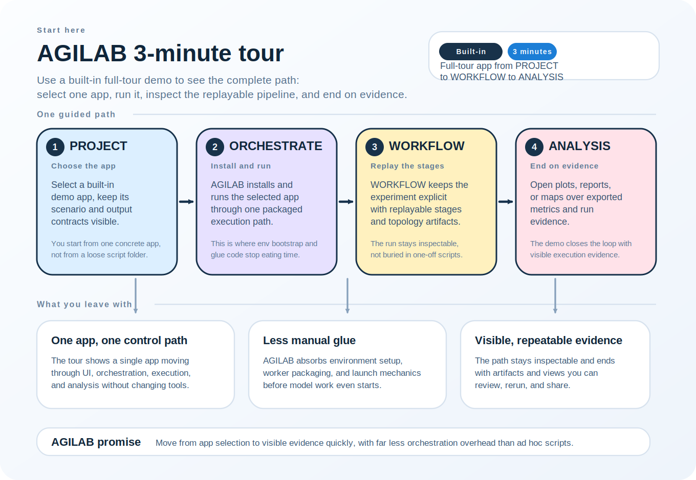
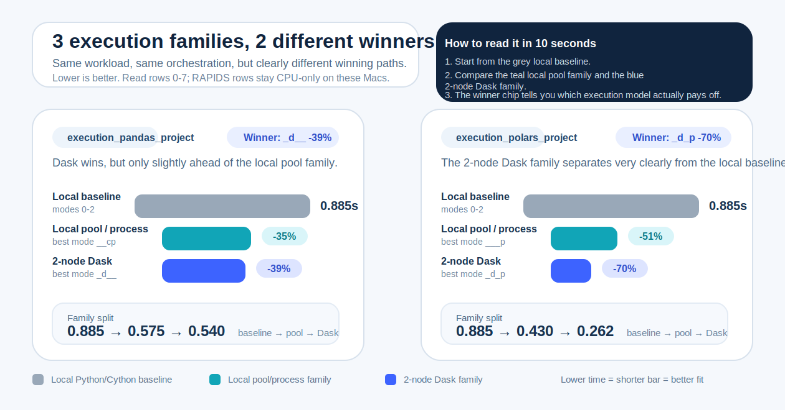

<p><a href="https://pypi.org/project/agilab/"></a><a href="https://opensource.org/licenses/BSD-3-Clause"></a><a href="https://thalesgroup.github.io/agilab"></a><a href="https://thalesgroup.github.io/agilab/demos.html"></a><a href="https://github.com/ThalesGroup/agilab"></a></p>

<details>
<summary>More project badges</summary>

<p><a href="https://pypi.org/project/agilab/"></a><a href="https://pypi.org/project/agilab/"></a><a href="https://github.com/ThalesGroup/agilab/actions/workflows/ci.yml"></a><a href="https://github.com/ThalesGroup/agilab/issues"></a><a href="https://github.com/ThalesGroup/agilab/pulse"></a><a href="tools/codex_workflow.md"></a><a href=".codex/skills/README.md"></a><a href=".claude/skills/README.md"></a><a href="docs/source/environment.rst"></a><a href="https://github.com/ThalesGroup/agilab/pulls"></a><a href="https://pypi.org/project/agilab/"></a><a href="https://github.com/ThalesGroup/agilab"></a><a href="https://github.com/psf/black"></a><a href="https://orcid.org/0009-0003-5375-368X"></a></p>
<p><a href="https://github.com/ThalesGroup/agilab/actions/workflows/coverage.yml"></a><a href="https://codecov.io/gh/ThalesGroup/agilab"></a><a href="https://codecov.io/gh/ThalesGroup/agilab?flags%5B0%5D=agi-gui"></a><a href="https://codecov.io/gh/ThalesGroup/agilab?flags%5B0%5D=agi-env"></a><a href="https://codecov.io/gh/ThalesGroup/agilab?flags%5B0%5D=agi-node"></a><a href="https://codecov.io/gh/ThalesGroup/agilab?flags%5B0%5D=agi-cluster"></a><a href="https://codecov.io/gh/ThalesGroup/agilab?flags%5B0%5D=agi-core"></a></p>

</details>


# AGILAB Open Source Project

AGILAB is an open-source platform for **reproducible AI/ML workflows** that keeps the same application understandable
from local experimentation to distributed workers and long-lived services.

It is built first for **applied ML engineers and technical teams** who want one control path for setup, run, replay,
and analysis instead of separate ad hoc scripts at each stage.

AGILAB is maintained by the Thales Group and released under the
[BSD 3-Clause License](https://github.com/ThalesGroup/agilab/blob/main/LICENSE).

Lead author and maintainer: Jean-Pierre Morard.
Contributors include Guillaume Demets and Julien Bestard.

## Start Here

If this is your first visit, ignore cluster mode, private app repositories, notebook-first flows, and packaged
install. Use one path only:

- source checkout
- web UI
- built-in `flight_project`
- local run
- visible analysis

If you want to see the AGILAB web UI before installing anything, start here instead:

- [Pre-install UI demo](https://thalesgroup.github.io/agilab/demos.html)

```bash
git clone https://github.com/ThalesGroup/agilab.git
cd agilab
./install.sh --install-apps --test-apps
uv --preview-features extra-build-dependencies run python tools/newcomer_first_proof.py
uv --preview-features extra-build-dependencies run streamlit run src/agilab/About_agilab.py
```

The newcomer proof command gives an explicit pass/fail verdict for the recommended source-checkout path before you start clicking through the UI.
If it fails, use the newcomer recovery page:
[Newcomer first-failure recovery](https://thalesgroup.github.io/agilab/newcomer-troubleshooting.html).
If you want the current public validated-vs-documented support picture before branching out,
use the [compatibility matrix](https://thalesgroup.github.io/agilab/compatibility-matrix.html).

Then in the UI:

1. select `src/agilab/apps/builtin/flight_project` in **PROJECT**
2. run the install/distribute/run flow in **ORCHESTRATE**
3. confirm fresh output appears under `~/log/execute/flight/`
4. open the resulting view in **ANALYSIS**

Your first proof is explicit:

- fresh generated output appears under `~/log/execute/flight/`
- the first proof stays visible as `PROJECT -> ORCHESTRATE -> ANALYSIS`

Fast orientation:

- [45-second workflow intro video](https://youtu.be/kOMDyvbnC9w)
- [Documentation](https://thalesgroup.github.io/agilab)
- [Compatibility matrix](https://thalesgroup.github.io/agilab/compatibility-matrix.html)
- [Flight project guide](https://thalesgroup.github.io/agilab/flight-project.html)

## Why teams use AGILAB

- **One control path** from UI or CLI entrypoints to local workers, distributed execution, and analysis.
- **Reproducible execution** through managed environments, explicit pipeline steps, and per-app settings.
- **Service mode** with `AGI.serve` (`start` / `status` / `health` / `stop`) instead of stopping at one-off runs.
- **Operationally visible workflows** where logs, generated snippets, and outputs stay tied to the same app context.

## Use AGILAB when

- your workflow already spans setup, run, replay, and analysis
- you want the same app to survive the move from local run to distributed execution
- you need environments, execution history, and generated artifacts to stay aligned

If you only want the smallest possible single-notebook path, AGILAB is probably more structure than you need.

## Alternative paths

Use these only after the first `flight_project` proof works.

### Evaluate the published package quickly

```bash
mkdir ~/agi-workspace && cd ~/agi-workspace
uv venv
source .venv/bin/activate
uv pip install agilab
uv run agilab
```

### Stay in a notebook with `agi-core`

[](https://colab.research.google.com/github/ThalesGroup/agilab/blob/main/examples/notebook_quickstart/agi_core_colab_first_run.ipynb)

Other notebook entry points:
- [`Benchmark`](https://colab.research.google.com/github/ThalesGroup/agilab/blob/main/examples/notebook_quickstart/agi_core_colab_benchmark.ipynb): install AGILAB plus core runtime packages from GitHub `main`, benchmark `mycode_project` across the default AGILAB mode sweep, and render a ranked comparison table
- [`Data + DAG`](https://colab.research.google.com/github/ThalesGroup/agilab/blob/main/examples/notebook_quickstart/agi_core_colab_data_dag.ipynb): advanced source-checkout notebook for a data-worker app and a DAG-style app
- [`Worker Paths`](https://colab.research.google.com/github/ThalesGroup/agilab/blob/main/examples/notebook_quickstart/agi_core_colab_worker_paths.ipynb): advanced source-checkout notebook for worker-class and source-path inspection

```bash
git clone https://github.com/ThalesGroup/agilab.git
cd agilab
./install.sh --install-apps --test-apps
uv run --with jupyterlab jupyter lab examples/notebook_quickstart/agi_core_first_run.ipynb
```

### Developer ergonomics

- PyCharm can reuse the bundled run configurations.
- VS Code can consume generated local `tasks.json` and `launch.json`.
- Codex and Claude can follow the shared runbook in [AGENTS.md](AGENTS.md).

## Watch the workflow

Keep the two public paths separate:

- first proof: `flight_project` through `PROJECT -> ORCHESTRATE -> ANALYSIS`
- full workflow tour: `uav_relay_queue_project` through `PROJECT -> ORCHESTRATE -> PIPELINE -> ANALYSIS`



Shareable visual:
- [Social card SVG](docs/source/diagrams/agilab_social_card.svg)

Video tutorial and slideshow:
- [45-second workflow intro video](https://youtu.be/kOMDyvbnC9w)
- [Public demos page](https://thalesgroup.github.io/agilab/demos.html)
- [Video tutorial and slideshow guide](docs/source/demo_capture_script.md)
- `uv --preview-features extra-build-dependencies run --with imageio --with imageio-ffmpeg python tools/build_demo_explainer.py`

## Quick links

- **Documentation:** https://thalesgroup.github.io/agilab
- **Compatibility matrix:** https://thalesgroup.github.io/agilab/compatibility-matrix.html
- **Execution Playground guide:** https://thalesgroup.github.io/agilab/execution-playground.html
- **Service mode guide:** https://thalesgroup.github.io/agilab/service-mode.html
- **Flight project guide:** https://thalesgroup.github.io/agilab/flight-project.html
- **PyPI package:** https://pypi.org/project/agilab
- **Discussions:** https://github.com/ThalesGroup/agilab/discussions
- **Developer runbook:** [AGENTS.md](AGENTS.md)
- **Demo capture workflow:** [docs/source/demo_capture_script.md](docs/source/demo_capture_script.md)

## See the stack in one picture


Useful references after the first proof:

- [Execution Playground guide](https://thalesgroup.github.io/agilab/execution-playground.html)
- [Notebook migration example: skforecast + Meteo-France](https://thalesgroup.github.io/agilab/notebook-migration-skforecast-meteo.html)
- builtin app path: `src/agilab/apps/builtin/meteo_forecast_project`
- [execution_pandas_project drill-down](https://thalesgroup.github.io/agilab/execution-playground.html#execution-pandas-project)
- [execution_polars_project drill-down](https://thalesgroup.github.io/agilab/execution-playground.html#execution-polars-project)
- [Flight project overview](https://thalesgroup.github.io/agilab/flight-project.html)
- [Apps-pages quick start](src/agilab/apps-pages/README.md)
- [Service mode and paths](https://thalesgroup.github.io/agilab/service_mode_and_paths.html)

## Killer example: Execution Playground

If you want one example that shows why AGILAB is different, use the built-in execution playground:

- `execution_pandas_project`
- `execution_polars_project`

They run the same synthetic workload on the same generated dataset, but through different worker paths:

- `PandasWorker` highlights a process-based execution path
- `PolarsWorker` highlights an in-process threaded execution path

This makes the benchmark more useful than a simple "library A vs library B" comparison: AGILAB shows which
execution model wins for the same workload, then keeps the orchestration path reproducible from UI to outputs.

Measured local benchmark

Generated with `uv --preview-features extra-build-dependencies run python tools/benchmark_execution_playground.py --repeats 3 --warmups 1 --worker-counts 1,2,4,8 --rows-per-file 100000 --compute-passes 32 --n-partitions 16`
on macOS / Python `3.13.9` with a heavier default workload (`16` partitions, `100000` rows per file, `32` compute passes):

The helper resolves its built-in app paths from the script location, so it does not require running from the repo root.

This heavier mixed workload makes a more useful point than a raw library benchmark:
adding workers only helps when the execution model actually fits the workload.

- `pandas / process`: `1.772s` at `1` worker, then worse at `8` workers (`2.157s`)
- `polars / threads`: improves at `1-2` workers (`1.520s`, `1.436s`), then converges back (`1.564s` at `8`)
- AGILAB therefore makes the execution model and the worker-count scaling behavior explicit on the same reproducible workload.

Raw benchmark data:
- [execution_playground_benchmark.json](docs/source/data/execution_playground_benchmark.json)

Measured 2-node 16-mode matrix

Generated with:

`uv --preview-features extra-build-dependencies run python tools/benchmark_execution_mode_matrix.py --remote-host <remote-macos-ip> --scheduler-host <local-macos-ip> --rows-per-file 100000 --compute-passes 32 --n-partitions 16 --repeats 2`

`--remote-host` accepts either `host` or `user@host`. If you pass only a host or IP, the helper defaults to `agi@<host>` for both SSH and dataset sync.

This second benchmark uses 2 macOS ARM nodes over SSH: the local scheduler/worker and a second Mac worker.
It covers all 16 execution modes:

- `0-3`: local CPU modes
- `4-7`: 2-node Dask modes
- `8-11`: local modes with the RAPIDS bit requested
- `12-15`: 2-node Dask modes with the RAPIDS bit requested

The mode code is a compact bitfield: `r d c p` = `rapids / dask / cython / pool`.

In the versioned benchmark artifacts committed today, the `r...` and `rd...` modes are still useful for coverage, but they are **CPU-only** runs because neither Mac exposed NVIDIA tooling on that capture.

How to read it quickly

1. Ignore rows `8-15` in the committed capture for performance interpretation: they keep the RAPIDS bit visible, but they are still CPU-only there.
2. Read the matrix by **families**, not by isolated rows:
   - local Python/Cython baseline: `0-2`
   - local pool/process family: `1-3`
   - 2-node Dask family: `4-7`
3. Compare each family to mode `0` (`____`) to see whether the execution model is buying you anything.



What the full 16-mode matrix shows:

- `execution_pandas_project`: the plain local Python/Cython family sits around `0.885-0.910s`, the local pool family around `0.575-0.585s`, and the best non-RAPIDS result comes from the 2-node Dask path `_d__` at `0.540s`.
- `execution_polars_project`: the plain local Python/Cython family sits around `0.875-0.900s`, the local pool family around `0.430-0.445s`, and the best non-RAPIDS result comes from the 2-node Dask+pool path `_d_p` at `0.262s`.
- AGILAB therefore shows more than a library race: it separates execution-model families clearly and makes the winning execution topology explicit.
- Local-only RAPIDS rows and 2-node RAPIDS rows are reported independently, so GPU availability follows the topology that actually ran.

Full published artifacts:
- [execution_mode_matrix_benchmark.json](docs/source/data/execution_mode_matrix_benchmark.json)
- [execution_mode_matrix_benchmark.csv](docs/source/data/execution_mode_matrix_benchmark.csv)
- [execution_pandas_project_mode_matrix.csv](docs/source/data/execution_pandas_project_mode_matrix.csv)
- [execution_polars_project_mode_matrix.csv](docs/source/data/execution_polars_project_mode_matrix.csv)

## Why star AGILAB

Star AGILAB if you care about one or more of these:

- **Reproducible AI/ML workflows** instead of hand-wired notebooks, shell scripts, and scattered env setup.
- **Agent-friendly engineering** with repo-native guidance through `AGENTS.md`, shared repo skill trees, and documented agent workflows.
- **Free-threaded Python readiness** where environment and worker compatibility is explicit rather than accidental.
- **Execution model benchmarking** that shows whether the same workload wins with process-based or in-process/threaded execution paths.
- **One control path** from app selection to orchestration, pipeline inspection, analysis, and service mode.

## Who this is for

- Teams moving from local experimentation toward distributed or service-style execution.
- Engineers who want a visible control path from UI or CLI to worker packaging and outputs.
- Developers who want a repo that works well with coding agents, not just with humans.

## Who this is not for

- Teams looking only for experiment tracking without execution orchestration.
- Users who want a notebook-only workflow with no packaging or deployment concerns.
- Organizations expecting a finished all-in-one enterprise platform out of the box.

## What makes AGILAB different

| Capability | What AGILAB gives you |
| --- | --- |
| Unified control plane | Launch the same app from Streamlit, CLI wrappers, or distributed workers. |
| Managed execution envs | Package worker dependencies into isolated environments instead of relying on one shared Python install. |
| Persistent operation | Use `AGI.serve` with health gates and structured status snapshots for long-lived workloads. |
| Free-threaded Python support | Opt into free-threaded Python when both the chosen environment and worker declare compatibility. |
| Execution model visibility | Benchmark the same workload across worker/runtime paths and make the winning execution model explicit. |
| Agentic development | Use repo-native guidance through `AGENTS.md`, shared repo skill trees, and workflow helpers instead of ad hoc prompts. |
| Modular adoption | Install the full stack or adopt `agi-env`, `agi-node`, `agi-cluster`, and `agi-core` separately. |

## AGILAB vs manual orchestration

| Workflow step | Manual approach | AGILAB approach |
| --- | --- | --- |
| Environment setup | Hand-build Python environments and keep them aligned across machines. | Use managed environments and packaged workers. |
| Running an experiment | Glue together scripts, shell commands, and remote execution by hand. | Drive the same flow from Streamlit, CLI wrappers, or worker dispatch. |
| Scaling out | Recreate dependencies and SSH conventions for each remote target. | Reuse `agi-node` / `agi-cluster` packaging and dispatch logic. |
| Service continuity | Invent your own start/status/health/stop checks. | Use `AGI.serve` with health snapshots and gate thresholds. |
| Artifact traceability | Logs and outputs end up scattered across scripts and machines. | Keep run history, logs, and app outputs on a documented control path. |

The point is not that AGILAB replaces every production platform. The point is that it removes a large amount of
hand-written orchestration during experimentation and validation, then makes the handoff to a broader stack cleaner.

In practice, that also means AGILAB can show when a performance win comes from the execution model itself. For example,
the same workload can be benchmarked through `PandasWorker` using a process-based path and through `PolarsWorker` using
an in-process threaded path, so the benchmark explains more than "library A vs library B".

## Repository layout

The monorepo hosts several tightly-coupled packages:

| Package | Location | Purpose |
| --- | --- | --- |
| `agilab` | `src/agilab` | Top-level Streamlit experience, tooling, and reference applications |
| `agi-env` | `src/agilab/core/agi-env` | Environment bootstrap, configuration helpers, and pagelib utilities |
| `agi-node` | `src/agilab/core/agi-node` | Local/remote worker orchestration and task dispatch |
| `agi-cluster` | `src/agilab/core/agi-cluster` | Multi-node coordination, distribution, and deployment helpers |
| `agi-core` | `src/agilab/core/agi-core` | Meta-package bundling the environment/node/cluster components |

Each package can be installed independently via `pip install <package-name>`, but the recommended development path is
to clone this repository and use the provided scripts.

## Developer workflow

For development mode, the strongly recommended tools are:

- **PyCharm (Professional)** with repository-specific settings.
- Community-only workflows can still work through CLI wrappers and manual entry points,
  but Pro is required for the full IDE-oriented setup flow.
- **Codex CLI** configured from repository-specific guidance (`AGENTS.md` and
  repository skill trees/workflow settings).

For a professional Codex workflow, use the repo helper:

- `./tools/codex_workflow.sh review` before coding changes.
- `./tools/codex_workflow.sh exec "..."` for implementation tasks.
- `./tools/codex_workflow.sh apply <task-id>` for generated task patch application.
- Configuration and usage details: `tools/codex_workflow.md`.
- If you prefer to work without an IDE, use the repo guide:
  - `docs/CLI_FIRST_WORKFLOW.md`

Use macOS or Linux when you need to validate or reuse Linux-dependent code paths.

## Framework execution flow

- **Entrypoints**: Streamlit (`src/agilab/About_agilab.py`) and CLI mirrors call `AGI.run`/`AGI.install`, which hydrate an `AgiEnv` and load app manifests via `agi_core.apps`.
- **Environment bootstrap**: `agi_env` resolves paths (`agi_share_path`, `wenv`), credentials, and uv-managed interpreters before any worker code runs; config precedence is env vars → `~/.agilab/.env` → app settings.
- **Planning**: `agi_core` builds a WorkDispatcher plan (datasets, workers, telemetry) and emits structured status to Streamlit widgets/CLI for live progress.
- **Dispatch**: `agi_cluster` schedules tasks locally or over SSH; `agi_node` packages workers, validates dependencies, and executes workloads in isolated envs.
- **Telemetry & artifacts**: run history and logs are written under `~/log/execute/<app>/`, while app-specific outputs land relative to `agi_share_path` (see app docs for locations).
- **Service mode**: `AGI.serve` manages persistent workers and returns machine-readable health snapshots (`agi.service.health.v1`) for gating and monitoring.

## Web interface workflow

The main interface is organized around four pages:

- **PROJECT**: project/app selection, settings, and source/config editing.
- **ORCHESTRATE**: install/distribute/run workflows, service controls, and health gate checks.
- **PIPELINE**: compose and replay step sequences, including locked snippets imported from ORCHESTRATE.
- **ANALYSIS**: launch built-in and custom Streamlit page bundles for post-run analysis.

## AGI.serve and health gates

`AGI.serve` is the persistent service API used by ORCHESTRATE service mode.

- Actions: `start`, `status`, `health`, `stop`.
- `health` writes/returns a JSON snapshot with schema `agi.service.health.v1`.
- Default gate thresholds are read from app settings under `[cluster.service_health]`:
  `allow_idle`, `max_unhealthy`, `max_restart_rate`.
- Health gates can be executed from ORCHESTRATE or from CLI:

```bash
uv --preview-features extra-build-dependencies run python tools/service_health_check.py \
  --app mycode_project \
  --apps-path src/agilab/apps/builtin \
  --format json
```

## Documentation & resources

- 📘 **Docs:** https://thalesgroup.github.io/agilab
- ⚙️ **Service mode guide:** https://thalesgroup.github.io/agilab/service-mode.html
- 💬 **Discussions:** https://github.com/ThalesGroup/agilab/discussions
- 📦 **PyPI:** https://pypi.org/project/agilab
- 🧩 **Core package index:** https://pypi.org/search/?q=agi-
- 🧪 **Test matrix:** refer to `.github/workflows/ci.yml`
- ✅ **Coverage snapshot:** see badges above (auto-updated after the dedicated `coverage` workflow)
- 🧾 **Runbook:** [AGENTS.md](AGENTS.md)
- 🛠️ **Developer tools:** scripts in `tools/` and application templates in `src/agilab/apps`
