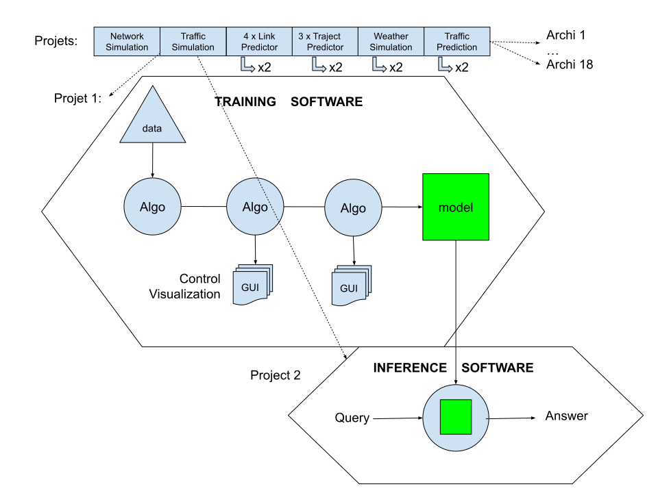
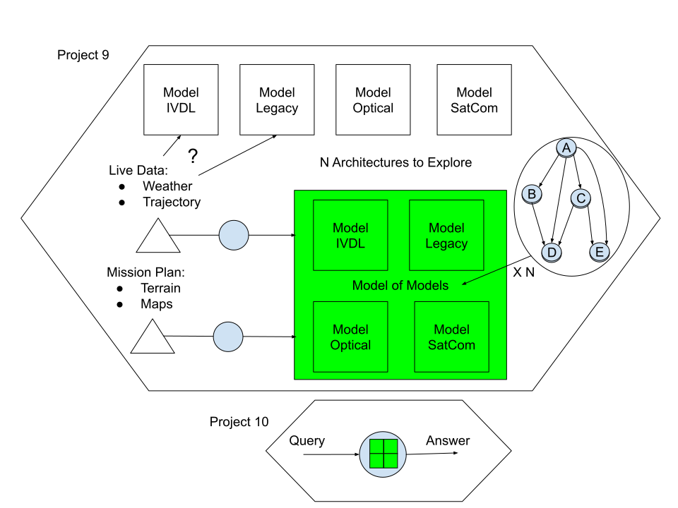

Introduction
============

AGILab at a Glance
------------------

AGILab helps domain experts and data scientists take ideas beyond notebooks. By
capturing requirements up front and providing opinionated tooling, teams can move
from experimentation to production without context switches.

.. image:: AI-Problematic.svg
   :alt: AI Problematic
   :align: center

Purpose
-------

AGILab is designed to maximise productivity across the AI lifecycle:

- **Collaborate across roles** – ship starter templates, cloning utilities, and
  import/export flows so teams reuse code instead of recreating it.
- **Scale without rewrites** – support larger datasets or alternate execution
  targets by toggling execution modes rather than refactoring pipelines.
- **Unlock generative help** – embed assistants for algorithm discovery,
  debugging, and documentation so prompt engineering lives alongside the code
  that uses it.
- **Lower operational friction** – automate packaging and cluster deployment,
  helping teams deliver without deep DevOps expertise.

Target Audience
---------------

AGILab serves professionals and domain experts who need a streamlined path from
exploration to shareable applications.

Main Dependencies
-----------------

AGILab relies on a focused toolchain chosen for portability, simplicity, and
runtime performance:

- `uv <https://docs.astral.sh/uv/>`_ – deterministic environment and packaging
  management for Python projects.
- `asyncssh <https://asyncssh.readthedocs.io/en/latest/AsyncSSH>`_ –
  asynchronous SSHv2 connections for cluster bootstrap and remote orchestration.
- `Cython <https://cython.org/>`_ – optional acceleration layer that lets
  critical Python sections compile down to C.
- `Dask <https://www.dask.org/>`_ – distributed compute primitives to
  parallelise workloads across workers.
- `Streamlit <https://streamlit.io/>`_ – unified UI surface for editing,
  executing, and exploring apps.
- `PyCharm <https://www.jetbrains.com/pycharm>`_ – primary IDE for AGILab
  development, mirrored by generated CLI wrappers.
- `OpenAI <https://chat.openai.com>`_ – online assistant provider for code
  generation and analysis.
- `Mistral (Universal Offline AI Chatbot)
  <https://github.com/ThalesGroup/universal-offline-ai-chatbot>`_ – local
  Mistral-instruct models powering offline experimentation.

Technology Selection Criteria
-----------------------------

The stack is optimised around:

- **Portability** – share environments across machines without heavyweight
  virtualisation.
- **Simplicity** – isolate dependencies and enforce reproducible installs with
  minimal ceremony.
- **Performance** – benchmark combinations of Cython, Dask, and worker pools to
  meet latency or throughput goals.

Example: Aircraft Radio Communication
-------------------------------------

**Needs Algos Set**

Modern systems rarely rely on a single algorithm. Telecom workflows in an
aircraft, for instance, coordinate multiple models and datasets.

Rather than defaulting to virtual machines or containers, AGILab enables reuse
across organisations, infrastructures, and operating systems while keeping
delivery lean.

**Needs Model of Models**

Artificial General Intelligence is not solved with a single model; orchestrations
of models tackle complex problems.

AGILab offers a playground to trial architectures without rewriting code:

- Select from 16 execution modes in the GUI to explore different runtime
  strategies.
- Decouple software design from available hardware resources, letting capacity
  planning evolve independently of app logic.
