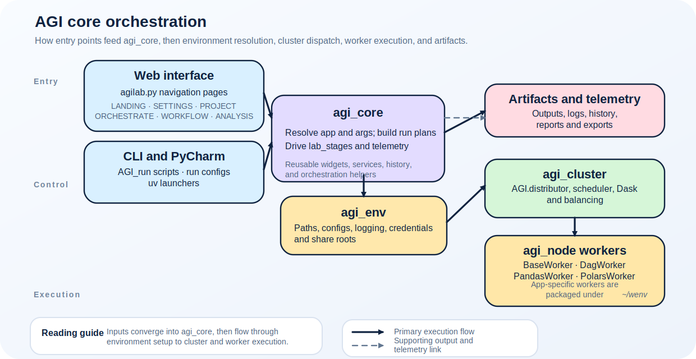

AGI Core Architecture
=====================

``agi_core`` is the shared framework-helper layer used by AGILAB pages, CLI
mirrors, telemetry, and app-loading code. It is not the worker runtime and it
does not own environment resolution or distributed execution. Those
responsibilities live in ``agi_env``, ``agi_node``, and ``agi_cluster``.

Use this page when you need to decide whether a change belongs in shared
page/app helpers or should stay inside an app, page, or worker package.

.. contents::
   :local:
   :depth: 2

Modules at a glance
-------------------

   Web interface and CLI entry points call into ``agi_core`` helpers before
   handing environment resolution to ``agi_env`` and execution to
   ``agi_cluster``.

``src/agilab/core/agi-core`` ships the following higher-level domains:

``agi_core.apps``
    Helper mixins for app metadata, dataset manifests, and path helpers that
    app managers can import from their project root. If you add a new manager or
    need an app to opt in to common validation, start here.
``agi_core.streamlit``
    Shared web interface widgets (status panels, history view, deploy dialogs) used
    by PROJECT/ORCHESTRATE/WORKFLOW/ANALYSIS. Keeping them here avoids circular imports from the
    page packages.
``agi_core.telemetry``
    Structured logging, run-history helpers, and wrappers used by ``AGI.run`` to
    emit consistent events back to the web interface and the CLI mirrors.
``agi_core.services``
    Small utility services (encryption, local cache, dataset registry) designed
    to be reused by both the GUI and the app installers.

What belongs here
-----------------

Put code in ``agi_core`` only when it is shared by multiple pages, CLI mirrors,
or app managers and does not require worker-runtime imports. Keep these outside
``agi_core``:

- active-project path and environment resolution: use ``agi_env``
- worker base classes, package bootstrap, and worker install hooks: use
  ``agi_node``
- run dispatch, Dask, SSH, service lifecycle, and ``AGI.run``: use
  ``agi_cluster``
- app-specific business logic: keep it under the app project

Execution flow
--------------

.. figure:: Agilab-Overview.svg
   :alt: High-level flow linking the web interface to agi-core
   :class: diagram-panel diagram-hero

   Web interface pages talk to ``agi_core`` services before dispatching work to
   ``agi_env``/``agi_cluster``.

.. figure:: diagrams/packages_agi_env.svg
   :alt: Package-level view highlighting agi_core dependencies
   :class: diagram-panel diagram-wide

   Generated from ``pyreverse`` to show how ``agi_core`` orchestrates calls to
   ``agi_env`` helpers and dispatcher facades.

Typical call stack when a user clicks **RUN** on the ORCHESTRATE page:

1. ``src/agilab/pages/2_ORCHESTRATE.py`` collects form values and calls
   shared app/page helpers.
2. ``agi_core`` builds app metadata, page state, telemetry context, or
   ``WorkDispatcher`` inputs without importing worker-only dependencies.
3. The page resolves an ``AgiEnv`` and calls the public ``AGI`` facade.
4. ``AGI.run`` hands execution to ``agi_cluster.agi_distributor`` and the
   worker package built by ``agi_node``.
5. Results propagate back through ``agi_core`` helpers such as history,
   downloads, telemetry, and status widgets before the UI renders the finished
   run.

Repository pointers
-------------------

=============  =============================================================
Directory      Purpose
=============  =============================================================
``apps``       Metadata helpers shared by ``src/agilab/apps`` managers.
``streamlit``  Widgets, layout templates, and modal logic for ORCHESTRATE/ANALYSIS.
``telemetry``  Structured logging, status persistence, and run history APIs.
``services``   Standalone service objects (encryption, caching, dataset registry).
=============  =============================================================

Tips for contributions
----------------------

- Keep business logic for a specific app inside its app project root: source
  built-ins use ``src/agilab/apps/builtin/<project>``, packaged payloads use
  ``src/agilab/lib/agi-app-*``, and external apps stay in their app repository.
  Only move code into ``agi_core`` when *multiple* apps/pages need the
  abstraction.
- When adding a new web widget, place it under ``agi_core/streamlit`` and
  export it through a small ``__all__``. That keeps import graphs manageable.
- ``agi_core`` has no hard dependency on ``agi_env`` or ``agi_cluster``. If your
  change requires environment or dispatcher behaviour, extract a thin interface
  and inject the dependency so unit tests stay fast.

See also
--------

- :doc:`framework-api` for the high-level ``AGI.*`` orchestration entry points.
- :doc:`agilab` for the user-facing web pages built on top of ``agi_core``.
- :doc:`architecture` for the full-stack overview (pages → agi_core → agi_env/cluster).
