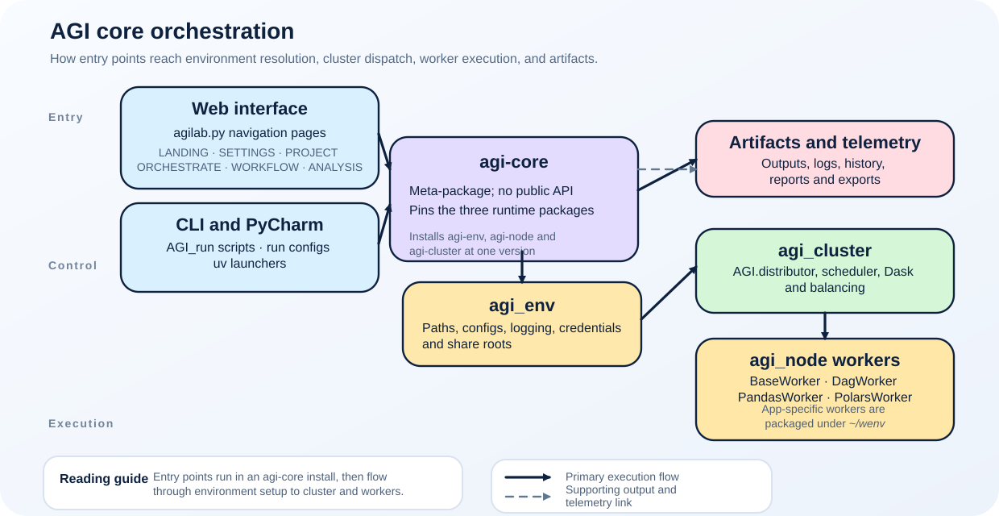
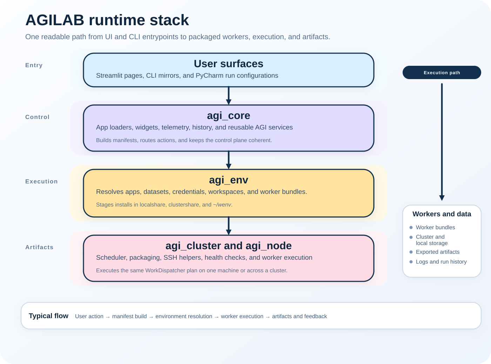
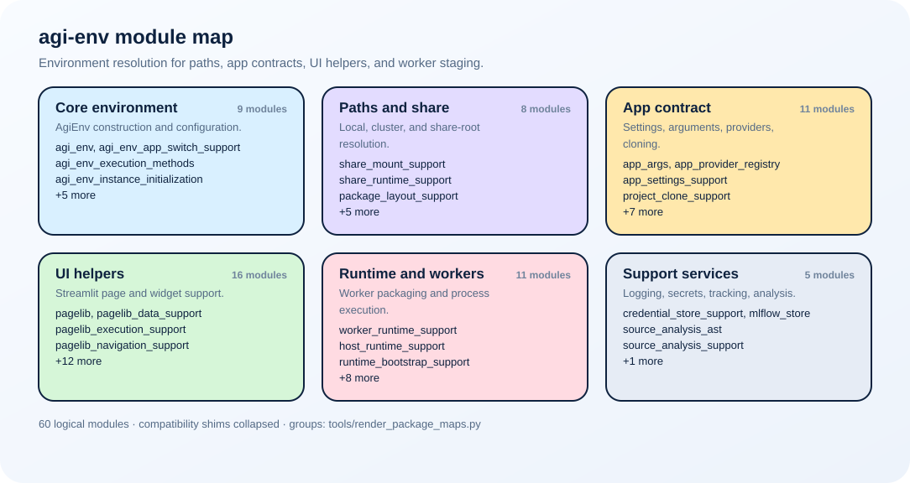

AGI Core Architecture
=====================

``agi-core`` is the meta-package that installs and wires ``agi-env``,
``agi-node``, and ``agi-cluster`` together. It carries no framework logic of its
own: environment resolution lives in ``agi_env``, the worker runtime in
``agi_node``, and distributed execution in ``agi_cluster``.

Use this page when you need to decide which of those three packages a change
belongs in, or whether it should stay inside an app, page, or worker package.

.. contents::
   :local:
   :depth: 2

Modules at a glance
-------------------

   Web interface and CLI entry points resolve the environment through
   ``agi_env`` and hand execution to ``agi_cluster``; ``agi-core`` is the
   distribution that installs those packages together.

``src/agilab/core/agi-core`` declares the three runtime packages as pinned
dependencies and exposes no public API of its own. Installing ``agi-core``
installs the set; importing ``agi_core`` gives you nothing to call:

.. code-block:: python

   >>> import agi_core
   >>> agi_core.__all__
   ()

The distribution contains a single module, ``agi_core.agi_env_runtime``, which
holds the ``RUNTIME_PACKAGE_SPEC`` metadata dictionary that ``agi-env`` reads to
order package resolution. It is framework plumbing, not an entry point.

.. note::

   Earlier revisions of this page described ``agi_core.apps``,
   ``agi_core.streamlit``, ``agi_core.telemetry``, and ``agi_core.services``.
   Those subpackages were never released. Import the shared helpers from
   ``agi_env``, ``agi_node``, or ``agi_cluster`` instead.

What belongs here
-----------------

Nothing new belongs in ``agi_core``: it is a dependency aggregator, and adding a
module there would give it a public surface it is not meant to have. Route
shared code to the package that owns the responsibility:

- active-project path and environment resolution: use ``agi_env``
- worker base classes, package bootstrap, and worker install hooks: use
  ``agi_node``
- run dispatch, Dask, SSH, service lifecycle, and ``AGI.run``: use
  ``agi_cluster``
- app-specific business logic: keep it under the app project

Execution flow
--------------

   Web interface pages resolve an ``AgiEnv`` and dispatch work through the
   public ``AGI`` facade in ``agi_cluster``.

   Generated from ``pyreverse`` to show how the page and CLI layers depend on
   ``agi_env`` helpers and dispatcher facades.

Typical call stack when a user clicks **RUN** on the ORCHESTRATE page:

1. ``src/agilab/pages/2_ORCHESTRATE.py`` collects form values and calls
   shared app/page helpers.
2. The page builds app metadata, page state, and ``WorkDispatcher`` inputs
   from helpers it owns, without importing worker-only dependencies.
3. The page resolves an ``AgiEnv`` and calls the public ``AGI`` facade.
4. ``AGI.run`` hands execution to ``agi_cluster.agi_distributor`` and the
   worker package built by ``agi_node``.
5. Results propagate back to the page, which renders history, downloads, and
   status from the run manifest.

Repository pointers
-------------------

===============  ===========================================================
Package          Purpose
===============  ===========================================================
``agi-env``      Paths, configs, logging, credentials, and share roots.
``agi-node``     Worker base classes, package bootstrap, and install hooks.
``agi-cluster``  Run dispatch, Dask, SSH, service lifecycle, and ``AGI.run``.
``agi-core``     Meta-package: installs the three above at a pinned version.
===============  ===========================================================

Tips for contributions
----------------------

- Keep business logic for a specific app inside its app project root: source
  built-ins use ``src/agilab/apps/builtin/<project>``, packaged payloads use
  ``src/agilab/lib/agi-app-*``, and external apps stay in their app repository.
  Only move code into a runtime package when *multiple* apps/pages need the
  abstraction.
- Web widgets shared across pages belong to the page bundle that owns them, or
  to ``agi_env.ui`` when the whole UI layer needs them. There is no
  ``agi_core`` widget namespace.
- ``agi-core`` pins ``agi-env``, ``agi-node``, and ``agi-cluster`` with ``==``
  constraints, so the four versions move together. A change that needs a new
  runtime capability must ship in the package that owns it, and the pins must
  be bumped in the same release.

See also
--------

- :doc:`framework-api` for the high-level ``AGI.*`` orchestration entry points.
- :doc:`agilab` for the user-facing web pages built on the runtime packages.
- :doc:`architecture` for the full-stack overview (pages → agi_env → agi_cluster).
