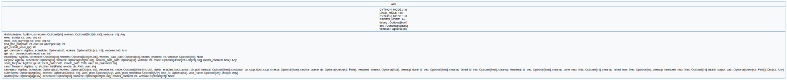

agi-distributor API
===================

Usage Example
-------------

Installation
^^^^^^^^^^^^

.. literalinclude:: examples/mycode/AGI.install-mycode.py
   :language: python

------

.. literalinclude:: examples/flight/AGI.install-flight.py
   :language: python

Distribute
^^^^^^^^^^^^

.. literalinclude:: examples/mycode/AGI.get_distrib-mycode.py
   :language: python

.. literalinclude:: examples/flight/AGI.get_distrib-flight.py
   :language: python

Run
^^^

.. literalinclude:: examples/mycode/AGI.run-mycode.py
   :language: python

.. literalinclude:: examples/flight/AGI.run-flight.py
   :language: python

Reference
----------

.. automodule:: agi_cluster.agi_distributor.agi_distributor
   :members:
   :undoc-members:
   :show-inheritance:
