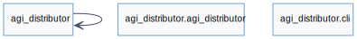
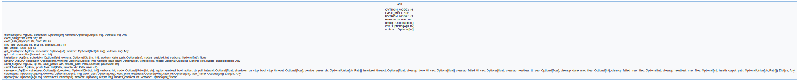

agi-distributor API
===================

``agi_distributor`` packages applications, ships the required artefacts to the
selected workers, and runs the chosen execution mode across the cluster.

Understanding ``modes_enabled`` and ``mode``
--------------------------------------------

The first thing to know before reading the examples is that AGILAB encodes
execution toggles as a small bitmask.

.. list-table::
   :header-rows: 1
   :widths: 18 18 64

   * - Parameter
     - Used by
     - Meaning
   * - ``modes_enabled``
     - ``AGI.install(...)``
     - Bitmask of the execution capabilities that should be prepared during
       install.
   * - ``mode``
     - ``AGI.run(...)``
     - One concrete execution mode selected for the current run.

The current bit values are:

.. list-table::
   :header-rows: 1
   :widths: 20 14 66

   * - Toggle
     - Bit value
     - Meaning
   * - ``pool``
     - ``1``
     - Worker-pool path; backend may be process- or thread-based.
   * - ``cython``
     - ``2``
     - Compiled worker path when available.
   * - ``cluster_enabled``
     - ``4``
     - Distributed Dask scheduler / remote worker path.
   * - ``rapids``
     - ``8``
     - RAPIDS / GPU path when supported.

Prefer the public constants instead of typing numeric bitmasks:

- ``AGI.PYTHON_MODE | AGI.DASK_MODE`` for the MyCode docs example.
- ``AGI.PYTHON_MODE | AGI.CYTHON_MODE | AGI.DASK_MODE`` for the Flight docs
  example.

This is why the install examples below pass named constants through
``modes_enabled=...`` and the run examples pass the same intent through a
``RunRequest``. Older snippets may contain raw integers, but public examples
should not teach those values directly.

In normal usage, these values are generated from the UI toggles rather than
typed manually.

Usage Example
-------------

Installation
^^^^^^^^^^^^

Install the ``mycode`` example:

.. literalinclude:: examples/mycode/AGI.install-mycode.py
   :language: python

Install the ``flight`` example:

.. literalinclude:: examples/flight_telemetry/AGI.install-flight-telemetry.py
   :language: python

Distribute
^^^^^^^^^^

Create the distribution bundle that will be sent to the workers:

.. literalinclude:: examples/mycode/AGI.get_distrib-mycode.py
   :language: python

Equivalent example for ``flight``:

.. literalinclude:: examples/flight_telemetry/AGI.get_distrib-flight-telemetry.py
   :language: python

Run
^^^

Start with the simplest mental model first:

.. code-block:: python

   from agi_cluster.agi_distributor import AGI, RunRequest

   request = RunRequest(mode=AGI.PYTHON_MODE)
   res = await AGI.run(app_env, request=request)

Then move to the generated examples that add install-time capabilities,
distributed hosts, and app-specific arguments:

.. literalinclude:: examples/mycode/AGI.run-mycode.py
   :language: python

Equivalent example for ``flight``:

.. literalinclude:: examples/flight_telemetry/AGI.run-flight-telemetry.py
   :language: python

Reference
----------

.. automodule:: agi_cluster.agi_distributor.agi_distributor
   :members:
   :show-inheritance:
