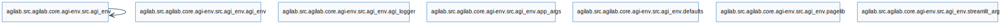
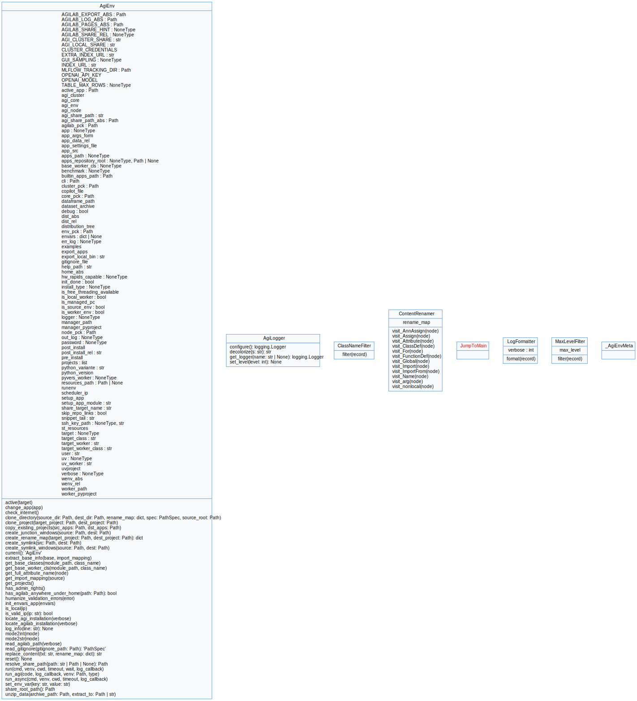

agi-env API
===========

This is a module share between core/agi-core and agilab to set all the path required by both

Usage Example
-------------

Instanciation
^^^^^^^^^^^^^

.. literalinclude:: snippets/AgiEnv.instanciation.py
   :language: python

.. note::
   ``AgiEnv`` behaves as a singleton. Repeated instantiation updates the same
   environment instance; call :func:`AgiEnv.reset` before configuring a new
   environment, or :func:`AgiEnv.current` to access the active one.

Share directory resolution
^^^^^^^^^^^^^^^^^^^^^^^^^^^^^^

``AgiEnv`` exposes the resolved data root through :py:attr:`env.agi_share_path_abs`.
The path is derived from environment settings using the following precedence:

1. ``AGI_CLUSTER_SHARE`` from the current process environment (e.g. ssh session, service unit).
2. ``AGI_CLUSTER_SHARE`` defined in the ``.env`` file.
3. Legacy ``AGI_SHARE_DIR`` from the process environment, then ``.env``.
4. ``AGI_LOCAL_SHARE`` (default ``~/localshare``).

This ordering lets remote workers honour the share configured by their host
without copying the manager settings. The behaviour differs slightly depending
on where the environment runs:

* **Manager / developer shells** – relative inputs are expanded against
  :py:attr:`env.home_abs` and the directory is created eagerly. Any missing or
  read-only share will raise an error so operators can fix the mount point.
* **Remote workers** – the configured value remains relative (for example,
  ``clustershare/<app>``) and is not created automatically. Workers
  never fall back to per-user paths; instead the configured share path must be
  mounted and writable on the remote host. When an absolute path under
  ``/Users/<user>`` or ``/home/<user>`` is provided, the leading segments are
  stripped so the worker can re-root the remainder under its own home directory
  or mount point.

Because the worker value stays relative, it will fail fast if ``agi_share_path``
is not mounted. This makes data provenance explicit and avoids hidden copies of
datasets on remote machines.

Reference
----------

.. automodule:: agi_env.agi_env
   :members:
   :undoc-members:
   :show-inheritance:

