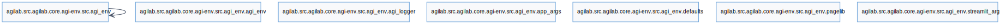
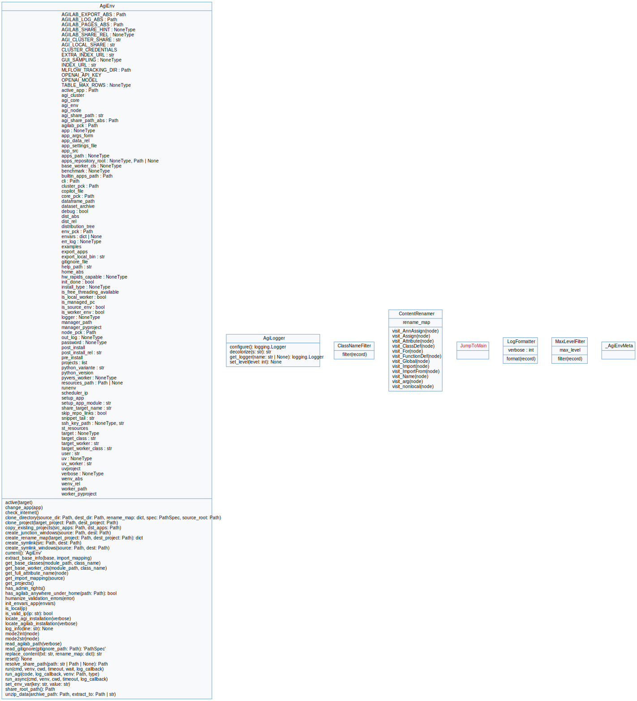

agi-env API
===========

``agi_env`` provides the shared headless environment and path-resolution layer
used by both AGILab and the core runtime packages. Streamlit/page dependencies
live in the separate ``agi-gui`` package under ``src/agilab/lib/agi-gui``.

Usage Example
-------------

Instanciation
^^^^^^^^^^^^^

.. literalinclude:: snippets/AgiEnv.instanciation.py
   :language: python

.. note::
   ``AgiEnv`` behaves as a singleton. Repeated instantiation updates the same
   environment instance. Call ``AgiEnv.reset()`` before configuring a new
   environment, or ``AgiEnv.current()`` to retrieve the active one.

Share directory resolution
^^^^^^^^^^^^^^^^^^^^^^^^^^^^^^

``AgiEnv`` exposes the resolved data root through
``AgiEnv.agi_share_path_abs``.
The path is derived from environment settings using the following precedence:

1. ``AGI_CLUSTER_SHARE`` from the current process environment, then ``.env``.
2. ``AGI_CLUSTER_SHARE`` fallback ``clustershare/<user>`` when no explicit
   cluster share is configured.
3. ``AGI_LOCAL_SHARE`` (default ``~/localshare``) when cluster mode is disabled.

The ``<user>`` segment is derived from ``AGILAB_SHARE_USER``, then ``USER``,
then ``USERNAME``, and is sanitised before being used as a path component.

This ordering lets operators set one shared-data knob in the UI/installer while
still allowing remote workers to honour host-specific cluster-share settings.
The behaviour differs depending on whether cluster mode is enabled:

* **Cluster mode enabled** – ``AgiEnv`` uses ``AGI_CLUSTER_SHARE``. Relative
  inputs are expanded against ``AgiEnv.home_abs`` on manager/developer shells.
  The configured share must be mounted and writable, and it must be distinct
  from ``AGI_LOCAL_SHARE``. The implicit fallback is ``clustershare/<user>``;
  if you override it in a multi-user deployment, keep the override per-user
  rather than pointing several operators at the same writable directory.
  Missing or read-only shares now raise immediately instead of silently
  degrading to a local path.
* **Cluster mode disabled** – ``AgiEnv`` uses ``AGI_LOCAL_SHARE`` for local
  datasets and outputs.
* **Remote workers** – the configured cluster-share value remains relative
  (for example, ``clustershare/<user>``) and is not created automatically.
  Workers never fall back to per-user local paths; the configured share path
  must already be mounted and writable on the remote host. When an absolute
  path under ``/Users/<user>`` or ``/home/<user>`` is provided, the leading
  segments are stripped so the worker can re-root the remainder under its own
  home directory or mount point.

Because the worker value stays relative, it will fail fast if
``agi_share_path``
is not mounted. This makes data provenance explicit and avoids hidden copies of
datasets on remote machines.

Per-user cluster-share isolation is part of that contract: each user should
resolve to their own share root so one operator's datasets and cluster-visible
outputs do not overwrite another operator's workspace. Generated snippets and
operator logs remain local under ``AGI_LOG_DIR``.

Reference
----------

.. automodule:: agi_env.agi_env
   :members:
   :show-inheritance:

