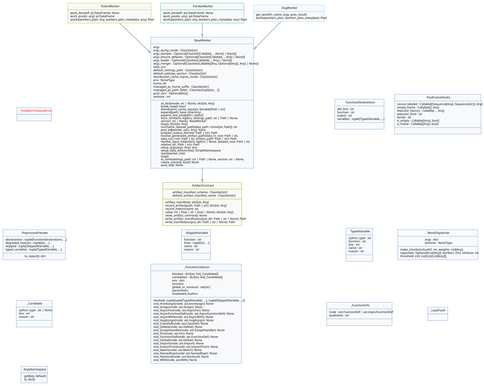
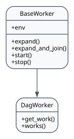
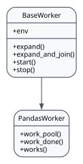
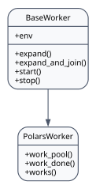

agi-node API
============

Path handling
-------------
Workers do not resolve dataset or workspace paths themselves. Path
normalisation lives in ``agi_node.agi_dispatcher.base_worker_path_support`` and
is reached through private ``BaseWorker`` helpers (``_normalized_path``,
``_share_root_path``, ``_resolve_data_dir``, ``_resolved_data_roots``). There is
no public normalisation entry point: ``BaseWorker`` applies it for you from
``setup_args``, ``from_toml``, and ``prepare_output_dir``.

What that resolution guarantees:

- Relative values are resolved against the share root, so configuration files
  can ship entries such as ``<app>/dataset`` and still land on the correct
  worker share on every host.
- UNC-style shares on Windows (for example ``\\server\share``) keep their
  double backslashes.
- Symlinks and bind mounts created by installers are preserved, and directories
  that only appear later during the run are still accepted.

The conventional argument fields are ``data_in`` and ``data_out``. ``data_uri``
was the earlier name for ``data_in``; it survives only as a legacy alias that
app argument models migrate on load — see
``src/agilab/apps/builtin/minimal_app_project/src/minimal_app/app_args.py``.
Do not introduce it in new code.

.. note::

   Earlier revisions of this page described a public
   ``BaseWorker.normalize_data_uri`` helper and a ``self.args.data_uri`` field.
   Neither exists. Call ``setup_args`` and let it resolve paths for you.

Argument helpers
----------------

Recent updates to ``BaseWorker`` standardise how workers load, merge, and persist
their argument models. Every subclass can opt into the following hooks:

- ``default_settings_path`` and ``default_settings_section`` control the TOML
  source used by ``from_toml`` / ``to_toml``.
- ``args_loader`` and ``args_merger`` are callables that fetch and combine raw
  settings with user overrides before instantiating the worker.
- ``args_ensure_defaults`` lets workers patch derived values (for example,
  normalising paths) after the merge but before instantiation.
- ``args_dumper`` and ``args_dump_mode`` define how ``to_toml`` emits the active
  configuration, enabling round-trips back into ``app_settings.toml``.

If these helpers live in the worker module (for example ``load_args`` or
``dump_args`` defined alongside the class) or inside a sibling ``*_args``/``app_args``
module, ``BaseWorker`` auto-binds them during class creation. That lets most apps
drop the explicit ``args_loader = …`` boilerplate while still allowing manual
overrides for custom integrations.

Managed PC path remapping
-------------------------

- ``managed_pc_path_fields`` lists argument attributes that should be remapped to
  the managed-machine workspace (``~/MyApp`` by default) when ``AgiEnv`` reports a
  managed PC.
- ``managed_pc_home_suffix`` customises the managed workspace folder name if your
  deployment uses something other than ``MyApp``.
- ``BaseWorker.from_toml`` applies the remapping automatically; when instantiating
  a worker manually, use ``setup_args`` to apply defaults and remap paths in a
  single call.
- ``setup_args`` optionally accepts ``output_field`` (e.g. ``"data_uri"``) along with
  ``output_subdir``, ``output_attr``, ``output_clean`` and ``output_parents_up`` so
  managers can prepare their output directories without repeating boilerplate.

Output directory helpers
------------------------

- ``prepare_output_dir`` centralises the setup of manager-side output folders
  (subdirectory ``dataframe`` by default). Hand it the base path you want to
  target and it resolves the path through the share resolver, clears old
  contents when ``clean`` is true (the default, and what ``setup_args`` passes
  as ``output_clean``), creates the directory, and stores it on
  ``self.data_out`` unless you override ``attribute``.
- It is also a validation boundary: it raises ``ValueError`` for a
  drive-relative root, for ``..`` traversal in either the root or the
  subdirectory, and for a subdirectory that is absolute. Catch it if your
  manager accepts an operator-supplied output path.

With these attributes in place, ``BaseWorker.from_toml`` produces a configured
instance and ``BaseWorker.to_toml`` writes the updated schema without each app
copying boilerplate. ``BaseWorker.as_dict`` exposes a serialisable payload for
Web pages and API consumers, while ``_extend_payload`` stays available for
apps that need to enrich the exported structure.

Reference
---------

This page documents the public worker foundation and the concrete worker types.
Operational build and hook entry points such as ``build``, ``pre_install``, and
``post_install`` remain covered in the runbook because they are packaging
tooling rather than the main API surface extended by app authors.

base_worker
~~~~~~~~~~~

.. automodule:: agi_node.agi_dispatcher.base_worker
   :members:
   :show-inheritance:

dag_worker
~~~~~~~~~~

.. automodule:: agi_node.dag_worker.dag_worker
   :members:
   :show-inheritance:

pandas_worker
~~~~~~~~~~~~~

.. automodule:: agi_node.pandas_worker.pandas_worker
   :members:
   :show-inheritance:

polars_worker
~~~~~~~~~~~~~

.. automodule:: agi_node.polars_worker.polars_worker
   :members:
   :show-inheritance:
