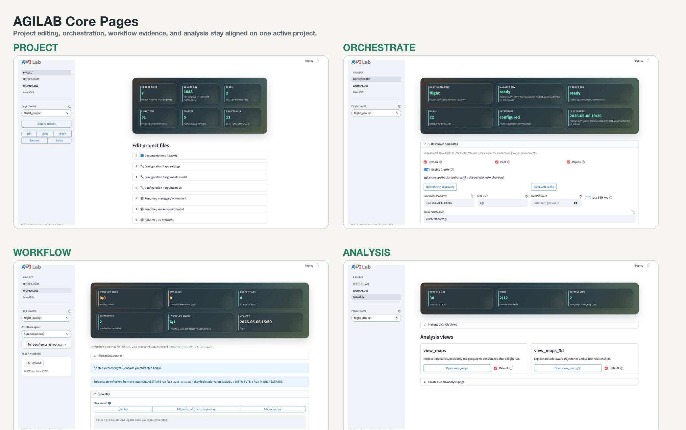

Main Page
=========

This page maps the built-in AGILab web pages and shows how they fit together.

The main web interface exposes one navigation surface for:

- **Core pages** (Project, Orchestrate, Workflow, Analysis), and
- **Page bundles and project notebooks** (optional sidecar surfaces launched
  from Analysis).

How pages are presented
-----------------------

- Core pages and page bundles both appear as “pages” in the UI, with a consistent
  layout and navigation.
- The key difference is runtime: core pages run inside the main AGILab web
  interface, while page bundles run in a sidecar web process and are embedded
  back into the UI.

Core pages
----------

- :doc:`edit-help` — **PROJECT**: inspect and modify project sources and settings.
- :doc:`execute-help` — **ORCHESTRATE**: install workers, generate distributions, and run pipelines.
- :doc:`experiment-help` — **WORKFLOW**: iterate in ``lab_stages.toml``, run snippets against exported data, and export a runnable supervisor notebook for use outside the AGILAB UI.
- :doc:`explore-help` — **ANALYSIS**: discover, configure, and launch page bundles
  and project notebooks.

Core page tour
--------------

Every built-in page now exposes direct documentation access from the sidebar,
so you can reopen the relevant guide without navigating back to the landing
page first.

   A compact visual tour of the four built-in Streamlit pages that structure the AGILAB workflow.

Page bundles
------------

Page bundles are optional dashboards stored under ``${AGILAB_PAGES_ABS}``
(default: ``src/agilab/apps-pages``). They are enabled per project via
``[pages].view_module`` in ``app_settings.toml``.

First-time navigation
---------------------

Use this as a page map, not as the newcomer proof path:

1. Open :doc:`edit-help` (Project) to inspect or select the target project.
2. Use :doc:`execute-help` (Orchestrate) to install dependencies, build
   distributions, configure distributed workers when needed, and generate a
   run snippet.
3. Move to :doc:`experiment-help` (Workflow) to import or iterate that
   generated stage in ``lab_stages.toml`` and export a runnable supervisor
   notebook when you want the pipeline outside the AGILAB UI.
4. Open :doc:`explore-help` (Analysis) to configure and launch page bundles or
   project notebooks for deeper views.

Public navigation split
-----------------------

Keep these two public paths separate:

- newcomer proof: ``flight_project`` through
  ``PROJECT -> ORCHESTRATE -> ANALYSIS``
- full tour demo: ``uav_relay_queue_project`` through
  ``PROJECT -> ORCHESTRATE -> WORKFLOW -> ANALYSIS``

That distinction keeps the docs truthful: the safest first local proof is not
the same thing as the strongest four-page product tour.

See also
--------

- :doc:`newcomer-guide` and :doc:`quick-start` for the first-proof path.
- :doc:`architecture` for the end-to-end pipeline view.
- :doc:`apps-pages` for how page bundles work (and the built-in bundle catalog).
- :doc:`distributed-workers` for the UI-driven cluster workflow from ORCHESTRATE to WORKFLOW.
- :doc:`learning-workflows` for training vs inference (and optional continuous/federated patterns).
- :doc:`demos` for the current public AGILAB demo entry points.
