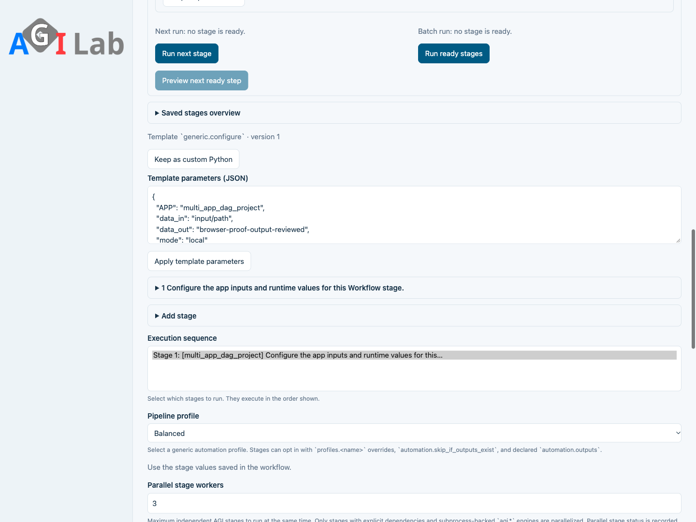
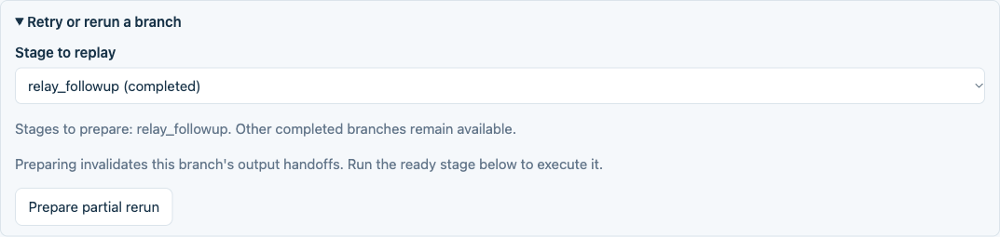
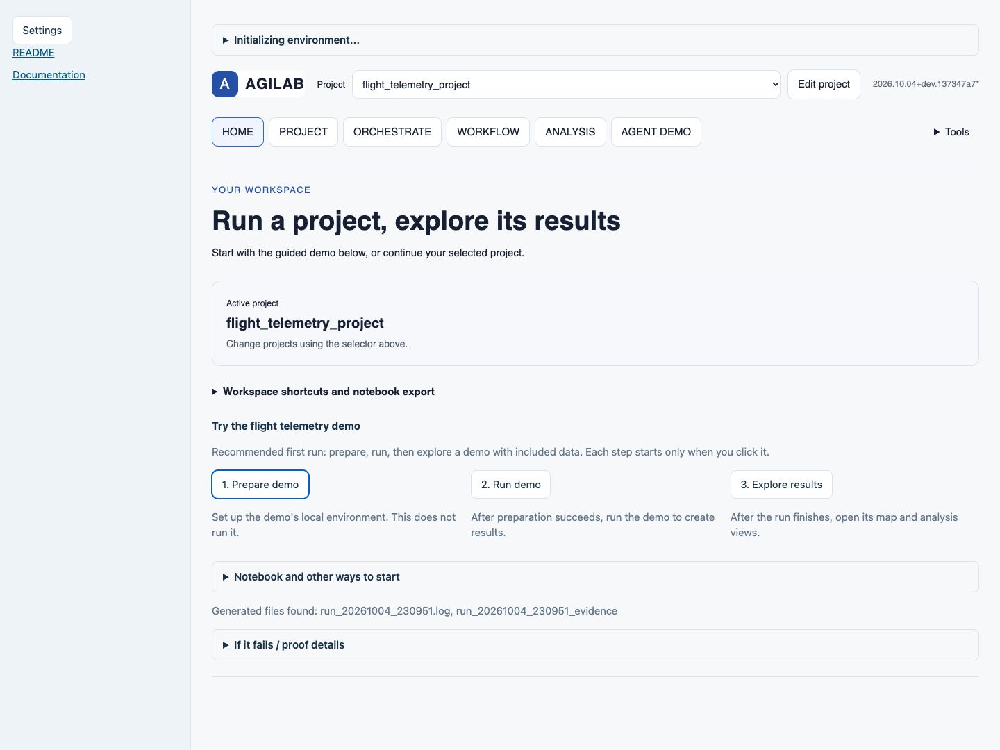
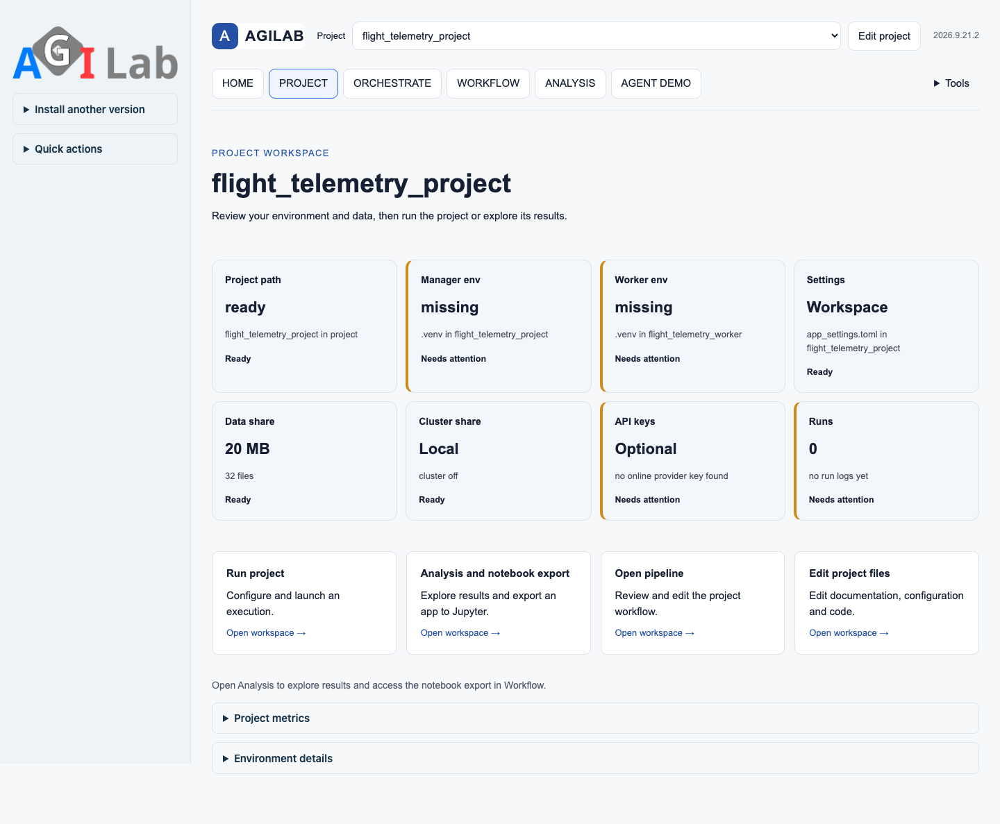
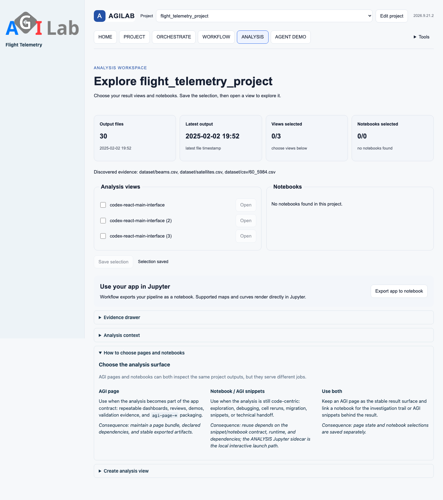
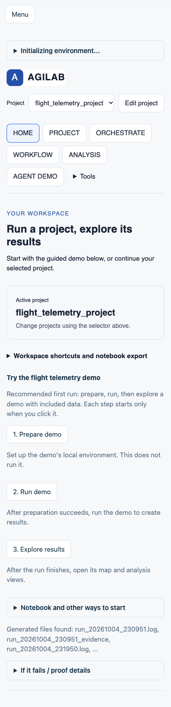

Native React UI and notebook export
===================================

AGILAB's source interface uses React and the ``agi_web`` Python view host.
The main interface, shared coordinate map and analysis curves render through
the native React host. Pipeline editing, specialised geographic views and
administration remain Python views, rendered by the same native host.

.. important::

   These instructions describe the migrated source checkout. A previously
   published PyPI wheel or hosted demonstration may still expose the interface
   of its recorded release. Local validation does not publish a new wheel or
   update a hosted Space; consult :doc:`release-proof` for published evidence.

Install and launch from source
------------------------------

The native release target is ``2026.10.04`` (normalised by PyPI to
``2026.10.4``). Once its publication is recorded in :doc:`release-proof`, a
new environment can install the UI, notebooks and promoted built-ins with::

   python -m pip install 'agilab[ui,notebook,examples]==2026.10.4'
   agilab --no-browser

Run the installed CLI outside the source checkout. The Minimal App, R Runtime
Bridge and legacy UAV Queue are also packaged, through the matching GitHub
Release distribution archive; see :doc:`public-app-catalog`. An app's Python,
scientific and external runtime prerequisites still apply. Private app
packages use their private distribution channel and are not included in
public wheels.

From the AGILAB repository root, install the UI and notebook profiles::

   uv sync --extra ui --extra notebook
   uv run --no-sync python -m agilab --no-browser

The ``ui`` profile includes the native host. The ``notebook`` profile adds the
Jupyter widget integration. App-specific scientific dependencies, models and
datasets remain the responsibility of the selected app. Worker-only and CLI
installations can continue using the headless packages without UI extras.

To open an app-owned local surface, use::

   uv run --no-sync agilab app surface pytorch_playground_project --ui react

The selected app must be installed in an environment containing its runtime
dependencies. An older ``backend = "streamlit"`` declaration is normalised to
the native React backend; it does not launch the former provider.

Keep a specialised view in Python
---------------------------------

Save this example as ``agilab_native_counter_view.py``:

.. code-block:: python

   from agi_web import python_ui as ui

   ui.title("Native Python counter")
   ui.session_state.setdefault("count", 0)

   def increment():
       ui.session_state["count"] += 1

   ui.text_input("Name", key="name")
   ui.button("Increment", on_click=increment)
   ui.write({"name": ui.session_state["name"], "count": ui.session_state["count"]})

From the source checkout, launch the view with the installed profiles::

   uv run --no-sync python -m agi_web.react_python_host agilab_native_counter_view.py --address 127.0.0.1 --port 8501 --no-browser

Controls update the Python session and execute callbacks there. State persists
across rerenders within that session. Forms submit their values together;
button events are consumed once. The browser receives rendered nodes and
assets rather than executing the app's Python code. The app remains responsible
for its computation, evidence files and external-service access.

For an app-aware page, append its arguments after ``--``::

   uv run --no-sync python -m agi_web.react_python_host VIEW.py --no-browser -- --active-app /path/to/app_project

Use loopback for local work. Any non-loopback binding requires
``AGILAB_PUBLIC_BIND_OK=1`` and an authentication or TLS indicator
(``AGILAB_AUTH_REQUIRED``, ``AGILAB_PUBLIC_AUTH`` or ``AGILAB_TLS_TERMINATED``).
Those indicators declare the surrounding deployment controls; they do not
implement authentication. See :doc:`environment` and
:doc:`trusted-shared-deployment` before shared deployment.

Render the same view inside Jupyter
-----------------------------------

In a notebook kernel with the notebook profile installed:

.. code-block:: python

   from agi_web.notebook_python_view import render_python_view

   render_python_view("agilab_native_counter_view.py")

For an app-aware view, pass ``active_app="/path/to/app_project"``. The Python
file and app directory must be available to that kernel. The returned AnyWidget
renders the controls inside the notebook, including callbacks, state and file
downloads. Its styles are isolated in a Shadow DOM. The widget transport runs
through the notebook kernel and renders the view with the native notebook adapter.

The interface embeds local React, Graphviz, Vega and mathematics assets. This
avoids a rendering dependency on a CDN. It does not make a scientific app's
models, data downloads or external services available offline automatically.

Shared map and analysis curves
------------------------------

Create a shared component from the same records used by the Python workflow:

.. code-block:: python

   from agi_web import coordinate_map_component
   from agi_web.react_analysis import render_react_notebook

   component = coordinate_map_component(
       [{"latitude": 48.85, "longitude": 2.35, "name": "Paris"}],
       label="name",
   )
   render_react_notebook(component)

``analysis_curves_component(records, x="time", series=["value"])`` provides
the corresponding curve component. Coordinate maps use the supplied
coordinates without remote map tiles. Specialised geographic pages can retain
their Python-specific renderers. The component payload and selected row
identifiers stay aligned with the app's evidence contract.

Export the host for a portable Python app
-----------------------------------------

.. code-block:: python

   from agi_web.portable_python_host import export_python_host

   export_python_host("agilab_native_counter_export/agi_web")

The export copies the native host, compiled assets and licence notices into
``agilab_native_counter_export/agi_web``. Copy ``agilab_native_counter_view.py``
and its reviewed app files into the parent ``agilab_native_counter_export/``
directory. Run the following command from that parent directory::

   python -m agi_web.react_python_host agilab_native_counter_view.py --address 127.0.0.1 --no-browser

Run the portable command with a Python interpreter available in its deployment
environment. The exported host uses the standard library. The view's own Python packages,
models, datasets and configuration must still be supplied. A static component
HTML export is useful for sharing an already computed visualisation; a Python
view or notebook widget is required when interactions must execute Python
callbacks. See :doc:`agi-web` for the component and renderer APIs.

Workflow stage ownership and branch replay
------------------------------------------

Open **Versioned stage templates** in WORKFLOW to create a structured stage,
review its parameters or resolve version and renderer drift. **Refresh from
template** is explicit; **Keep as custom Python** retains the exact code.
Editing Python in the stage editor, HISTORY or an imported notebook relinquishes
template ownership. Both notebook export modes reject stale templates.
See :doc:`roadmap/versioned-pipeline-stages` for the persisted contract and
reviewed legacy conversion with a source backup.

The multi-app runner exposes **Retry or rerun a branch**. Select a failed step
and **Prepare retry**, or a completed step and **Prepare partial rerun**.
Preparation invalidates that step, its descendants and their artifact handoffs.
Other completed results, history and artifact files remain available.

Use **Run next stage** or **Run ready stages** to execute the prepared branch
through the existing persistent DAG runner. Reloading WORKFLOW recovers the
saved revision and pending branch. An uncertain external callback requires
recovery with its exact owner and idempotency token before retry. A changed DAG
source, or an older state without its source fingerprint, requires an explicit
**Reset preview state** before replay.

   Real WORKFLOW controls in an isolated source-checkout proof. Template
   parameters were saved, edited and recovered after reload.

   The branch replay controls use the persistent runner. This capture uses
   synthetic app callbacks to verify UI and persistence; it does not demonstrate
   business computation or a cloud run.

Recover and re-export an imported notebook
------------------------------------------

WORKFLOW preserves the complete source notebook in its hash-verified import
contract, including cell IDs and order, markdown and raw cells, empty cells,
attachments, outputs, custom metadata and kernel metadata. Download the original
source or the source with reviewed code edits from WORKFLOW. Edited cells lose
their stale outputs and execution counters; provenance records both hashes.

For the command-line route::

   python -m agilab.notebooks.notebook_pipeline_import source-export \
     --contract notebook_import_contract.json \
     --output agilab_authored_notebook_recovered.ipynb

Add ``--cell-edits agilab_reviewed_notebook_cell_edits.json`` for reviewed source
cell edits. A composite compiled stage cannot always be split safely into its
original cells; WORKFLOW diagnoses this case and keeps the original recoverable.

Foreign kernels and unsupported shell or magic cells remain diagnosed rather
than silently rewritten. To explicitly convert a supported setup cell, repeat
``--convert-setup-cell CELL_ID``. Simple plain-index ``%pip`` or ``!pip install``
requirements become declared dependencies; import does not install them.
``%matplotlib inline`` becomes an acknowledged non-interactive backend.
Successive conversions retain prior dependency declarations and source
provenance. Other shell commands and foreign-language magics require review in
the source notebook.

See :doc:`notebook-advanced` for the import and recovery boundary.

Installed interface examples
----------------------------

These captures use the installed UI and notebook wheels with the actual
built-in flight telemetry project. They illustrate the local migration; they
do not claim that a public release or hosted Space has been updated.

   Home links the selected project to execution, analysis and notebook export.

   The retained Python PROJECT view is rendered by the React host.

   ANALYSIS discovers the installed specialised views.

   The same interface adapts to a mobile viewport. Mobile captures of
   `PROJECT <_static/native-ui/agilab_native_react_main_project_mobile.png>`_
   and `ANALYSIS <_static/native-ui/agilab_native_react_main_analysis_mobile.png>`_
   are also available.
