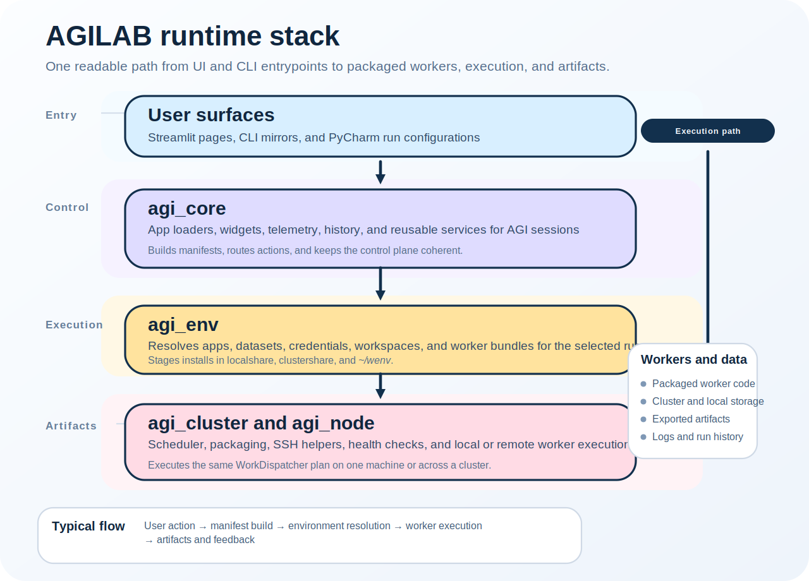

AGILab
========

This page is the entry point for the AGILab web interface.

It describes the UI surface, the built-in pages, and the Python module
reference behind that interface.

The web interface exposes a set of built-in pages plus optional app-specific
dashboards called page bundles.

For newcomer onboarding, start with :doc:`newcomer-guide` and
:doc:`quick-start`.

For current shipped capabilities, see :doc:`features`.

For toolchain fit and framework comparison, see :doc:`agilab-mlops-positioning`.

See:

- :doc:`agilab-help` for the landing page entry point.
- :doc:`edit-help`, :doc:`execute-help`, :doc:`experiment-help`, :doc:`explore-help` for the built-in pages.
- :doc:`apps-pages` for page bundles (sidecar dashboards).

Reference
---------

.. automodule:: agilab
   :members:
   :undoc-members:
   :show-inheritance:

.. automodule:: agilab.lab_run
   :members:
   :undoc-members:
   :show-inheritance:
