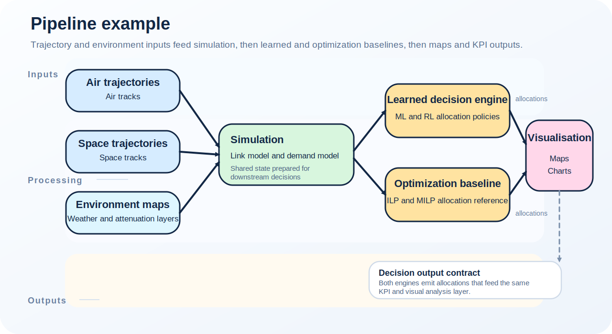
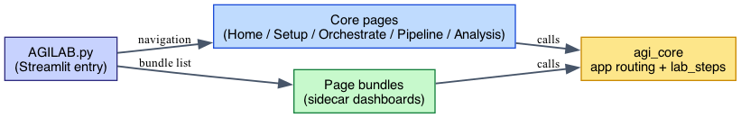
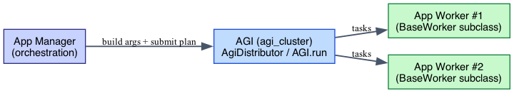
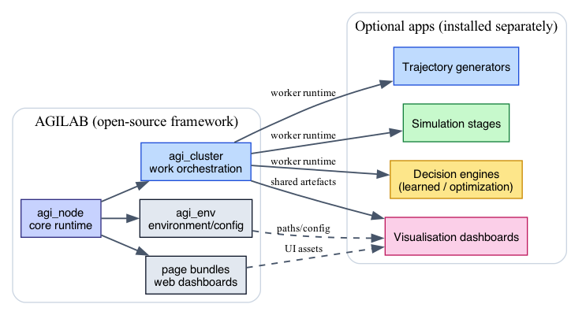

AGILab Architecture
===================

This page gives a single place to understand how the repository is organised,
which services collaborate at runtime, and where to hook in when building a new
app or extending the platform.

New to AGILab? Start with :doc:`quick-start` for a first run, use
:doc:`architecture-five-minutes` for the compact layer map, then return here
when you need the big picture of how the layers fit together.

.. figure:: Agilab-Overview.svg
   :alt: High-level view of AGILab runtime
   :class: diagram-panel diagram-hero

   AGILab layers from the web interface down to worker clusters.

Component view
--------------

.. figure:: diagrams/packages_agi_distributor.svg
   :alt: Package diagram generated from agi_cluster
   :class: diagram-panel diagram-standard

   Pyreverse snapshot of how the web interface entry points, ``agi_core`` façade,
   ``agi_env`` and ``agi_cluster`` exchange data before the workers are started.

Pipeline example
----------------

   Data flows from trajectory generators and environment maps into simulation
   stages, decision engines (learned and/or optimization baselines), and finally
   visualisation and KPI reporting.

agilab.py navigation
--------------------

   agilab.py exposes core pages (PROJECT/ORCHESTRATE/WORKFLOW/ANALYSIS) and optional page bundles
   (sidecar dashboards), all routed into ``agi_core`` for orchestration.

Manager vs worker responsibilities
----------------------------------

   An app manager prepares arguments and submits plans via ``AGI.run``; workers
   (BaseWorker subclasses) execute the distributed tasks.

   Why setup.py exists: Dask serialises and ships worker code as .egg archives.
   setup.py is the build hook that generates those archives when the cluster is initialised.
   It has no role in the PyPI release pipeline — that is handled entirely by pyproject.toml and uv.

Layers at a glance
------------------

.. list-table:: Layer responsibilities
   :widths: 20 80
   :header-rows: 1

   * - Layer / Code roots
     - What it does
   * - **User surfaces**
     - Web interface pages (``src/agilab/pages``) plus CLI mirrors in
       ``src/agilab/examples`` and ``tools/run_configs``. They capture user
       intent and translate it into ``AGI.*`` calls.
   * - **agi_core**
     - Reusable widgets, telemetry, app loaders. Keeps web-UI/CLI code thin
       and prepares ``WorkDispatcher`` manifests. See :doc:`agi-core-architecture`.
   * - **agi_env**
     - Discovers datasets, resolves symlinks, stages bundles in ``~/wenv`` and
       prepares environment variables. Every run builds an ``AgiEnv`` first.
   * - **agi_cluster / agi_node**
     - Scheduler, workers, balancer, SSH/zip helpers. Turns manifests into Dask
       jobs locally or on remote hosts.
   * - **Apps (``src/agilab/apps``)**
     - Project-specific logic. App managers describe ``build_distribution`` and
       worker arguments but rely on the shared layers above.
   * - **Workers (``~/wenv/<app>_worker``)**
     - Cythonised/packaged code deployed on cluster nodes.

**User surfaces**
    - Web interface pages shipped in ``src/agilab/pages`` (PROJECT/ORCHESTRATE/WORKFLOW/ANALYSIS).
    - CLI mirrors under ``src/agilab/examples`` and ``tools/run_configs``.
    - ``tools/run_configs/*.sh`` can be executed directly from a terminal (no
      PyCharm required).
    - Example scripts in ``src/agilab/examples`` (kept in sync via
      ``pycharm/setup_pycharm.py``).

**Core services**
    - :doc:`agi-env` handles configuration, environment discovery, dataset
      staging and artifact caching. Every entry point constructs an ``AgiEnv``
      before touching a worker.
    - :doc:`agi-node` and :doc:`agi-distributor` package the reusable logic shared
      between all apps (dataset helpers, worker bootstrap, git/LFS utilities…).
    - :doc:`framework-api` exposes ``AGI.run`` / ``AGI.get_distrib`` /
      ``AGI.install`` orchestration.
    - Apps under ``src/agilab/apps`` stay isolated but consume the same base
      worker / dispatcher APIs. The repository includes example app templates
      such as ``mycode_project``, ``flight_telemetry_project``, and the lightweight
      ``UAV Relay Queue`` demo (install id ``uav_relay_queue_project``); additional
      templates can follow the same contract.
    - AGILAB is intentionally a **two-runtime system**:

      - the manager/runtime side resolves settings, UI state, snippets, and orchestration
      - the worker/runtime side runs the packaged worker code from ``~/wenv/<app>_worker``

      This split is why manager imports and worker imports are different
      contracts. A dependency or path can be valid on the manager side and
      still be missing or packaged differently on the worker side.

**Execution back-plane**
    - :doc:`agi-distributor` contains the Dask-based scheduler, worker templates and
      capacity-weighted work-plan balancer. Workers are packaged
      (``python -m agi_node…``) into ``~/wenv/<app>_worker`` before run time.
    - Optional cluster helpers (SSH, remote installs, zip staging) live under
      ``src/agilab/core/agi-node/agi_dispatcher`` and are reused by every app.
    - AGILAB submits one coarse AGILAB task per worker to the outer Dask
      scheduler. The code that runs inside ``BaseWorker.works(...)`` is
      intentionally opaque to that outer scheduler.
    - This boundary is deliberate. It keeps the worker contract stable across
      plain local, pool-based, and Dask-based execution modes, reduces coupling
      between app code and Dask internals, and keeps packaging/deployment at
      one worker-runtime granularity.
    - This means nested execution inside a worker is not first-class AGILAB
      telemetry. If a worker starts its own inner Dask client or scheduler, the
      outer Dask/Bokeh dashboard only sees the outer AGILAB worker future, not
      the inner task graph.
    - In practice, treat Dask as the cluster back-plane for AGILAB workers, not
      as the supported inner orchestration engine inside one worker process.

Runtime flow
------------

1. A run configuration (web button, CLI script, PyCharm run config) calls
   an example in ``src/agilab/examples/<app>/AGI_run_*.py``.
2. The script instantiates ``AgiEnv`` with the desired ``apps_dir`` and ``app``.
   ``AgiEnv`` resolves symlinks, copies optional data bundles, seeds
   ``~/.agilab/apps/<app>/app_settings.toml`` from the app's versioned
   source ``app_settings.toml`` (``<project>/app_settings.toml`` or
   ``<project>/src/app_settings.toml``) when needed, and loads overrides from
   that workspace copy.
3. ``AGI.run`` (or ``AGI.get_distrib`` / ``AGI.install``) selects the dispatcher
   mode, builds or reuses the worker wheel, and starts a scheduler locally or on
   the configured SSH hosts.
   The manager/runtime process does not execute the worker logic directly; it
   prepares and dispatches the worker/runtime package.
4. :doc:`agi-distributor` spins up workers, streams ``WorkDispatcher`` plans derived
   from the app manager, and feeds telemetry back into the capacity predictor.
5. Results land in ``~/agi-space`` (for end users) or the repo ``data``/``export``
   folders (for developers), while logs are mirrored to
   ``~/log/execute/<app>/`` for reproducibility.

Apps choose their own distribution unit. For example, the ``UAV Relay Queue``
demo (install id ``uav_relay_queue_project``) fans out one scenario JSON file per
worker and writes each run into its own output directory so distributed runs
can keep per-scenario artifacts isolated.

Two common execution modes:

- **Local notebook / laptop** – scheduler + workers run on the same machine.
  Use this for prototyping and keep an eye on ``~/log/execute/<app>/`` for
  telemetry.
- **Cluster / SSH hosts** – scheduler runs locally, workers spawn remotely via
  the SSH helpers in ``agi_cluster.agi_distributor``. Provide credentials via
  ``~/.agilab/.env`` and rerun ``pycharm/setup_pycharm.py`` after editing run
  configurations so CLI wrappers stay synced.

Repository map
--------------

.. literalinclude:: directory-structure.txt
   :language: none
   :caption: Tracked repository tree snapshot

Refresh the tracked tree after repository-layout changes by updating ``docs/source/directory-structure.txt`` from a clean checkout.

Core vs optional apps
---------------------

   AGILAB (open-source framework) underpins optional apps that can be installed
   separately. Public docs only cover the open-source layers and built-in apps.

Documentation map
-----------------

- :doc:`quick-start` – install/run instructions and links to sample commands.
- :doc:`introduction` – background, motivation, and terminology.
- :doc:`agi-core-architecture` – internals of the web-interface/CLI façade.
- :doc:`framework-api` – reference for ``AGI.run`` and the dispatcher helpers.

See also
--------

- :doc:`directory-structure` for details on each top-level folder.
- :doc:`framework-api` for the public ``AGI.*`` orchestration helpers.
- :doc:`agi-env` for environment bootstrapping and dataset handling.
