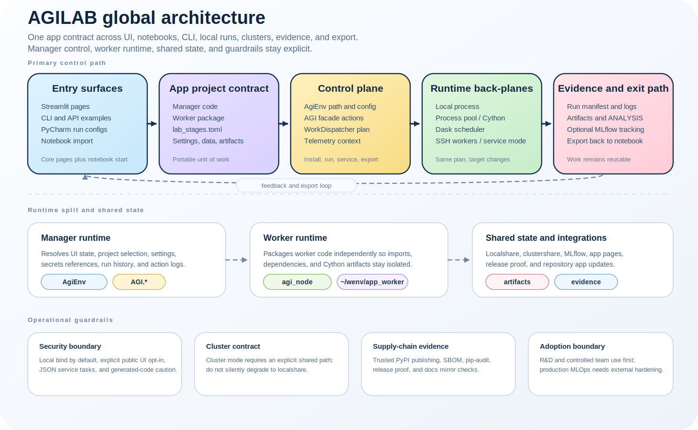
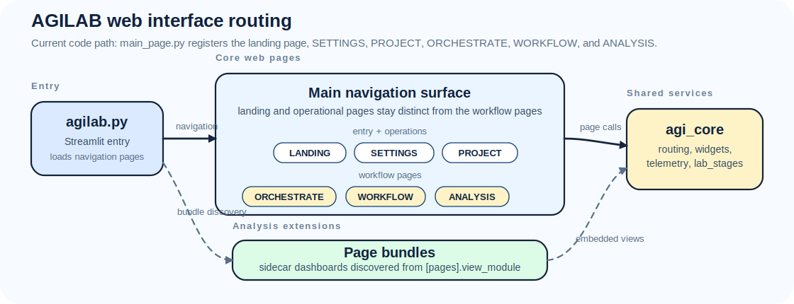
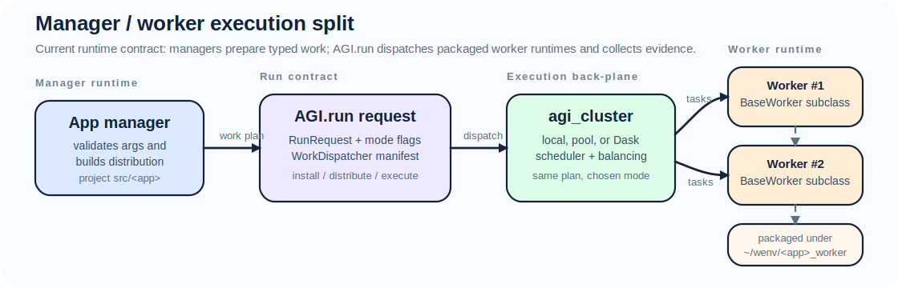
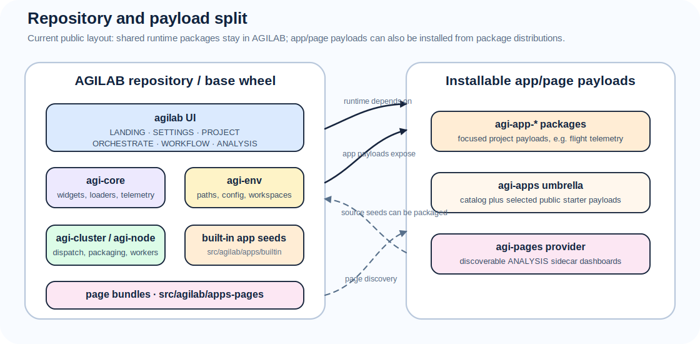

AGILab Architecture
===================

This page gives a single place to understand how the repository is organised,
which services collaborate at runtime, and where to hook in when building a new
app or extending the platform.

New to AGILab? Start with :doc:`quick-start` for a first run, use
:doc:`architecture-five-minutes` for the compact layer map, then return here
when you need the big picture of how the layers fit together.

The short version is:

.. code-block:: text

   UI / CLI / notebook
     -> AgiEnv
     -> AGI.run / AGI.install / AGI.get_distrib
     -> worker packaging
     -> local, pool, Dask, or SSH execution
     -> artifacts, evidence, ANALYSIS, notebook export

Everything else in this page explains who owns each part of that path.

   Global AGILAB architecture from entry surfaces to the reusable app contract,
   runtime back-planes, evidence, portability, and operational guardrails.

Component view
--------------

.. figure:: diagrams/packages_agi_distributor.svg
   :alt: Package diagram generated from agi_cluster
   :class: diagram-panel diagram-standard

   Pyreverse snapshot of how the web interface entry points, ``agi_core`` façade,
   ``agi_env`` and ``agi_cluster`` exchange data before the workers are started.

Pipeline example
----------------

.. figure:: diagrams/pipeline_example.svg
   :alt: Pipeline example from trajectories and environment maps to visualisation
   :class: diagram-panel diagram-hero

   Data flows from trajectory generators and environment maps into simulation
   stages, decision engines (learned and/or optimization baselines), and finally
   visualisation and KPI reporting.

agilab.py navigation
--------------------

   agilab.py exposes the landing and SETTINGS entry points plus core workflow pages
   (PROJECT/ORCHESTRATE/WORKFLOW/ANALYSIS) and optional page bundles, all routed
   into ``agi_core`` for orchestration.

Manager vs worker responsibilities
----------------------------------

   An app manager prepares arguments and submits a ``WorkDispatcher`` plan through
   ``AGI.run``; the selected local/pool/Dask back-plane executes packaged
   worker runtimes.

   ``setup.py`` exists only for the worker-dispatch packaging path: some
   distributed upload paths still serialize worker code as egg archives. Public
   PyPI release packaging is handled by ``pyproject.toml`` and ``uv``.

Runtime ownership
-----------------

.. list-table::
   :widths: 22 34 44
   :header-rows: 1

   * - Role
     - Main code roots
     - Contract
   * - **User surfaces**
     - ``src/agilab/pages``, ``src/agilab/examples``, ``tools/run_configs``
     - Capture user intent and translate it into the public ``AGI.*`` actions.
   * - **Framework helpers**
     - ``agi_core``, ``agi_gui``
     - Keep pages and CLI mirrors thin: app loading, shared widgets, telemetry,
       and UI/page helpers.
   * - **Environment resolver**
     - ``agi_env``
     - Build an ``AgiEnv`` for the active project: paths, settings, shares, logs,
       and runtime environment variables.
   * - **Execution facade**
     - ``agi_cluster.agi_distributor.AGI``
     - Expose ``install``, ``get_distrib``, ``run``, and service actions used by
       both UI and automation.
   * - **Worker packaging and runtime**
     - ``agi_node``, ``~/wenv/<app>_worker``
     - Package worker code, bootstrap worker environments, and run app-specific
       stages.
   * - **Execution back-plane**
     - local process, pool, Dask, SSH workers
     - Execute one coarse AGILAB work item per worker and return artifacts,
       logs, and telemetry.
   * - **Apps**
     - ``src/agilab/apps`` and packaged ``agi-app-*`` payloads
     - Keep project-specific manager code, worker code, settings, datasets, and
       examples behind the common app contract.

Package names versus runtime roles
----------------------------------

Some names are close but not interchangeable:

- ``agi_core`` is the shared app/page framework helper layer. It is not the
  worker runtime.
- ``agi_gui`` contains Streamlit-facing helpers and must stay out of headless
  worker manifests.
- ``agi_env`` resolves the selected app, settings, logs, workspace paths, and
  environment variables.
- ``agi_node`` owns worker bootstrap, worker base classes, and worker packaging.
- ``agi_cluster`` exposes the ``AGI`` facade and the distributor that dispatches
  local, pool, Dask, or SSH runs.
- ``agi-distributor`` is the documentation/API page name for the distributor
  implemented under ``agi_cluster.agi_distributor``.

Manager and worker dependency rule
----------------------------------

AGILAB is intentionally a two-runtime system. The manager/runtime side resolves
settings, UI state, snippets, and orchestration. The worker/runtime side runs
the packaged worker code from ``~/wenv/<app>_worker``.

That split is why manager imports and worker imports are different contracts. A
dependency or path can be valid on the manager side and still be missing or
packaged differently on the worker side.

Practical rule:

- put UI and orchestration dependencies in the app project manifest
- put compute-stage dependencies in ``src/<app>_worker/pyproject.toml``
- do not put Streamlit or page-only dependencies in worker manifests
- when a worker install fails, compare the source worker manifest with the
  deployed copy under ``~/wenv/<app>_worker`` before changing app code

Execution back-plane boundary
-----------------------------

:doc:`agi-distributor` contains the Dask-based scheduler, worker templates, and
capacity-weighted work-plan balancer. Optional cluster helpers for SSH, remote
installs, and zip staging live under ``src/agilab/core/agi-node`` and are reused
by every app.

AGILAB submits one coarse AGILAB task per worker to the outer Dask scheduler.
The code that runs inside ``BaseWorker.works(...)`` is intentionally opaque to
that outer scheduler. This keeps the worker contract stable across plain local,
pool-based, and Dask-based execution modes.

If a worker starts its own inner Dask client or scheduler, the outer Dask/Bokeh
dashboard only sees the outer AGILAB worker future, not the inner task graph.
Treat Dask as AGILAB's cluster back-plane for workers, not as a supported inner
orchestration engine inside one worker process.

Runtime flow
------------

1. A web button, CLI script, notebook, or run configuration selects an app and
   prepares run parameters.
2. The entry point instantiates ``AgiEnv`` with the selected app. ``AgiEnv``
   resolves symlinks, copies optional data bundles, seeds
   ``~/.agilab/apps/<app>/app_settings.toml`` from the app's versioned
   source ``app_settings.toml`` (``<project>/app_settings.toml`` or
   ``<project>/src/app_settings.toml``) when needed, and loads overrides from
   that workspace copy.
3. ``AGI.run`` (or ``AGI.get_distrib`` / ``AGI.install``) selects the dispatcher
   mode, builds or reuses the worker wheel, and starts a scheduler locally or on
   the configured SSH hosts.
   The manager/runtime process does not execute the worker logic directly; it
   prepares and dispatches the worker/runtime package.
4. :doc:`agi-distributor` starts workers, streams ``WorkDispatcher`` plans
   derived from the app manager, and feeds telemetry back into the capacity
   predictor.
5. Results land in ``~/agi-space`` (for end users) or the repo ``data``/``export``
   folders (for developers), while logs are mirrored to
   ``~/log/execute/<app>/`` for reproducibility.

Apps choose their own distribution unit. For example, the ``UAV Relay Queue``
demo (install id ``uav_relay_queue_project``) fans out one scenario JSON file per
worker and writes each run into its own output directory so distributed runs
can keep per-scenario artifacts isolated.

Two common execution modes:

- **Local notebook / laptop** – scheduler + workers run on the same machine.
  Use this for prototyping and keep an eye on ``~/log/execute/<app>/`` for
  telemetry.
- **Cluster / SSH hosts** – scheduler runs locally, workers spawn remotely via
  the SSH helpers in ``agi_cluster.agi_distributor``. Provide credentials via
  ``~/.agilab/.env`` and rerun ``pycharm/setup_pycharm.py`` after editing run
  configurations so CLI wrappers stay synced.

Repository map
--------------

.. literalinclude:: directory-structure.txt
   :language: none
   :caption: Tracked repository tree snapshot

Refresh the tracked tree after repository-layout changes by updating ``docs/source/directory-structure.txt`` from a clean checkout.

Core vs optional apps
---------------------

   AGILAB contains the shared runtime plus public built-in seeds; focused
   ``agi-app-*`` and ``agi-pages`` payloads make the same app/page contracts
   installable without depending on a source checkout.

Documentation map
-----------------

- :doc:`quick-start` – install/run instructions and links to sample commands.
- :doc:`introduction` – background, motivation, and terminology.
- :doc:`agi-core-architecture` – internals of the web-interface/CLI façade.
- :doc:`framework-api` – reference for ``AGI.run`` and the dispatcher helpers.

See also
--------

- :doc:`directory-structure` for details on each top-level folder.
- :doc:`framework-api` for the public ``AGI.*`` orchestration helpers.
- :doc:`agi-env` for environment bootstrapping and dataset handling.
