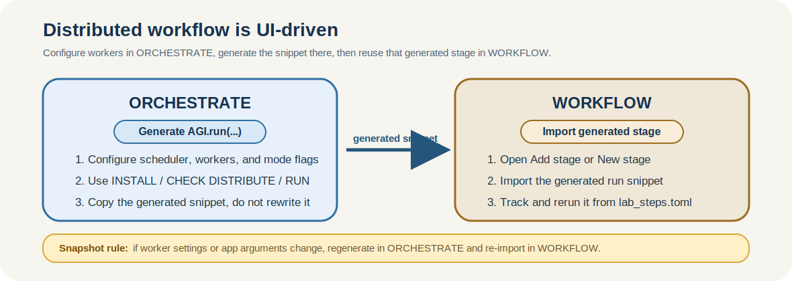
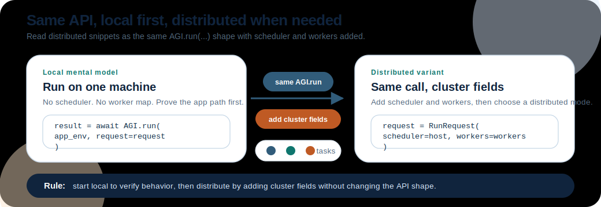

Distributed Workers
===================

AGILAB supports distributed execution across remote worker machines, but the
usual workflow is UI-driven rather than handwritten.

.. important::

   You usually do not write ``AGI.install(...)`` or ``AGI.run(...)`` by hand.
   Configure the cluster in **ORCHESTRATE**, let AGILAB generate the snippet,
   then import or regenerate that generated stage in **WORKFLOW**.

For most users, the recommended sequence is:

1. Configure scheduler, workers, and execution flags in :doc:`execute-help`.
2. Let **ORCHESTRATE** generate the ``AGI.install(...)``,
   ``AGI.get_distrib(...)``, or ``AGI.run(...)`` snippet for the current setup.
3. Reuse that generated snippet in :doc:`experiment-help` when you want the
   distributed run to become a reproducible WORKFLOW stage.

You normally do not start by writing cluster orchestration code from scratch.

   The supported workflow is configure in ORCHESTRATE, generate the snippet there, then reuse that generated stage in WORKFLOW.

Prerequisites
-------------

Before configuring distributed workers, make sure the environment is ready:

- The machine running AGILAB can reach every worker over the network.
- SSH access works non-interactively from the manager to every worker.
- Use the real login user for each worker. Do not assume ``agi`` unless that
  host really exposes an ``agi`` account. Prefer explicit ``user@host``
  notation whenever the username is not obvious.
- A shared writable cluster path is visible on every node. The scheduler-side
  root is ``AGI_CLUSTER_SHARE``; remote workers can see the same backing storage
  through an SSHFS mount at **Workers Data Path**. In cluster mode, do not rely
  on ``AGI_LOCAL_SHARE`` as a fallback.
- The shared-path rule above applies to remote workers. For a local-only Dask
  cluster, where workers are ``127.0.0.1`` or ``localhost``, the scheduler and
  workers share the same local filesystem. ``AGI_CLUSTER_SHARE`` may therefore
  be a normal local path, including APFS on macOS, and **Workers Data Path** does
  not need to point to an SSHFS mount.
- In multi-user environments, each operator uses a separate cluster-share root.
  Do not let several users write into the same ``AGI_CLUSTER_SHARE`` tree.
- ``uv`` and the required Python runtime are available on the manager and the
  remote workers.
- Worker installation uses non-interactive SSH. AGILAB prepends
  ``$HOME/.local/bin`` to remote commands, so user-local ``uv`` installs are
  valid as long as ``$HOME/.local/bin/uv`` exists on each worker.
- A Windows machine can be used as the AGILAB UI/manager when the OpenSSH
  client is available; LAN discovery reads Windows ``ipconfig`` / ARP output as
  a convenience. Remote cluster workers are still expected to expose a POSIX
  shell environment such as Linux or macOS. Native Windows workers are a
  separate support target because worker probing, SSHFS setup, and generated
  install/run commands currently assume POSIX tools.
- Dask is a cluster runtime dependency. When Dask mode is enabled, AGILAB adds
  ``dask[distributed]`` to the generated worker environment before starting the
  remote ``dask worker`` process. Do not duplicate it in an app worker manifest
  unless the app code imports Dask directly.
- The target app can be installed cleanly before you scale it to more nodes.

Use :doc:`key-generation`, :doc:`environment`, and :doc:`troubleshooting` if
any of those assumptions are not already true.

Stage 1: Configure Distributed Execution in ORCHESTRATE
-------------------------------------------------------

Open :doc:`execute-help` and use **System settings** as the source of truth for
cluster execution.

Typical distributed settings include:

- enabling the Dask / cluster execution path
- choosing the scheduler host
- defining the worker host map (for example ``{"192.168.1.21": 1, "192.168.1.22": 1}``)
- enabling or disabling ``pool``, ``cython``, and ``rapids`` according to the
  worker capabilities

When cluster mode is enabled from ORCHESTRATE, AGILAB first tries to populate
the scheduler and worker fields from LAN discovery. Treat that as a convenience
bootstrap: inspect the discovered values, keep only hosts that pass your SSH and
share checks, and override the fields manually when discovery misses a node or
finds a host you do not want to use.

These values are persisted in the per-user workspace copy of
``app_settings.toml``, so future snippet generations stay aligned with the same
cluster definition.

The share directory should follow the same isolation rule: one user, one share
root. Keep worker installation files, datasets, and cluster-visible outputs in
a per-user cluster-share path instead of a common writable directory shared by
multiple operators. Generated snippets remain under the local ``AGI_LOG_DIR``
workspace.

.. figure:: _static/page-shots/orchestrate-page.png
   :alt: Screenshot of the ORCHESTRATE page showing deployment toggles and generated setup code.
   :align: center
   :class: diagram-panel diagram-wide

   ORCHESTRATE is where you define worker settings and generate the snippets used for install, distribution, and run.

Stage 2: Let ORCHESTRATE Generate the Snippet
---------------------------------------------

Once the distributed settings are configured, ORCHESTRATE generates the
deployment and execution code for you.

Use the generated sections in this order:

- **Install** to generate and run the ``AGI.install(...)`` snippet that stages
  the worker runtime on the selected nodes
- **Distribute** to generate ``AGI.get_distrib(...)`` and inspect how the work
  plan is partitioned before running it
- **Run** to generate the final ``AGI.run(...)`` snippet for the configured
  distributed setup
- **Notebook** to download the generated orchestration recipe as a runnable
  ``.ipynb`` handoff artifact when you want to review or share the current
  install/distribute/run setup outside the UI

Treat these snippets as generated operational artifacts, not as examples you
must manually reconstruct first.

Reading ``mode`` and ``modes_enabled``
--------------------------------------

The generated install and run snippets usually contain one of these fields:

.. list-table::
   :header-rows: 1
   :widths: 18 18 64

   * - Field
     - Typical snippet
     - Meaning
   * - ``modes_enabled``
     - ``AGI.install(...)``
     - Bitmask of the execution capabilities that should be staged during
       install.
   * - ``mode``
     - ``AGI.run(...)``
     - One concrete execution mode selected for the current run.

Both use the same bit values derived from the ORCHESTRATE toggles:

.. list-table::
   :header-rows: 1
   :widths: 20 14 66

   * - Toggle
     - Bit value
     - Meaning
   * - ``pool``
     - ``1``
     - Worker-pool execution path; backend may be process- or thread-based.
   * - ``cython``
     - ``2``
     - Compiled worker path when a Cython build exists.
   * - ``cluster_enabled``
     - ``4``
     - Distributed Dask scheduler / remote worker execution.
   * - ``rapids``
     - ``8``
     - RAPIDS / GPU execution path when supported by the target workers.

So a value such as ``13`` means ``4 + 8 + 1``:
distributed cluster execution, with ``rapids`` and ``pool`` enabled. A value
of ``15`` means all four flags are enabled.

You normally do not enter these integers yourself. ORCHESTRATE computes them
from the current cluster toggles and inserts the decoded value into the
generated snippet.

Quick UI Walkthrough
--------------------

Use this short checklist the first time:

1. In **ORCHESTRATE**, open **System settings** and enter the scheduler host and
   worker map.
2. Use **INSTALL** to stage the worker runtime on the selected machines.
3. Use **CHECK DISTRIBUTE** to inspect the generated ``AGI.get_distrib(...)``
   plan and confirm the partitions land on the intended workers.
4. Use **RUN** to generate the current ``AGI.run(...)`` snippet for that setup.
5. In **WORKFLOW**, open **Add stage** or **New stage**, then import or regenerate
   that generated run stage instead of rewriting it manually.

Equivalent Generated Snippets
-----------------------------

If you want the simplest mental model first, start with a local-only run:

   Read distributed snippets as the same ``AGI.run(...)`` call with a few extra cluster fields.

.. code-block:: python

   import asyncio

   from agi_cluster.agi_distributor import AGI, RunRequest
   from agi_env import AgiEnv

   async def main():
       app_env = AgiEnv(app="mycode_project", verbose=1)
       request = RunRequest(mode=AGI.PYTHON_MODE)
       result = await AGI.run(app_env, request=request)
       print(result)

   asyncio.run(main())

That is the same API, but without scheduler, workers, or distributed flags.

Once that mental model is clear, the distributed variant is the same call with
the cluster fields filled in:

ORCHESTRATE emits a snippet equivalent to the current UI configuration. A
distributed ``AGI.run(...)`` snippet typically looks like this:

.. code-block:: python

   import asyncio

   from agi_cluster.agi_distributor import AGI, RunRequest
   from agi_env import AgiEnv

   async def main():
       app_env = AgiEnv(app="mycode_project", verbose=1)
       workers = {
           "192.168.1.21": 1,  # one worker slot on host 1
           "192.168.1.22": 1,  # one worker slot on host 2
       }
       request = RunRequest(
           scheduler="192.168.1.10",
           workers=workers,
           mode=AGI.DASK_MODE,
       )
       result = await AGI.run(app_env, request=request)
       print(result)

   asyncio.run(main())

In normal usage, you get this from ORCHESTRATE after setting the scheduler and
worker hosts in the UI.

Stage 3: Validate the Distribution Before Running
-------------------------------------------------

Before launching a large distributed run, use **CHECK DISTRIBUTE** in
ORCHESTRATE.

This gives you:

- the generated ``AGI.get_distrib(...)`` snippet
- a **Distribution tree** view of the current work plan
- the **Workplan** editor so you can reassign partitions to different workers

This stage is the fastest way to catch obvious mismatches such as:

- too many partitions for the selected workers
- all partitions being assigned to one host
- cluster settings changed in the UI but an old run snippet still being reused

Stage 4: Reuse the Generated Snippet in WORKFLOW
------------------------------------------------

When the distributed run should become part of a repeatable workflow, move to
:doc:`experiment-help`.

The normal reuse path is:

1. Generate the install / distribute / run snippet in ORCHESTRATE.
2. On **WORKFLOW**, open **Add stage** (or **New stage** on a fresh lab).
3. Import the generated snippet as the stage source, or regenerate it from the
   latest current settings.
4. Run the imported stage from WORKFLOW so the distributed orchestration becomes
   part of ``lab_stages.toml`` and the tracked experiment history.

Important: imported snippets are snapshots. If you change worker hosts,
execution flags, or app arguments in ORCHESTRATE, regenerate or re-import the
snippet before running it again in WORKFLOW.

.. figure:: _static/page-shots/workflow-page.png
   :alt: Screenshot of the WORKFLOW page showing the lab-stage workspace where generated snippets are imported and rerun.
   :align: center
   :class: diagram-panel diagram-wide

   WORKFLOW is where the generated distributed snippet becomes a tracked, reusable stage in ``lab_stages.toml``.

Best Practices
--------------

Use these habits to keep distributed runs predictable:

- Start with one local scheduler and one remote worker before scaling to many
  nodes.
- Treat ``AGI_CLUSTER_SHARE`` as the scheduler-side source path and
  **Workers Data Path** as the worker-side SSHFS mount target. These paths may
  differ on mixed operating systems, for example a macOS scheduler path mounted
  under a Linux worker home directory, but they must expose the same backing
  storage after SSHFS is mounted.
- Keep local-only and remote-worker clusters distinct. Local-only clusters can
  use a local ``AGI_CLUSTER_SHARE`` path directly; remote-worker clusters need a
  worker-visible shared mount target in **Workers Data Path**.
- Keep worker SSHFS prerequisites explicit: ``sshfs`` must be installed, the
  worker must be able to SSH back to the scheduler, and the scheduler host key
  should already be present in the worker ``known_hosts`` file. AGILAB uses
  reconnect/keepalive options and strict host-key checking rather than silently
  accepting new scheduler keys.
- Keep cluster share and local share conceptually separate. In cluster mode,
  outputs should land on the shared cluster path, not silently on local-only
  storage.
- Re-run **INSTALL** after dependency changes, worker-environment changes, or
  app updates that affect imports.
- Use **CHECK DISTRIBUTE** before expensive runs so the partitioning matches the
  intended worker layout.
- Size worker counts to the actual workload. More workers do not automatically
  mean better performance if the work plan is small or heavily serialized.
- Keep generated snippets in sync with the current UI state. Do not assume an
  older exported script still matches the latest app configuration.

Troubleshooting
---------------

Common distributed setup failures usually fall into one of these categories:

- **INSTALL hangs or never starts remotely**: verify SSH reachability, keys, and
  host trust.
- **Workers do not join the scheduler**: verify the scheduler host is reachable
  from the workers and that the worker host definitions are correct.
- **Outputs go to the wrong place**: verify cluster mode is enabled, the
  scheduler ``AGI_CLUSTER_SHARE`` is mounted on each remote worker with SSHFS,
  and **Workers Data Path** matches the worker-visible mount target.
- **Remote import errors after a successful install**: verify the worker
  environment was rebuilt from the current app and that dependencies are
  declared in the correct ``pyproject.toml`` scope.
- **Remote Dask worker never attaches and logs mention ``Failed to spawn:
  dask``**: re-run **INSTALL** with the current AGILAB version so the generated
  worker environment is recreated and receives ``dask[distributed]``. This is
  part of AGILAB cluster deployment, not a dependency every app should carry.
- **WORKFLOW runs stale cluster code**: regenerate or re-import the snippet from
  ORCHESTRATE after changing worker or app settings.

See also:

- :doc:`execute-help`
- :doc:`experiment-help`
- :doc:`cluster`
- :doc:`key-generation`
- :doc:`troubleshooting`
