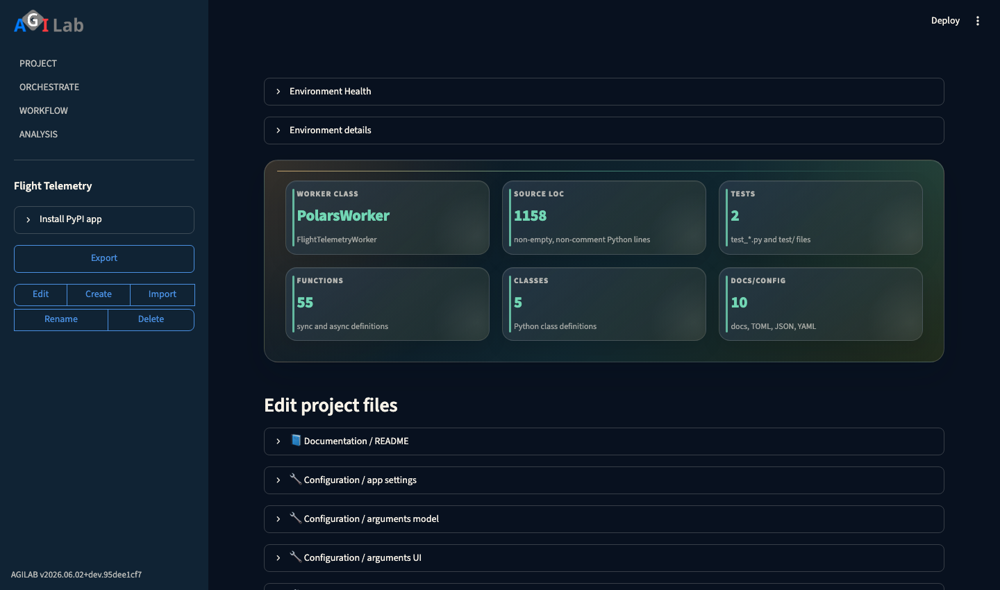
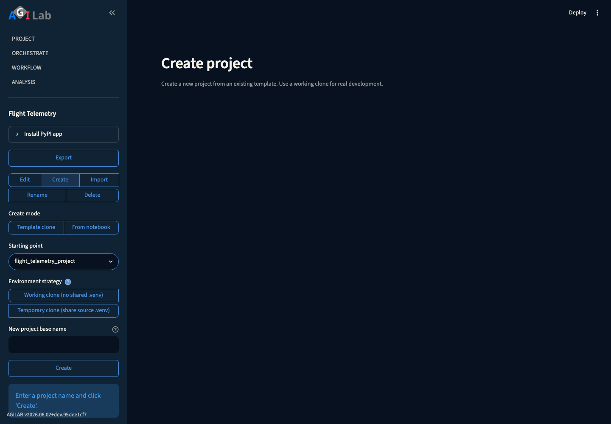

PROJECT
========

.. toctree::
   :hidden:

Page snapshot
-------------

   The PROJECT page keeps project selection in the sidebar and exposes the editable source/config sections in the main panel.

   The Create action groups project creation inputs in the sidebar: choose a starting point, pick the environment strategy, then enter the new project name.

Sidebar
-------

- ``Read Documentation`` opens this guide in the hosted public docs when
  reachable, and falls back to the locally generated docs build when available.
- ``Select`` loads the chosen project and exposes an ``Export`` button that writes
  ``<project>.zip`` to ``${EXPORT_APPS}`` using the active ``export-app-filter``.
  The rest of the page (expanders described below) becomes available from this
  view.
- ``Create`` lets you clone either the current project or one of the templates
  discovered on disk. The helper normalises the name (adds the ``_project``
  suffix) and rejects duplicates before cloning. You now choose an
  ``Environment strategy``:

  - ``Temporary clone (share source .venv)`` keeps the source ``.venv`` by
    symlink. It is fast and lightweight, but deleting or rebuilding the source
    environment can break the clone too.
  - ``Working clone (no shared .venv)`` creates the project without a shared
    ``.venv``. This is the safer choice for real development; run ``INSTALL``
    before ``EXECUTE`` to recreate the environment for the clone.

- ``Rename`` now preserves the existing project ``.venv`` while switching the
  project folder to the new name, then removes the original folder and switches
  the session to the renamed project once the operation succeeds.
- ``Delete`` permanently removes the active project after you tick the
  confirmation box. When the folder is deleted, AGILab automatically selects a
  remaining project so you can keep working.
- ``Import`` restores a project archive produced by ``Export``. You can request a
  clean import (strips ``.gitignore`` files) and the modal overwrite flow guards
  against accidentally replacing an existing project.

Tutorial: create a project
--------------------------

Use this when you want to duplicate an existing project before editing code or
settings.

1. Open **PROJECT**.
2. In the sidebar, choose **Create**.
3. Select the source project or template you want to duplicate.
4. Enter the new project name. AGILab adds the ``_project`` suffix if needed.
5. Choose the environment strategy:

   - ``Temporary clone (share source .venv)`` for quick experiments.
   - ``Working clone (no shared .venv)`` for real development work.

6. Confirm the clone action.
7. Select the new cloned project in the sidebar.

What to do next:

- If you chose ``Temporary clone``, you can usually inspect or edit the clone
  immediately.
- If you chose ``Working clone``, go to :doc:`execute-help`, run ``INSTALL``,
  then run ``EXECUTE`` before expecting the clone to behave like the source
  project.
- If the clone should expose optional analysis bundles, open ``APP-SETTINGS``
  and check the ``[pages]`` section.

Main Content Area
-----------------
- When ``Select`` is active the page reveals a stack of expanders backed by the
  in-browser code editor. Each expander streams syntax-highlighted content and
  writes any saved changes straight back to disk:

  - ``PYTHON-ENV`` edits the project ``pyproject.toml`` so you can manage
    dependencies without leaving the browser.
  - ``PYTHON-ENV-EXTRA`` surfaces ``uv_config.toml`` for supplemental dependency
    constraints.
  - ``MANAGER`` and ``WORKER`` expose the main orchestration modules. The editor
    offers class/function/attribute pickers so you can focus on specific
    sections before saving.
  - ``EXPORT-APP-FILTER`` controls the ``.gitignore`` rules that the export flow
    applies when producing the archive.
  - ``APP-SETTINGS`` opens the per-user workspace
    ``~/.agilab/apps/<project>/app_settings.toml``. AGILab keeps the ``[args]``
    and ``[pages]`` sections in sync with the Orchestrate and Analysis pages.
    The file is seeded from the app's versioned source ``app_settings.toml``
    (``<project>/app_settings.toml`` or ``<project>/src/app_settings.toml``)
    when the app is first loaded.
  - ``README`` allows quick edits to the project ``README.md``.
  - ``APP-ARGS`` targets ``app_args.py`` in the app package. Use it to
    synchronise default arguments with the Orchestrate page.
  - ``APP-ARGS-FORM`` displays (and creates if missing) the optional
    ``app_args_form.py`` web snippet used to render a custom parameter UI
    in Orchestrate.
  - ``PRE-PROMPT`` serialises ``pre_prompt.json`` so you can tailor the prompt
    used by the WORKFLOW assistant.

Troubleshooting and checks
--------------------------

Use these checks if Project actions do not behave as expected:

- If no projects are listed, verify the active ``apps`` directory and confirm the
  target project folder contains a valid ``README``/``app_manager`` structure.
- If **Delete** does not refresh the UI, re-open the page and re-select the
  same project; the deletion flow is asynchronous and can race with the list
  rebuild.
- If edits appear lost after saving, confirm you are still in the same project and
  that write permissions are available for the selected source file.
- If a ``Temporary clone`` stops launching, check whether the source project
  ``.venv`` was deleted or rebuilt. Switch to a ``Working clone`` when you need
  a stable long-lived project.
- If import/export fails, check free disk space and confirm ``${EXPORT_APPS}`` and
  the project path are writable.

See also
--------

- :doc:`agilab-help` for the global page map.
- :doc:`execute-help` for orchestrating installs/distribution after project setup.
- :doc:`architecture` for how project files feed workers and runtimes.

Support
-------

Support: open an issue on GitHub

.. |PyPI version| image:: https://img.shields.io/pypi/v/AGI.svg
   :target: https://pypi.org/project/agilab/
