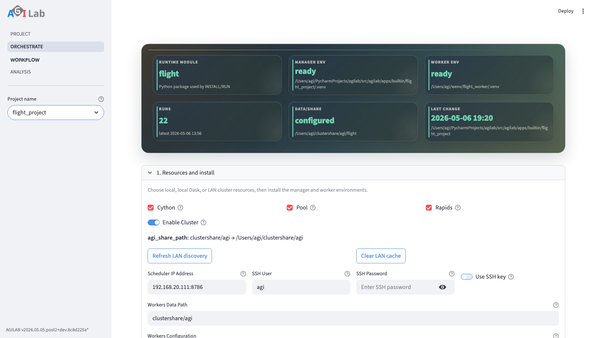

ORCHESTRATE
==============

.. toctree::
   :hidden:

Introduction
------------
ORCHESTRATE is the operational page for one project.

It handles install, distribution, run, service mode, and generated execution
snippets. The mutable per-user settings file lives under
``~/.agilab/apps/<app>/app_settings.toml`` and is seeded from the app's
versioned ``app_settings.toml`` source file on first use.

Page snapshot
-------------

   ORCHESTRATE centralises deployment settings and generated snippets before install, distribution, and run actions.

Sidebar
-------
- ``Read Documentation`` opens this guide in the hosted public docs when
  reachable, and falls back to the locally generated docs build when available.
- Project selector that keeps the page in lockstep with the active app.
- ``Verbosity level`` changes the ``verbose`` flag injected into every generated
  snippet (0–3) and is persisted under ``[cluster].verbose``.

Main Content Area
-----------------
- ``System settings`` groups the cluster configuration. Toggle support for
  ``pool``, ``cython`` and ``rapids``, enable the Dask scheduler and provide IP
  definitions for workers. The calculated mode hint clarifies how the chosen
  combination will execute and the settings are written back to
  ``~/.agilab/apps/<app>/app_settings.toml``.
- ``Install`` renders the install snippet that provisions the project's virtual
  environments. ``INSTALL`` streams stdout/stderr into ``Install logs`` so you
  know when the worker is ready. A successful install automatically enables the
  ``Run`` section.
- ``Distribute`` is split into two parts:

    * ``<module> args``: edit the run arguments managed in ``app_args.py``. You
      can toggle between the generated form UI and the optional custom snippet
      saved in ``app_args_form.py``. Saved values update ``[args]`` in
      ``~/.agilab/apps/<app>/app_settings.toml``. Custom forms may also surface derived preview
      metrics computed from the current inputs and the latest generated summary
      artefacts. When they do, the preview should match the metric written back
      by the app after ``RUN`` so the UI and exported reports stay aligned.
    * ``Distribute details``: generates the ``AGI.get_distrib`` snippet and the
      ``CHECK DISTRIBUTE`` action. When the command succeeds the ``Distribution
      tree`` expander plots the resulting work plan (DAG or tree) and ``Workplan``
      lets you reassign partitions to different workers before saving the
      modified plan.

- ``Run`` exposes the ``AGI.run`` snippet together with a ``Benchmark all
  modes`` toggle if you want to iterate through every execution path. ``RUN``
  streams logs into the ``Run logs`` expander and stores the output timings in
  ``benchmark.json``, which is summarised under ``Benchmark results``.
- ``Notebook`` exports the current ORCHESTRATE recipe as ``<app>_orchestrate.ipynb``.
  It includes the generated ``INSTALL``, ``CHECK distribute``, and ``RUN``
  snippets that are available for the active configuration. It is export-only:
  notebook import remains in :doc:`experiment-help` because import changes
  ``lab_stages.toml`` and therefore belongs to the pipeline definition workflow.
- ``Service mode (persistent workers)`` keeps long-lived worker loops alive and
  lets you trigger ``START/STATUS/HEALTH gate/STOP`` without rebuilding the execution
  context every time.
- ``LOAD DATA`` fetches the latest dataframe path configured for the project and
  shows an in-place preview. The preview is available even after a rerun.
- ``Prepare Data for WORKFLOW and ANALYSIS`` creates (or updates) the CSV that
  powers the WORKFLOW and ANALYSIS pages. Use the column selector with
  ``Select all`` support to decide which fields are persisted to
  ``${AGILAB_EXPORT_ABS}/<module>/export.csv``.

Execution Mode Values
---------------------

The generated snippets use two closely related parameters that come from
``System settings``:

.. list-table::
   :header-rows: 1
   :widths: 18 18 64

   * - Parameter
     - Used by
     - Meaning
   * - ``modes_enabled``
     - ``AGI.install(...)``
     - Bitmask of the execution capabilities that the install stage should
       prepare on the target machines.
   * - ``mode``
     - ``AGI.run(...)``
     - One concrete execution mode selected for this run, built from the same
       bitmask scheme.

AGILAB currently builds these values from the execution toggles as follows:

.. list-table::
   :header-rows: 1
   :widths: 22 14 64

   * - Toggle
     - Bit value
     - Meaning
   * - ``pool``
     - ``1``
     - Enable the worker-pool execution path when the app provides it. The
       backend may be process- or thread-based.
   * - ``cython``
     - ``2``
     - Enable the compiled worker path when the worker has a Cython build.
   * - ``cluster_enabled``
     - ``4``
     - Run through the Dask scheduler / distributed worker path instead of a
       local-only run.
   * - ``rapids``
     - ``8``
     - Enable the RAPIDS / GPU execution path when the target environment
       supports it.

Common examples:

.. list-table::
   :header-rows: 1
   :widths: 16 18 66

   * - Value
     - Expression
     - Typical reading
   * - ``0``
     - none
     - Plain local Python execution.
   * - ``1``
     - ``pool``
     - Local multiprocessing path.
   * - ``4``
     - ``cluster``
     - Distributed run without extra pool / Cython / RAPIDS flags.
   * - ``13``
     - ``cluster + pool + rapids``
     - Distributed pool-based run with RAPIDS enabled.
   * - ``15``
     - ``cluster + pool + cython + rapids``
     - All currently enabled execution flags.

This is why generated snippets should express execution intent with public
constants such as ``AGI.PYTHON_MODE | AGI.DASK_MODE`` and pass run settings
through ``RunRequest``. One snippet prepares runtime capabilities through
``AGI.install(..., modes_enabled=...)``; the other selects the concrete run
shape through ``AGI.run(app_env, request=request)``.

In normal usage, you do not type bitmasks manually. You set the toggles in
``System settings`` and AGILAB generates the matching snippet.

From UI to Snippet Fields
-------------------------

If you are reading a generated snippet and want to know where each value came
from in the UI, use this mapping:

.. list-table::
   :header-rows: 1
   :widths: 24 24 52

   * - UI field or toggle
     - Generated snippet field
     - Notes
   * - ``Verbosity level``
     - ``verbose=...``
     - Copied directly into ``AgiEnv(..., verbose=...)``.
   * - ``Enable Cluster``
     - contributes ``+4`` to ``mode`` / ``modes_enabled``
     - Also enables the scheduler / workers fields in the generated snippet.
   * - ``Scheduler host``
     - ``scheduler="..."``
     - Host running the Dask scheduler in distributed mode.
   * - ``Worker map``
     - ``workers={...}``
     - Maps each host to a worker-slot count. For example,
       ``{"192.168.1.21": 1, "192.168.1.22": 2}`` means one worker slot on
       the first host and two on the second.
   * - ``Pool``
     - contributes ``+1`` to ``mode`` / ``modes_enabled``
     - Enables the worker-pool path when the app supports it. The backend may
       be process- or thread-based.
   * - ``Cython``
     - contributes ``+2`` to ``mode`` / ``modes_enabled``
     - Enables the compiled worker path when a Cython build exists.
   * - ``RAPIDS``
     - contributes ``+8`` to ``mode`` / ``modes_enabled``
     - Enables the RAPIDS / GPU path when the target environment supports it.
   * - ``<module> args``
     - app-specific kwargs such as ``data_in=...``, ``data_out=...``, ``files=...``
     - Comes from the generated form or custom ``app_args_form.py`` UI.

Distributed Workflow
--------------------

For distributed runs, ORCHESTRATE is the control point. The intended workflow
is:

1. Configure scheduler, workers, and execution flags in ``System settings``.
2. Let ORCHESTRATE generate the current ``AGI.install(...)``,
   ``AGI.get_distrib(...)``, and ``AGI.run(...)`` snippets.
3. Reuse the generated run snippet in :doc:`experiment-help` when the
   distributed execution should become a reproducible WORKFLOW stage.

You usually do not write these orchestration snippets manually first. They are
generated from the current UI configuration. See :doc:`distributed-workers` for
the full step-by-step deployment guide.

For a first pass through the UI, follow this sequence exactly:

1. Open ``System settings`` and configure the scheduler host and worker map.
2. Run ``INSTALL`` so the worker runtime is staged on the configured machines.
3. Run ``CHECK DISTRIBUTE`` to inspect the generated distribution tree and
   confirm the work plan matches the selected workers.
4. Open ``Run`` and copy or export the generated ``AGI.run`` snippet.
5. Optionally open ``Notebook`` to download the current orchestration recipe as
   a runnable notebook for review or handoff.
6. In :doc:`experiment-help`, import or regenerate that snippet as a WORKFLOW
   stage instead of retyping it.

Snippet Handoff to WORKFLOW
---------------------------
For newcomers, keep ORCHESTRATE and WORKFLOW in sync with this workflow:

1. Generate the snippet in **Orchestrate** (typically ``AGI.run``).
2. On **WORKFLOW**, open **Add stage** (or **New stage** when starting fresh),
   pick ``Stage source = Generate stage`` for a fresh generation, or ``Stage source =``
   an existing snippet (for example ``AGI_run.py`` or ``lab_snippet.py``) to
   import it directly.
3. For app updates, update ``<module> args`` in the per-user workspace
   ``app_settings.toml`` / ``[args]`` then regenerate or re-import the matching
   snippet in WORKFLOW.

This avoids running stale code that still references old app argument values.
For example, when an app renames an argument, older saved snippets that still
pass the removed name will fail fast until you regenerate or replace them.

Service Mode Health
-------------------

For a complete operator workflow (web and CLI), see :doc:`service-mode`.

Use these defaults as a stable baseline for most projects:

- ``Heartbeat timeout``: ``10s``.
- ``Done artifacts TTL``: ``168h`` (7 days).
- ``Failed artifacts TTL``: ``336h`` (14 days).
- ``Heartbeat artifacts TTL``: ``24h``.
- ``Done/Failed max files``: ``2000`` each.
- ``Heartbeat max files``: ``1000``.

Health gate defaults are persisted per app in the workspace
``app_settings.toml`` under ``[cluster.service_health]``:

- ``allow_idle`` (default ``false``).
- ``max_unhealthy`` (default ``0``).
- ``max_restart_rate`` (default ``0.25``).

When STATUS runs, Orchestrate displays a health table:

- ``worker``: Dask worker address.
- ``healthy``: overall health evaluation for that worker loop.
- ``reason``: why the worker is unhealthy (empty when healthy).
- ``future_state``: Dask future state for the loop task.
- ``heartbeat_state``: latest worker heartbeat-reported state.
- ``heartbeat_age_sec``: seconds since latest heartbeat.

Use ``HEALTH gate`` to run ``AGI.serve(..., action="health")`` and immediately
validate the current state against the per-app SLA thresholds above.

Auto-restart reason values currently include:

- ``loop-finished`` / ``loop-error`` / ``loop-cancelled``.
- ``missing-heartbeat``.
- ``stale-heartbeat(<N>s)``.

Service health JSON export
--------------------------

Each ``AGI.serve`` service action writes a machine-readable health snapshot
(``agi.service.health.v1``), and ``action="health"`` returns that payload
directly.

Default output path:

- ``${AGI_CLUSTER_SHARE}/service/<app_target>/health.json``.

Custom output path:

.. code-block:: python

   health = await AGI.serve(
       app_env,
       action="health",
       health_output_path="service/custom_health.json",
   )
   print(health["status"], health["workers_unhealthy_count"])

Field reference:

- :doc:`service-health-schema`

Troubleshooting and checks
--------------------------

Use these checks if Orchestrate actions do not behave as expected:

- If ``INSTALL`` stays stuck, check cluster host reachability, SSH credentials,
  and whether ``~/.agilab/.env`` still points to valid venv paths.
- If the generated snippet looks wrong, compare ``[args]`` in
  ``~/.agilab/apps/<project>/app_settings.toml`` with the values shown in
  ``app_args_form.py``. If the workspace copy is missing, AGILab will reseed it
  from the app source copy (``<project>/app_settings.toml`` or
  ``src/<project>/src/app_settings.toml``).
- If ``RUN`` returns import errors, verify the target virtual environment contains
  the same versions as ``src/<project>/pyproject.toml`` and re-run install.
- If no logs appear, confirm the log expansion is expanded and that the runtime
  has write access to ``~/log/execute/<app>``.
- If an external monitor cannot read service health, call
  ``AGI.serve(..., action="health")`` and verify that ``health.json`` is written
  at the expected path.

See also
--------

- :doc:`agilab-help` to place Orchestrate in the full page flow.
- :doc:`experiment-help` for running the generated snippet in the WORKFLOW assistant.
- :doc:`explore-help` for launching result views.
