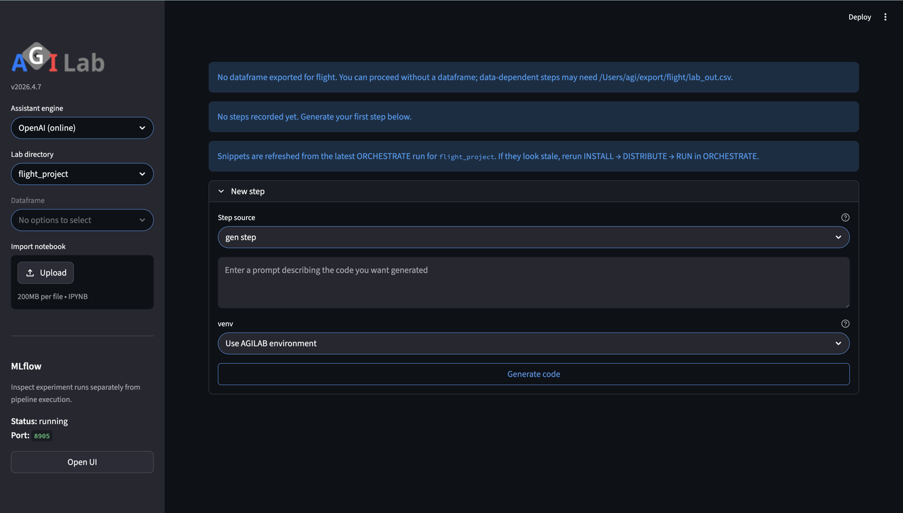

PIPELINE
===========

.. toctree::
   :hidden:

Page snapshot
-------------

   PIPELINE combines lab-step editing, execution context, dataframe selection, and notebook export in the same workspace.

Sidebar
-------
- ``Read Documentation`` opens this guide in the hosted public docs, and
  ``Open Local Documentation`` uses the locally generated docs build when
  available.
- ``Lab Directory``: choose the module whose lab artefacts you want to work on.
  The selection points at ``${AGILAB_EXPORT_ABS}/<module>`` and initialises
  ``lab_steps.toml`` if it does not exist yet.
- ``Steps``: pick the ``lab_steps`` file relative to the export directory. When
  you change the selection the assistant reloads the stored conversation.
- ``DataFrame``: select which CSV (or parquet) is mounted for the assistant. The
  resolved absolute path lives under ``${AGILAB_EXPORT_ABS}``.
- ``Import Notebook``: upload an ``.ipynb`` file to seed the conversation when
  working offline.
- ``Export notebook``: write the current lab as ``lab_steps.ipynb`` so you can
  run the pipeline outside the AGILAB UI as a runnable supervisor notebook.
  In a source checkout, AGILAB also writes a project-local PyCharm mirror under
  ``exported_notebooks/<module>/lab_steps.ipynb``.
- ``MLflow``: shows whether the local tracking UI is running and exposes an
  ``Open UI`` link. The UI is a tracker view, not another execution button.

Main Content Area
-----------------

ASSISTANT
~~~~~~~~~
Each lab is organised as a sequence of steps stored in ``lab_steps.toml``.
The numbered buttons at the top let you jump between them. Ask questions or
describe transformations in the text area—AGILab forwards the prompt to the
Responses API together with the selected DataFrame metadata. The code editor
reacts to the toolbar actions:

* ``Save`` keeps the snippet as-is in the current step.
* ``Next`` persists the snippet and advances to a fresh step.
* ``Remove`` deletes the step from ``lab_steps.toml``.
* ``Run`` writes the snippet to ``lab_snippet.py``, executes it and stores any
  produced dataframe under ``lab_out.csv`` so the preview and the
  Orchestrate/Analysis pages can consume the result.

The runtime is chosen from the *Execution environment* box below the editor.
If you pick a concrete virtual environment path the snippet runs via
``run_agi`` inside that environment (the path is kept with the step under
the ``E`` field). Leaving the selector on the default AGILab environment
falls back to ``run_lab``, reusing the managed runtime that ships with the
app. In both cases the exported dataframe and history behave identically.

The assistant automatically reloads the most recent dataframe and shows it below
the editor. If nothing has been saved yet, you will see a reminder to run a
snippet first.

Verified recipe memory
~~~~~~~~~~~~~~~~~~~~~~
PIPELINE also has a local, provider-neutral recipe-memory layer. Before the
assistant calls the selected model, AGILAB searches validated examples from the
current ``lab_steps.toml``, exported supervisor notebooks, built-in app labs,
and ``~/.agilab/pipeline_recipe_memory/cards.jsonl``. Matching recipe cards are
added only to the model-facing prompt as implementation patterns; the saved
``Q`` field remains the original user request.

Recipe cards store the intent, redacted code, dataframe/schema hints,
dependencies, output columns, operation names, validation status, and source
provenance. Local paths, home directories, email addresses, bearer tokens, and
OpenAI-style keys are redacted before a card is reused or written.

AGILAB promotes new cards only after validation. In the current UI path that
means the dataframe auto-fix loop executed the generated snippet successfully.
Unvalidated saved snippets stay as candidates and are ignored by retrieval
unless ``AGILAB_PIPELINE_RECIPE_MEMORY_INCLUDE_CANDIDATES=1`` is set. Set
``AGILAB_PIPELINE_RECIPE_MEMORY=0`` to disable retrieval for a session, or
``AGILAB_PIPELINE_RECIPE_MEMORY_ROOTS`` to add more local lab or notebook
sources.

When your lab step is based on app execution, use the **Pipeline** add flow:

- Generate the target snippet in **ORCHESTRATE** (typically ``AGI.run``).
- In **Add step** (or **New step** on an empty project), choose ``Step source =``
  ``gen step`` to regenerate from prompt, or select an existing exported snippet
  to import it directly.
- Imported snippets are marked read-only and run with the project manager runtime.

If you change values in Orchestrate arguments, regenerate or re-import the
snippet in Pipeline before running the step.

AGILab does not silently rewrite saved Python snippets when a lab is reopened.
If a generated step becomes stale after an app or orchestration change, the
saved code remains unchanged until you explicitly regenerate or replace it.
This avoids hidden behaviour changes, but it also means stale generated steps
must be refreshed deliberately.
One concrete example is ``sat_trajectory_project``: generated snippets now use
``total_satellites_wanted``, so older saved snippets using ``number_of_sat`` or
``number_of_tle_satellites`` must be regenerated before they can run.

Notebook export
~~~~~~~~~~~~~~~
PIPELINE can export the current lab as a runnable supervisor notebook. This is
not just a static dump of code cells.

* The notebook is written beside ``lab_steps.toml`` as ``lab_steps.ipynb``.
* You can open it outside the AGILAB UI in Jupyter-compatible tools such as
  JupyterLab or PyCharm.
* For a source checkout, prefer the mirror under
  ``exported_notebooks/<module>/lab_steps.ipynb`` and launch it from the AGILAB
  root project explicitly, for example:

  .. code-block:: bash

     uv --project /path/to/agilab run --with jupyterlab jupyter lab exported_notebooks/<module>/lab_steps.ipynb

  or execute it headlessly with:

  .. code-block:: bash

     uv --project /path/to/agilab run --with nbconvert python -m jupyter nbconvert --to notebook --execute --inplace exported_notebooks/<module>/lab_steps.ipynb

* The exported notebook keeps the recorded per-step runtime and environment
  metadata instead of flattening the whole pipeline into one implicit kernel
  contract.
* Use the generated helper functions such as ``run_agilab_step(i)`` and
  ``run_agilab_pipeline()`` to execute the saved steps in their recorded
  runtime.
* When the active app declares related analysis pages, the notebook also
  includes launcher helpers for those pages.

This is the accurate mental model: AGILAB can export a runnable version of your
pipeline outside the UI, but for mixed-runtime or multi-venv flows it does so as
a supervisor notebook rather than pretending every step belongs to one notebook
kernel.

MLflow tracking
~~~~~~~~~~~~~~~
Pipeline execution and MLflow tracking now share the same runtime contract:

.. figure:: diagrams/pipeline_mlflow_tracking.svg
   :alt: Diagram showing one parent MLflow run for the whole pipeline and one nested run per executed step.
   :align: center
   :class: diagram-panel diagram-standard

   PIPELINE creates one parent MLflow run per execution, then one nested run per step, while both in-process and subprocess paths write to the same tracking store exposed by the MLflow UI.

* ``Run pipeline`` creates one parent MLflow run for the whole lab execution.
* Every executed step becomes a nested MLflow run with its own metadata.
* The tracked metadata comes from ``lab_steps.toml`` and includes the step
  description, prompt/question, selected model, execution engine, and runtime.
* Captured stdout, the executed snippet, the run log, and produced dataframe
  artefacts are logged to the same tracking store when they exist.

This means MLflow is no longer just a nearby dashboard. It is the execution
trace for PIPELINE runs, while the sidebar remains the place where you inspect
that trace.

AGILAB does not define a separate experiment tracker, model registry, run
format, or metrics schema. The AGILAB runtime talks through a small tracker
facade (for example ``tracker.log_metric(...)`` and
``tracker.log_artifact(...)``), and the default backend is MLflow. This keeps
tracking automatic during normal AGILAB execution while preserving compatibility
with existing MLflow tooling.

Inside a snippet or worker, prefer the AGILAB facade when you need custom
domain metrics:

.. code-block:: python

   from agilab.tracking import tracker

   tracker.log_metric("accuracy", 0.94)
   tracker.log_artifact("reports/confusion_matrix.png")

The tracking store is the directory configured by ``MLFLOW_TRACKING_DIR``.
Subprocess-based steps receive the same ``MLFLOW_TRACKING_URI`` as in-process
steps, so both execution paths are visible from the same MLflow UI.

HISTORY
~~~~~~~
Inspect or tweak the raw ``lab_steps.toml`` via the code editor. Saving the
file here immediately refreshes the assistant tab.

Troubleshooting and checks
--------------------------

Use these checks if Pipeline steps are confusing or fail to execute:

- If numbered step buttons do not match ``lab_steps.toml``, open **HISTORY** and
  confirm the selected file is the current module's lab file.
- If execution fails on a stale path, regenerate or re-import the snippet in
  PIPELINE before rerunning the step.
- If ``Run`` writes no dataframe, check the destination under
  ``${AGILAB_EXPORT_ABS}/<module>/lab_out.csv`` and ensure ``Write permissions``
  are enabled for the selected execution environment.
- If an imported notebook is not loaded, re-upload ``.ipynb`` and then reopen the
  step editor to force a refresh.
- If MLflow stays empty after a run, confirm that the step completed and that
  the tracking store under ``MLFLOW_TRACKING_DIR`` is writable.
- If MLflow link fails to open, verify ``activate_mlflow`` completed and port
  forwarding is not blocked locally.

See also
--------

- :doc:`agilab-help` for the overall page sequence.
- :doc:`distributed-workers` for the full distributed workflow from ORCHESTRATE configuration to imported Pipeline step.
- :doc:`execute-help` for generating reliable snippets before running a step.
- :doc:`apps-pages` for analysis-side visualisations after a successful run.
- :doc:`roadmap/versioned-pipeline-steps` for the proposed structured successor
  to raw generated snippets in ``lab_steps.toml``.
