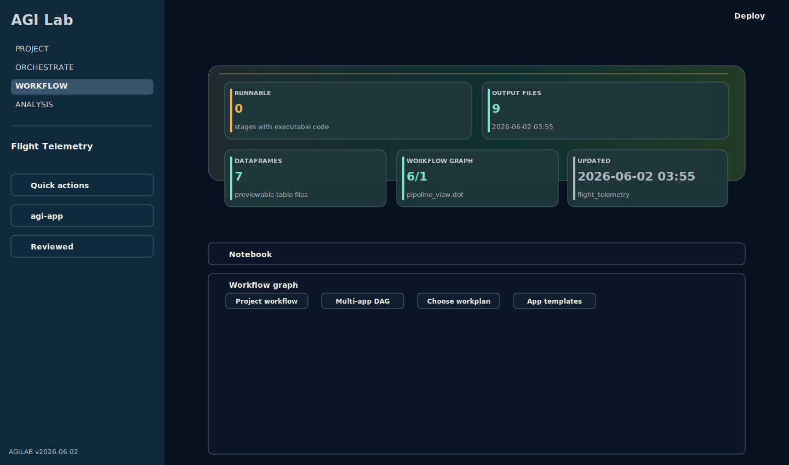

WORKFLOW
===========

.. toctree::
   :hidden:

Page snapshot
-------------

   WORKFLOW combines lab-stage editing, execution context, dataframe selection, and notebook export in the same workspace.

Sidebar
-------
- ``Read Documentation`` opens this guide in the hosted public docs when
  reachable, and falls back to the locally generated docs build when available.
- ``Lab Directory``: choose the module whose lab artefacts you want to work on.
  The selection points at ``${AGILAB_EXPORT_ABS}/<module>`` and initialises
  ``lab_stages.toml`` if it does not exist yet.
- ``Stages``: pick the ``lab_stages`` file relative to the export directory. When
  you change the selection the assistant reloads the stored conversation.
- ``DataFrame``: select which CSV (or parquet) is mounted for the assistant. The
  resolved absolute path lives under ``${AGILAB_EXPORT_ABS}``.
- ``MLflow``: shows whether the local tracking UI is running and exposes an
  ``Open UI`` link. The UI is a tracker view, not another execution button.

Main Content Area
-----------------

ASSISTANT
~~~~~~~~~
Each lab is organised as a sequence of stages stored in ``lab_stages.toml``.
The numbered buttons at the top let you jump between them. Ask questions or
describe transformations in the text area—AGILab forwards the prompt to the
Responses API together with the selected DataFrame metadata. The code editor
reacts to the toolbar actions:

* ``Save`` keeps the snippet as-is in the current stage.
* ``Next`` persists the snippet and advances to a fresh stage.
* ``Remove`` deletes the stage from ``lab_stages.toml``.
* ``Run`` writes the snippet to ``lab_snippet.py``, executes it and stores any
  produced dataframe under ``lab_out.csv`` so the preview and the
  Orchestrate/Analysis pages can consume the result.

The runtime is chosen from the *Execution environment* box below the editor.
If you pick a concrete virtual environment path the snippet runs via
``run_agi`` inside that environment (the path is kept with the stage under
the ``E`` field). Leaving the selector on the default AGILab environment
falls back to ``run_lab``, reusing the managed runtime that ships with the
app. In both cases the exported dataframe and history behave identically.

The assistant automatically reloads the most recent dataframe and shows it below
the editor. If nothing has been saved yet, you will see a reminder to run a
snippet first.

When your lab step is based on app execution, use the **WORKFLOW** add flow:

- Generate the target snippet in **ORCHESTRATE** (typically ``AGI.run``).
- In **Add stage** (or **New stage** on an empty project), choose ``Stage source =``
  ``Generate stage`` to regenerate from prompt, or select an existing exported snippet
  to import it directly.
- The default generation mode is **Safe actions**. The assistant returns a
  versioned JSON action contract, AGILAB validates it against the loaded
  dataframe schema, and the page saves deterministic pandas code derived from
  that contract.
- Use **Python snippet (advanced)** only when the transformation cannot be
  represented by the safe action registry and you intend to review the raw
  generated code yourself.
- Imported snippets are marked read-only and run with the project manager runtime.

If you change values in Orchestrate arguments, regenerate or re-import the
snippet in WORKFLOW before running the stage.

AGILab does not silently rewrite saved Python snippets when a lab is reopened.
If a generated stage becomes stale after an app or orchestration change, the
saved code remains unchanged until you explicitly regenerate or replace it.
This avoids hidden behaviour changes, but it also means stale generated stages
must be refreshed deliberately.
For example, if an app renames a runtime argument, older saved snippets that
still pass the removed name must be regenerated or replaced before they can run.

Pipeline profiles and stage dependencies
~~~~~~~~~~~~~~~~~~~~~~~~~~~~~~~~~~~~~~~~
``lab_stages.toml`` can remain a plain ordered stage list, but projects that
need faster replay can opt into explicit single-project workflow automation.
The contract is additive: older stage files without dependency fields still run
in their saved sequence.

The WORKFLOW execution controls expose:

* ``Pipeline profile``: chooses the generic automation profile for this run.
  Built-in profile names are ``balanced``, ``smoke``, ``fast``, ``evidence``,
  and ``custom``. A stage may declare optional ``profiles.<name>`` overrides;
  if it does not, AGILAB runs the saved stage exactly as written.
* ``Parallel stage workers``: caps how many independent ``agi.*`` stages can
  run at the same time. In-process ``runpy`` stages remain serialized because
  they share the Streamlit session state.
* ``Save automation settings``: persists the selected profile and worker cap in
  the ``lab_stages.toml`` metadata. Opening WORKFLOW or changing the controls
  does not rewrite the file until you press this button.
* ``Stage dependencies``: lets you review or edit ``deps`` for the selected
  stages. ``Suggest dependencies`` derives candidate edges from install/pipeline
  naming and explicit path literals such as ``data_in`` and ``data_out``. Review
  the suggestions before pressing ``Save dependencies``.
* ``Show dependency graph``: previews the exact dependency graph used to compute
  execution waves.

A dependency-aware stage entry uses stable ids instead of fragile list indices:

.. code-block:: toml

   [[my_project]]
   id = "prepare_data"
   deps = []
   D = "my_app/pipeline"
   R = "agi.run"
   C = "..."

   [[my_project]]
   id = "train_model"
   deps = ["prepare_data"]
   D = "my_model/pipeline"
   R = "agi.run"
   C = "..."

The runner validates the graph before execution. Duplicate ids, unknown
dependencies, cycles, or dependencies outside the selected execution sequence
block the run instead of producing a partial or racy pipeline. When dependencies
are valid, AGILAB computes topological waves: independent ``agi.*`` stages in
the same wave may run concurrently, while dependent stages wait for their
upstream wave.

Stages can also declare an optional output-existence skip rule inside the same
stage entry:

.. code-block:: toml

   [[my_project]]
   id = "prepare_data"
   deps = []
   D = "my_app/pipeline"
   R = "agi.run"
   C = "..."
   automation = { skip_if_outputs_exist = true, outputs = ["my_app/pipeline"] }

This rule skips a stage only when every declared output exists. It is a
convenience for fast local iteration, not a full freshness proof: AGILAB does
not compare input mtimes, dependency hashes, or semantic content for this
shortcut. Use ``reset_target`` or clear outputs when you need a clean rebuild.

Each workflow run writes a local automation manifest beside the run logs. The
current schema is ``agilab.pipeline.automation.v2``. The manifest also records
``agilab.pipeline.automation.v1`` as a compatible schema for readers that only
need the original profile, wave, stage status, and dependency fields. The
manifest records the selected profile, worker cap, stage ids, dependencies,
computed waves, per-stage status, declared output records, and a DOT dependency
graph. Output records include resolved paths, existence, file or directory
classification, size and mtime when available, and a SHA-256 for regular files
up to the bounded manifest hashing limit. Larger files and directories are
classified instead of hashed so workflow logging stays cheap. When MLflow
tracking is available, the parent run also stores the automation metadata and
dependency graph as text artifacts. The ``pipeline_metadata/automation.json``
artifact records schema, compatible reader schemas, producer, producer version,
local-only scope, workflow source, app, target, profile, run id, max workers,
dependency waves, stage ids, and stage dependencies. For parallel waves, the
automation manifest is the per-stage evidence source; nested MLflow stage runs
remain a serial-stage evidence path. The ``Latest automation run`` expander
summarizes the same manifest with a ``Schema`` KPI for reader compatibility
status (``current``, ``compatible legacy``, ``unknown``, or ``unsupported``),
the detailed schema caption, compatible reader schemas, producer, producer version, run id, automation profile, max workers,
local-only scope, workflow source, app, target, lab directory, stages file,
stages file SHA-256, start timestamp, finish timestamp, run duration, run
error, stage counts, wave count, ``run_manifest_path`` for the immutable
per-run manifest, ``manifest_path`` as the compatibility alias for that same
per-run file, ``latest_manifest_path`` for the rolling latest-manifest alias,
manifest SHA-256, declared output count, existing output count, hashed output
count, and oversized-output count. Use
``Show output evidence`` in that expander to inspect the manifest rows for each
declared output: stage, status, specification, resolved path, existence, file
kind, size, hash status, and SHA-256 when available.

   The MLflow parent run also records ``pipeline_metadata/sequence.json`` with
   schema ``agilab.pipeline.sequence.v2``. That artifact keeps the selected
   sequence for legacy readers and adds the effective automation profile, run id,
   max worker setting, dependency waves, stage ids, and stage dependencies so the
   tracker evidence matches the actual waved execution plan.

Workflow graph scopes
~~~~~~~~~~~~~~~~~~~~~
The **Workflow graph** expander is the transition path from a single-project
workflow to cross-app artifact orchestration. Use the ``Workflow scope``
selector to choose what the graph represents:

* ``Project workflow`` renders the current ``lab_stages.toml`` as a read-only
  compatibility graph. It explains stage order and dependencies, while the
  existing stage controls remain the source of truth for real single-project
  execution.
* ``Multi-app DAG`` loads or edits a cross-app artifact contract. This is the
  path for connecting app stages through explicit produced and consumed
  artifacts.

For ``Multi-app DAG`` scope, use the ``Workplan source`` selector to choose
where the plan comes from:

* ``App templates`` loads checked-in workflow templates bundled with the active
  app.
* ``Sample library`` loads checked-in public examples from
  ``docs/source/data/multi_app_dag*.json``.
* ``Workspace drafts`` loads plans saved from the current project workspace
  under ``.agilab/multi_app_dags``.
* ``Custom path`` loads an external JSON plan by path.

The graph is hidden by default so small screens stay readable. Enable
``Show graph`` only when the current screen has enough room. Enable
``Show technical output details`` when you need the lower-level output handoff
table behind the plan.

To edit a plan, enable ``Edit plan``. The normal editing path stays away from
raw JSON:

* ``Steps`` chooses the app-level steps in the plan.
* ``Creates`` chooses the outputs produced by those steps.
* ``Uses`` chooses which later steps use earlier outputs.
* ``Check plan`` validates the schema, app names, inputs, and outputs.
* ``Save as workspace plan`` stores the draft for the current project.
* ``Show generated JSON`` is available for review or export, but it is not the
  primary editing flow.

Execution is intentionally conservative:

* ``Preview next ready step`` is a preview action. It updates the persisted
  runner state without claiming that an app really ran.
* ``Run next stage`` is only available for checked-in workflow templates with a
  controlled execution marker. AGILAB ships controlled examples, and app-owned
  executable templates saved under an app's ``dag_templates`` directory can use
  the generic controlled contract adapter.
* ``Run ready stages`` executes every currently runnable controlled stage in
  one batch. Independent branches can run concurrently, and each stage still
  owns its app runtime, including any AGI/Dask distribution used inside that
  app.
* When a distributed stage submitter is configured, a ``Stage backend`` selector
  appears before the run buttons. ``Local contracts`` keeps execution in the
  current UI process; ``Distributed backend`` submits each ready stage through
  the configured backend and records ``distributed_stage`` provenance in the
  DAG state.
  When ``Distributed backend`` is selected, WORKFLOW shows the exact
  per-stage request preview before the run buttons: app, scheduler, worker
  nodes/slots, workers data path, mode integer, apps path, and the JSON
  ``RunRequest`` payload that will be sent for each stage.
  The built-in submitter is configured from the active app's saved
  **ORCHESTRATE** cluster settings: ``cluster_enabled`` must be true, a
  scheduler, workers, and ``Workers Data Path`` must be present, and each DAG
  stage ``app`` must resolve under ``src/agilab/apps/builtin`` or
  ``src/agilab/apps``. Each submitted stage runs in an isolated AGILAB
  subprocess so parallel ready stages do not share the in-process ``AGI`` class
  state.
* Workspace drafts and custom DAGs remain preview-only until they are promoted
  into a checked-in worker app template with an explicit controlled execution
  contract. Workerless app templates are still valid AGILAB apps, but they do
  not imply distributed DAG execution.

The technical JSON contract still uses stable field names so plans remain
portable:

* ``nodes[].execution.entrypoint`` names the stable stage executor, for example
  ``flight_telemetry_project.flight_context``. WORKFLOW displays this value in the stage
  table and graph so users can see what will execute before pressing
  ``Run next stage``.
* ``nodes[].execution.command`` is an optional command-list executor for
  deterministic local steps. Prefer a JSON list such as
  ``["python", "-m", "package.module"]`` over a shell string.
* ``nodes[].execution.params``, ``steps``, ``data_in``, ``data_out``, and
  ``reset_target`` are preserved from the DAG template into the execution plan,
  runner state, distributed request preview, and distributed submission
  evidence. This keeps cross-app DAG execution auditable instead of relying on
  hidden defaults.
* ``produces`` and ``consumes`` declare the artifact contract between stages.
  Distributed executable app templates must declare at least one produced
  artifact per controlled stage so the runner can publish evidence and unlock
  downstream stages.

Use the smoke validator before a live two-node run:

.. code-block:: bash

   uv --preview-features extra-build-dependencies run python tools/dag_distributed_stage_smoke.py \
     --scheduler <scheduler-host>:8786 \
     --workers '{"<scheduler-host>": 1, "<worker-host>": 1}' \
     --workers-data-path clustershare/agi \
     --compact

Add ``--execute`` only after SSH, SSHFS, app installs, and ORCHESTRATE cluster
settings are known good. Without ``--execute``, the command writes a dry-run
evidence JSON under ``test-results/`` and does not start Dask workers.

The panel shows the current readiness metrics, graph, artifact handoffs, and
execution history. Use the history table to distinguish preview dispatch events
from controlled real stage completions before promoting a DAG into a broader
orchestration flow.

Notebook import and export
~~~~~~~~~~~~~~~~~~~~~~~~~~
The closed-by-default ``Notebook`` expander keeps notebook import and export
near the pipeline definition instead of in the sidebar:

* ``Import notebook`` uploads an ``.ipynb`` file and previews the stages that
  would be merged into ``lab_stages.toml``.
* After preview, keep ``All runnable cells`` to import the full runnable
  notebook, or choose one cell as the import scope and promote that cell into an
  AGILAB stage. Focused promotion keeps the selected cell's detected artifact
  contract and environment hints without importing unrelated exploratory cells.
* ``Download pipeline notebook`` exports the current lab as ``lab_stages.ipynb``.

WORKFLOW can export the current lab as a runnable supervisor notebook. This is
not just a static dump of code cells. Its purpose is to avoid lock-in: if you
later decide AGILAB is no longer needed for a project, the workflow you built is
still available as a normal notebook that can be opened, reviewed, adapted, and
executed in Jupyter-compatible tools. In short, you do not lose the work because
you stop using the AGILAB UI.

* The notebook is written beside ``lab_stages.toml`` as ``lab_stages.ipynb``.
* You can open it outside the AGILAB UI in Jupyter-compatible tools such as
  JupyterLab or PyCharm.
* For a project-owned notebook layout, keep the same supervisor notebook at
  ``<app-project>/notebooks/lab_stages.ipynb`` so it travels with the app:

  .. code-block:: bash

     APP_PROJECT="${APP_PROJECT:-/path/to/<app-project>}"
     uv --project "$APP_PROJECT" run --with jupyterlab jupyter lab notebooks/lab_stages.ipynb
     uv --project "$APP_PROJECT" run --with nbconvert python -m jupyter nbconvert --to notebook --execute --inplace notebooks/lab_stages.ipynb

* For a source checkout, prefer the mirror under
  ``exported_notebooks/<module>/lab_stages.ipynb`` and launch it from the AGILAB
  root project explicitly, for example:

  .. code-block:: bash

     CHECKOUT="${AGILAB_CHECKOUT:-/path/to/checkout}"
     uv --project "$CHECKOUT" run --with jupyterlab jupyter lab exported_notebooks/<module>/lab_stages.ipynb

  or execute it headlessly with:

  .. code-block:: bash

     CHECKOUT="${AGILAB_CHECKOUT:-/path/to/checkout}"
     uv --project "$CHECKOUT" run --with nbconvert python -m jupyter nbconvert --to notebook --execute --inplace exported_notebooks/<module>/lab_stages.ipynb

* The exported notebook keeps the recorded per-stage runtime and environment
  metadata instead of flattening the whole pipeline into one implicit kernel
  contract.
* Use the generated helper functions such as ``run_agilab_stage(i)`` and
  ``run_agilab_pipeline()`` to execute the saved stages in their recorded
  runtime.
* When the active app declares related analysis pages, the notebook also
  includes launcher helpers for those pages.

This is the accurate mental model: AGILAB can export a runnable version of your
pipeline outside the UI, but for mixed-runtime or multi-venv flows it does so as
a supervisor notebook rather than pretending every stage belongs to one notebook
kernel.

Use notebook export when you want a durable exit path, an audit/review artifact,
or a handoff to a team that prefers notebooks. Use project export/import when
you want to move an AGILAB project snapshot between AGILAB workspaces. Use
packaged ``agi-app-*`` or ``agi-page-*`` artifacts when you want long-term app or
dashboard distribution.

MLflow tracking
~~~~~~~~~~~~~~~
WORKFLOW execution and MLflow tracking now share the same runtime contract:

.. figure:: diagrams/pipeline_mlflow_tracking.svg
   :alt: Diagram showing one parent MLflow run for the workflow and nested stage runs for serial stage execution.
   :align: center
   :class: diagram-panel diagram-standard

   WORKFLOW creates one parent MLflow run per execution. Serial stages create nested MLflow runs, while parallel waves record per-stage status in the automation manifest and attach workflow-level metadata to the parent run.

* ``Run pipeline`` creates one parent MLflow run for the whole lab execution.
* Serial executed stages become nested MLflow runs with their own metadata.
* Parallel ready waves intentionally use the automation manifest for per-stage
  status, stdout, failure, and dependency evidence.
* The tracked metadata comes from ``lab_stages.toml`` and includes the stage
  description, prompt/question, selected model, execution engine, and runtime.
* Captured stdout, the executed snippet, the run log, and produced dataframe
  artefacts are logged to the same tracking store when they exist.

This means MLflow is no longer just a nearby dashboard. It is the execution
trace for WORKFLOW runs, while the sidebar remains the place where you inspect
that trace.

AGILAB does not define a separate experiment tracker, model registry, run
format, or metrics schema. The AGILAB runtime talks through a small tracker
facade (for example ``tracker.log_metric(...)`` and
``tracker.log_artifact(...)``), and the default backend is MLflow. This keeps
tracking automatic during normal AGILAB execution while preserving compatibility
with existing MLflow tooling.

Inside a snippet or worker, prefer the AGILAB facade when you need custom
domain metrics:

.. code-block:: python

   from agilab.tracking import tracker

   tracker.log_metric("accuracy", 0.94)
   tracker.log_artifact("reports/confusion_matrix.png")

The tracking store is the directory configured by ``MLFLOW_TRACKING_DIR``.
Serial subprocess-based stages receive the same ``MLFLOW_TRACKING_URI`` as
in-process stages, so both serial execution paths are visible from the same
MLflow UI. For parallel stage waves, use the latest automation manifest in
WORKFLOW as the detailed per-stage execution view.

HISTORY
~~~~~~~
Inspect or tweak the raw ``lab_stages.toml`` via the code editor. Saving the
file here immediately refreshes the assistant tab.

Troubleshooting and checks
--------------------------

Use these checks if Workflow stages are confusing or fail to execute:

- If numbered stage buttons do not match ``lab_stages.toml``, open **HISTORY** and
  confirm the selected file is the current module's lab file.
- If execution fails on a stale path, regenerate or re-import the snippet in
  WORKFLOW before rerunning the stage.
- If ``Run`` writes no dataframe, check the destination under
  ``${AGILAB_EXPORT_ABS}/<module>/lab_out.csv`` and ensure ``Write permissions``
  are enabled for the selected execution environment.
- If an imported notebook is not loaded, re-upload ``.ipynb`` and then reopen the
  stage editor to force a refresh.
- If MLflow stays empty after a run, confirm that the stage completed and that
  the tracking store under ``MLFLOW_TRACKING_DIR`` is writable.
- If MLflow link fails to open, verify ``activate_mlflow`` completed and port
  forwarding is not blocked locally.

See also
--------

- :doc:`agilab-help` for the overall page sequence.
- :doc:`distributed-workers` for the full distributed workflow from ORCHESTRATE configuration to imported WORKFLOW stage.
- :doc:`execute-help` for generating reliable snippets before running a stage.
- :doc:`apps-pages` for analysis-side visualisations after a successful run.
- :doc:`roadmap/versioned-pipeline-stages` for the proposed structured successor
  to raw generated snippets in ``lab_stages.toml``.
