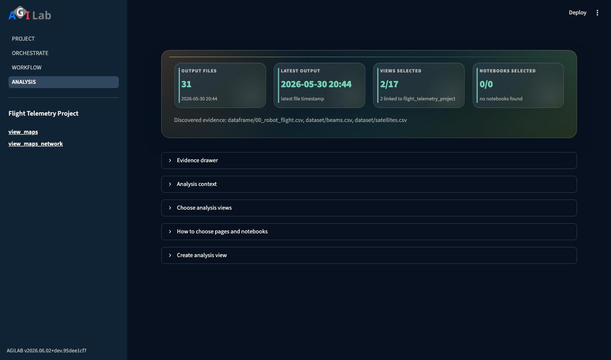

ANALYSIS
===========

.. toctree::
   :hidden:

Introduction
------------
The **Analysis** page is the catalog and launcher for installed analysis views.

It lets you choose which views belong to the active project and launch them in
isolated sidecar sessions.

Page snapshot
-------------

   ANALYSIS exposes the available page bundles, stores the selected views per project, and launches them as sidecar dashboards.

Sidebar
-------
- ``Read Documentation`` opens this guide in the hosted public docs when
  reachable, and falls back to the locally generated docs build when available.
- Project selector that keeps the current application in sync with the rest of
  the suite.
- ``Analysis views`` lists compact launch links for the selected views. If no
  view has been selected yet, it lists every discovered view so you can launch
  one without first editing the project configuration.
- The currently selected project determines which views are stored inside its
  workspace ``app_settings.toml`` file under ``~/.agilab/apps/<project>/``
  in the ``[pages]`` section.

Main Content Area
-----------------
.. tab-set::

   .. tab-item:: Discover

      AGILab scans ``${AGILAB_PAGES_ABS}`` for installed page bundles and
      Python files that expose an entrypoint such as ``src/<module>/<module>.py``
      (or ``main.py`` / ``app.py``). The page grid lists every discovered bundle
      so you can preview what is available on disk.

   .. tab-item:: Configure

      Use **Choose analysis views** to choose which pages are shown as
      sidebar shortcuts for analyzing the selected project. The selection
      is written to ``~/.agilab/apps/<project>/app_settings.toml`` in the
      ``[pages]`` section under ``view_module``. Only the names you choose are
      persisted for the active project; every project keeps its own list. The
      workspace file is seeded from the app's ``app_settings.toml`` source file
      (for example ``<project>/app_settings.toml`` or
      ``<project>/src/app_settings.toml``) the first time the app is loaded.

      You can also create a complete starter bundle directly from this page using
      **Create analysis view**. It creates a minimal pyproject and runnable
      Streamlit module so the page is immediately usable and ready to be
      customized. Use **Starting point** when you want to begin from a blank
      template or duplicate an existing app page before clicking **Create**.

   .. tab-item:: Launch

      Each selected view appears as a compact sidebar link. Opening it launches
      the bundle in a dedicated web process (one port per view, per session)
      using the nearest virtual environment (``.venv``/``venv`` in the bundle or the
      directories pointed to ``${AGILAB_VENVS_ABS}`` and
      ``${AGILAB_PAGES_VENVS_ABS}``). The child app is then embedded via iframe
      and a ``Back to Analysis`` control keeps navigation lightweight.

Tips & Notes
------------
- Views are ordinary web projects. Bundles that expose a ``pyproject.toml``
  and a ``src/<module>/<module>.py`` entry point are automatically picked up.
- Built-in IDE pages (PROJECT, ORCHESTRATE, WORKFLOW, ANALYSIS) always remain
  available; page bundles simply add extra entries to the Analysis catalogue when
  the project opts into them.
- ``UAV Relay Queue`` is a good reference setup (install id
  ``uav_relay_queue_project``): select both ``view_relay_resilience`` and
  ``view_maps_network`` to inspect the same run through a dedicated queue
  dashboard and the generic topology map.
- AGILab caches the list per project, so the Analysis grid reflects the exact
  configuration stored in ``app_settings.toml``.
- If a view needs its own Python environment, place it alongside the page
  bundle (``.venv`` or ``venv``) or in the shared directories referenced by the
  ``AGILAB_VENVS_ABS`` / ``AGILAB_PAGES_VENVS_ABS`` environment variables.
  Analysis automatically picks the first interpreter that exists when spinning up
  the sidecar process.

Troubleshooting and checks
--------------------------

If analysis view discovery is unexpected, use these checks:

- If the list is empty, confirm the bundle folder contains ``pyproject.toml`` and
  ``src/<module>/<module>.py``.
- If a bundle is not launchable, verify that no syntax error blocks startup and
  that the bundle has either ``.venv``/``venv`` or a valid shared interpreter
  under ``${AGILAB_VENVS_ABS}`` / ``${AGILAB_PAGES_VENVS_ABS}``.
- If a launch opens a blank frame, confirm the web process starts on the expected port and
  that your browser blocks mixed local/remote content.
- If the selected bundle list is not saved, check write permission on
  ``~/.agilab/apps/<project>/app_settings.toml``.
- If ``view_maps_network`` opens but shows no UAV queue data, point the data
  directory to one run folder such as
  ``~/export/uav_relay_queue/queue_analysis/<artifact_stem>/`` rather than the parent
  directory. The generic page expects one scenario run at a time.

See also
--------

- :doc:`agilab-help` to place Analysis in the full flow.
- :doc:`apps-pages` to understand page bundle requirements.
