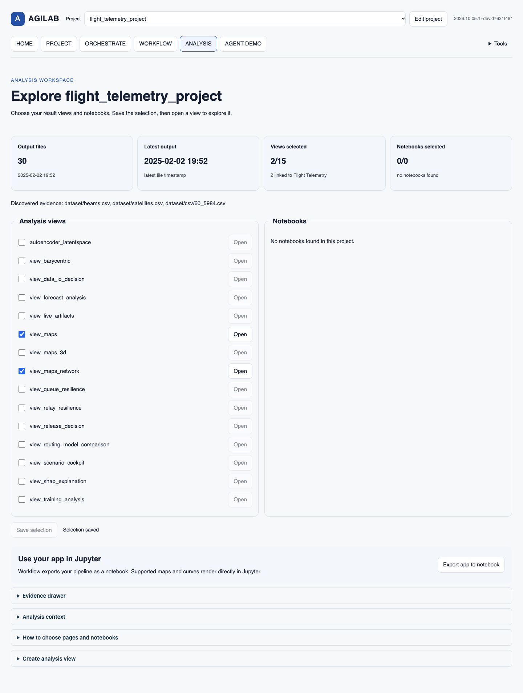

ANALYSIS
===========

.. toctree::
   :hidden:

Introduction
------------
The **Analysis** page is the catalog and launcher for installed analysis views
and project notebooks.

It lets you choose which AGI pages and notebooks belong to the active project
and launch them from one place.

Choose the right surface
------------------------

Use an **AGI page** when the analysis is becoming part of the application
contract: a repeatable dashboard, review screen, demo, validation evidence, or
shared result surface. A page reads exported artifacts from the project and the
selected page links are persisted in the project workspace settings under
``[pages].view_module``. This is the route that enables non-notebook users,
stable demos, CI-backed artifact contracts, and reusable ``agi-page-*``
packaging. The consequence is that you must maintain a page bundle, declared
dependencies, and stable exported artifacts for the page to read.

Use a **notebook or AGI snippet** when the analysis is still code-centric:
exploration, debugging, cell-by-cell reruns, migration from an existing
notebook, reusable snippets, or handoff to a technical user. In ANALYSIS, a
selected notebook opens through a project-rooted JupyterLab sidecar. Outside the
page, exported notebooks and AGI snippets can also be reused wherever the AGI
runtime and dependencies are available. The consequence is that reuse depends on
the snippet/notebook contract, runtime environment, and declared dependencies;
it is excellent for evolving logic but less direct for end users than an AGI
page.

Use both when needed: keep an AGI page as the stable result surface and link a
notebook or AGI snippets as the investigation trail behind that result. AGI page
selections and notebook selections are stored separately.

Page snapshot
-------------

   ANALYSIS groups the project's views and notebooks into two selection panels, with explicit save, open, and notebook export actions.

Workspace header
----------------
The React header contains the **Project** selector and workspace navigation.
Choose the active project there before configuring its views or notebooks.
The catalogue, saved selections, and notebook routes follow that project.

Main Content Area
-----------------
.. tab-set::

   .. tab-item:: Discover

      **Analysis views** lists the installed page bundles discovered under
      ``AGILAB_PAGES_ABS``. A bundle provides a ``pyproject.toml`` and a Python
      entry point such as ``src/<module>/<module>.py``, ``main.py``, or ``app.py``.
      **Notebooks** lists ``.ipynb`` files discovered in the active project's
      ``notebooks`` directory. The summary above the panels shows the available
      and selected items.

   .. tab-item:: Configure

      Tick the checkboxes in **Analysis views** and **Notebooks**, then click
      **Save selection**. **Discard changes** restores the saved choices when
      edits are pending. The status beside these controls reports unsaved
      changes, a successful save, or a save error.

      Views are saved in ``[pages].view_module`` and notebooks in
      ``[notebooks].selected`` inside
      ``~/.agilab/apps/<project>/app_settings.toml``. Each project keeps its
      own selections. The workspace file is seeded from the app's source
      ``app_settings.toml`` the first time that app is loaded.

      **Create analysis view** remains available for Python authors. Choose
      **Starting point** to create a blank starter bundle or duplicate an
      existing page, then click **Create**. The generated bundle contains a
      minimal ``pyproject.toml`` and a runnable Python page module rendered by
      the native UI host.

   .. tab-item:: Open

      Click **Open** beside a saved, selected item. The button becomes
      available when the selection is saved and the item has a launchable
      route; save or discard pending edits before opening an item.

      An analysis view opens inside ANALYSIS through its existing Python-backed
      renderer. A page bundle can run in a dedicated web sidecar using its
      nearest ``.venv`` or ``venv``, or an interpreter under
      ``AGILAB_VENVS_ABS`` or ``AGILAB_PAGES_VENVS_ABS``, and appear in an
      embedded frame. Use **Back to Analysis** to return to the catalogue.

      In a local AGILAB runtime, opening a notebook starts a project-rooted
      JupyterLab sidecar and embeds that notebook. Hosted ANALYSIS runtimes
      report that notebook sidecars are available locally only. Notebook
      files and AGI snippets remain reusable separately in an appropriate
      Python/Jupyter environment with their declared dependencies.

   .. tab-item:: Export app to notebook

      **Export app to notebook** opens WORKFLOW for the active project, where
      the pipeline can be exported as a readable, executable ``.ipynb`` file.
      The export keeps Python cells editable and reusable in Jupyter.
      Supported maps and analysis curves render directly in the notebook.

      This action is a link to the export workflow. Save or discard pending
      selection changes before navigating away.

Tips & Notes
------------
- Views are ordinary web projects. Bundles that expose a ``pyproject.toml``
  and a ``src/<module>/<module>.py`` entry point are automatically picked up.
- Core workspace pages (PROJECT, ORCHESTRATE, WORKFLOW, ANALYSIS) always remain
  available; page bundles simply add extra entries to the Analysis catalogue when
  the project opts into them.
- ``UAV Relay Queue`` is a good reference setup (install id
  ``uav_relay_queue_project``): select both ``view_relay_resilience`` and
  ``view_maps_network`` to inspect the same run through a dedicated queue
  dashboard and the generic topology map.
- AGILAB discovers available bundles and restores saved choices for each
  project from ``app_settings.toml``.
- If a view needs its own Python environment, place it alongside the page
  bundle (``.venv`` or ``venv``) or in the shared directories referenced by the
  ``AGILAB_VENVS_ABS`` / ``AGILAB_PAGES_VENVS_ABS`` environment variables.
  Analysis automatically picks the first interpreter that exists when spinning up
  the sidecar process.

Troubleshooting and checks
--------------------------

If analysis view discovery is unexpected, use these checks:

- If the list is empty, confirm the bundle folder contains ``pyproject.toml`` and
  ``src/<module>/<module>.py``.
- If a bundle is not launchable, verify that no syntax error blocks startup and
  that the bundle has either ``.venv``/``venv`` or a valid shared interpreter
  under ``${AGILAB_VENVS_ABS}`` / ``${AGILAB_PAGES_VENVS_ABS}``.
- If a launch opens a blank frame, inspect the sidecar startup logs and the
  browser's frame or network errors; confirm the expected local endpoint is reachable.
- If the selected bundle list is not saved, check write permission on
  ``~/.agilab/apps/<project>/app_settings.toml``.
- If ``view_maps_network`` opens but shows no UAV queue data, point the data
  directory to one run folder such as
  ``~/export/uav_relay_queue/queue_analysis/<artifact_stem>/`` rather than the parent
  directory. The generic page expects one scenario run at a time.

See also
--------

- :doc:`agilab-help` to place Analysis in the full flow.
- :doc:`apps-pages` to understand page bundle requirements.
