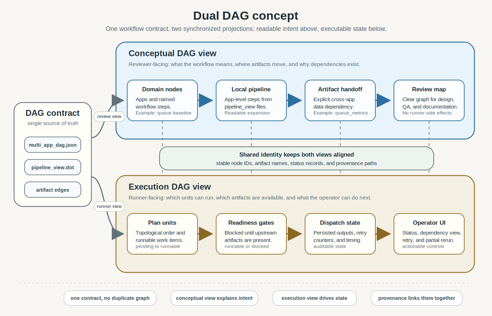

Features
========

This page lists current shipped capabilities.

For toolchain fit, framework comparison, and when to choose AGILab, see
:doc:`agilab-mlops-positioning`.

For planned work, see :doc:`roadmap/agilab-future-work`.

AGILab currently exposes 2 main user interfaces:

 - ``agi-core``: an API interface callable directly from your Python program.
 - ``agilab``: a web interface that generates ``agi-core`` calls and can render generated snippets for execution.

Shared components include ``agi-env`` (headless environment setup),
``agi-gui`` (Streamlit UI dependency bundle and page helpers), ``agi-node``
(runtime orchestration), and ``agi-cluster`` (multi-node execution support).

agi-core
--------

- **Automated Virtual Environment Setup:**

  - Automatically installs virtual environments for cluster nodes which are computers with multi-cores CPU, GPU and NPU.

- **Flexible Application Run Modes:**

  - **Process Management:**

    - Single Process
    - Multiple Processes

  - **Language Support:**

    - Pure Python (From python 3.11)
    - Cython (Ahead of execution compilation)

  - **Deployment Modes:**

    - Single Node with MacOS, Windows (from W11) or Linux (Ubuntu from ubuntu 24.04)
    - Cluster with heterogeneous os per node

- **Node Capacity Calibration:**

  - Estimates relative worker capacity and feeds those weights into the
    dispatcher.

- **Capacity-Weighted Static Load Balancing:**

  - Builds a deterministic work plan before execution. Large plans use
    capacity-normalized longest-processing-time assignment; the scheduler does
    not rebalance already-running work in flight.

- **Distributed Work-Plan Execution:**

  - Facilitates partitioned data processing, worker dispatch, and app-level
    aggregation.
  - AGILab currently standardizes the ``map`` side of the workflow: building
    distribution plans, dispatching partitions, and running them on local or
    cluster workers.
  - AGILab now exposes a shared ``agi_node`` reduce contract with explicit
    partial inputs, reducer merge semantics, and a standard reduce artefact
    schema.
  - ``execution_pandas_project`` and ``execution_polars_project`` emit named
    benchmark reduce artefacts through that shared contract; the user-facing
    ``flight_telemetry_project`` emits trajectory-summary reduce artefacts;
    ``weather_forecast_project`` emits forecast-metrics reduce artefacts; and
    ``uav_queue_project`` plus ``uav_relay_queue_project`` emit the same
    ``reduce_summary_worker_<id>.json`` artifact shape for queue metrics.
  - The Release Decision evidence view discovers those artefacts, validates
    their schema, and displays reducer name, partial count, artifact path,
    benchmark row/source/execution fields, flight row/aircraft/speed fields,
    weather forecast MAE/RMSE/MAPE fields, and UAV queue-family packet/PDR fields
    when present.
  - The public reducer benchmark validates 8 partials / 80,000 synthetic items
    in ``0.003s`` against a ``5.0s`` target.
  - A repository guardrail requires every non-template built-in app to expose a
    reducer contract. ``mycode_project`` and ``global_dag_project`` are explicit
    template-only exemptions because they do not produce concrete worker merge
    output; future apps/templates must opt in when they produce durable worker
    summaries.

- **Optimized Run-Mode Selection:**

  - Chooses the best run-mode from up to 16 combinations (8 base modes and an optional RAPIDS variant).

agilab
------

- **Notebook-like multi-venv execution:**

  - Coordinate runs through one interface while keeping isolated runtimes for
    project stages, workers, or page bundles.

- **agi-core API Generation:**

  - Automatically generates APIs to streamline development processes.

- **Multi-provider coding assistant:**

  - Integrates with OpenAI, Mistral, and OpenAI-compatible endpoints such as vLLM to offer real-time code suggestions across preferred providers.

- **Embedded Dataframe Export:**

  - Easily export dataframes cross project.

- **5 Ways to Reuse Code:**

  - **Framework Instantiation:**

    - Inherit from agi-core ``AgentWorker | DagWorker | DataWorker`` classes.

  - **Project Templates:**

    - Clone existing code or create new project from templates.

  - **Q&A Snippets History:**

    - Utilize historical code snippets for quick integration.

  - **Collaborative Coding:**

    - Export / Import project to work together efficiently cross organisation.

  - **Views Creation:**

    - Share views seamlessly across multiple projects.

- **Project & Page Isolation:**

  - Create full AGILab *apps* from templates; each ships with its own
    ``pyproject.toml`` / ``uv_config.toml`` so ``uv`` provisions a dedicated
    virtual environment during Install.
  - Build additional **page bundles** (standalone dashboards) that
    live under ``src/agilab/apps-pages``. Every bundle carries its own
    ``pyproject.toml`` or embedded ``.venv`` so the Analysis launcher spins it up
    inside an isolated interpreter.

Engineering prototyping evidence
--------------------------------

AGILab is strongest for engineering prototypes that need more structure than a
single notebook but less ceremony than a production MLOps platform:

- app templates and cloned projects provide a repeatable manager/worker shape
- app and page bundles keep dependencies isolated through their own
  ``pyproject.toml`` / ``uv`` environments
- ``app_args_form.py`` and ``app_settings.toml`` give prototypes a typed,
  configurable UI surface instead of hard-coded script parameters
- ``lab_stages.toml`` and notebook import/export support let teams move between
  notebook exploration and reproducible pipeline snippets
- the notebook-to-pipeline import report validates that bridge with
  ``tools/notebook_pipeline_import_report.py --compact``; it reads a checked-in
  ``.ipynb``, preserves markdown context and code cells, extracts import hints
  plus artifact references, writes a richer ``lab_stages.toml`` preview used by
  the existing ``WORKFLOW`` upload path, and emits ``not_executed_import``
  metadata without running notebook cells
- the notebook import preflight report validates the generic migration boundary
  with ``tools/notebook_import_preflight.py --compact``; it reads an ``.ipynb``
  without execution, flags cleanup risks such as runtime installs, shell calls,
  network access, widgets, hidden notebook state, and absolute paths, and writes
  app-neutral ``notebook_import_contract.json`` and
  ``notebook_import_pipeline_view.json`` sidecars when requested; when an app
  owns a ``notebook_import_views.toml`` manifest it also writes a
  ``notebook_import_view_plan.json`` sidecar that matches declared views to
  artifact paths without inferring UI intent from notebook cells; the
  ``WORKFLOW`` upload path now prepares that preview first, lets the operator
  choose an import scope of all runnable cells or one focused cell promoted as
  an AGILAB stage, and only replaces ``lab_stages.toml`` after explicit
  confirmation
- the notebook round-trip report validates
  ``tools/notebook_roundtrip_report.py --compact`` across
  ``lab_stages.toml -> supervisor notebook -> import -> lab_stages preview`` so
  saved stage description, prompt, model, code, runtime, import hints, and
  artifact references survive the non-executing round trip
- the notebook union-environment report validates
  ``tools/notebook_union_environment_report.py --compact``; it renders a
  ``single-kernel union notebook`` only for compatible ``runpy``/current-kernel
  stages and marks mixed runtimes or environments as
  ``supervisor_notebook_required``
- the data connector facility report validates
  ``tools/data_connector_facility_report.py --compact`` against
  ``SQL, OpenSearch/Elasticsearch, and object-storage connector definitions`` in
  a plain-text TOML catalog; search-index contracts cover OpenSearch-compatible
  clusters, while object-storage contracts cover AWS S3/S3-compatible stores,
  Azure Blob Storage, and Google Cloud Storage. It runs in
  ``contract_validation_only`` mode, checks kind-specific fields, and requires
  environment references instead of embedded remote credentials
- the data connector cloud emulator report validates
  ``tools/data_connector_cloud_emulator_report.py --compact`` in
  ``cloud_emulator_contract_only`` mode; it checks account-free MinIO/S3,
  Azurite/Azure Blob, fake-gcs-server/GCS, and local search endpoints against
  the same connector facility and runtime-adapter contracts without proving
  real cloud IAM, networking, quota, or billing behavior
- the data connector resolution report validates
  ``tools/data_connector_resolution_report.py --compact`` for
  connector-aware app/page resolution; it resolves app-settings connector IDs,
  proves page-specific references, preserves ``legacy_path_fallback`` rows,
  and runs in ``contract_resolution_only`` mode without network probes
- the data connector health report validates
  ``tools/data_connector_health_report.py --compact`` in
  ``health_probe_plan_only`` mode; it plans SQL, OpenSearch, and
  object-storage health/status probes behind operator opt-in and records
  ``unknown_not_probed`` public evidence without network checks
- the data connector health actions report validates
  ``tools/data_connector_health_actions_report.py --compact`` in
  ``operator_trigger_contract_only`` mode; it exposes operator-triggered health
  probes as explicit action rows while keeping public network execution at zero
- the data connector runtime adapters report validates
  ``tools/data_connector_runtime_adapters_report.py --compact`` in
  ``runtime_adapter_contract_only`` mode; it binds credentialed connector adapters
  to runtime operations and health actions while deferring credential values and
  keeping public network execution at zero
- the data connector live endpoint smoke report validates
  ``tools/data_connector_live_endpoint_smoke_report.py --compact`` in
  ``live_endpoint_smoke_plan_only`` mode; opt-in
  ``live_endpoint_smoke_opt_in`` execution is operator-gated, never logs
  credential values, and is publicly exercised with a local SQLite endpoint
- the data connector UI preview report validates
  ``tools/data_connector_ui_preview_report.py --compact`` in
  ``static_ui_preview_only`` mode; it renders connector state and
  connector-derived provenance as static JSON+HTML cards, page bindings,
  legacy fallbacks, and health opt-in boundary evidence
- the data connector live UI report validates
  ``tools/data_connector_live_ui_report.py --compact`` in
  ``streamlit_render_contract_only`` mode; it wires connector state and
  connector-derived provenance into the Release Decision page while keeping
  connector network probes at zero
- the connector-aware view surface report validates
  ``tools/data_connector_view_surface_report.py --compact`` in
  ``connector_view_surface_contract_only`` mode against
  ``agilab.data_connector_view_surface.v1``; it verifies the Release Decision
  connector state/provenance panel, health/status boundary, import/export
  provenance panel, and external artifact traceability panel without network
  probes
- the data connector app catalogs report validates
  ``tools/data_connector_app_catalogs_report.py --compact`` in
  ``app_catalog_validation_only`` mode; it proves app-local connector catalogs
  for every non-template built-in app without network probes
- optional ``pipeline_view.dot`` / ``pipeline_view.json`` files give prototypes
  a conceptual architecture view alongside generated execution snippets
- the Analysis page can generate minimal page bundles so a prototype can gain a
  shareable dashboard without becoming a full product
- the landing page first-proof wizard now routes newcomers through one
  validated ``flight_telemetry_project`` source-checkout proof, reads
  ``run_manifest.json``, and shows a manifest-driven remediation checklist
  with exact evidence commands when the proof is missing, invalid, incomplete,
  or failing
- ``tools/newcomer_first_proof.py --json`` writes
  ``~/log/execute/flight_telemetry/run_manifest.json`` so the first proof has one stable
  command/environment/timing/artifact/validation record that the release
  decision view can consume as promotion evidence
- the revision traceability report validates
  ``tools/revision_traceability_report.py --compact`` in
  ``revision_traceability_static`` mode against
  ``agilab.revision_traceability.v1``; it fingerprints the repository HEAD,
  bundled AGI core package versions, and built-in app manifests without
  invoking git commands or querying networks
- the public certification profile report validates
  ``tools/public_certification_profile_report.py --compact`` in
  ``public_certification_static`` mode against
  ``agilab.public_certification_profile.v1``; it turns the compatibility
  matrix into a ``bounded_public_evidence`` profile while explicitly avoiding
  production or third-party certification claims
- the supply-chain attestation report validates
  ``tools/supply_chain_attestation_report.py --compact`` in
  ``supply_chain_static_attestation`` mode against
  ``agilab.supply_chain_attestation.v1``; it fingerprints package metadata,
  lockfile, license, bundled AGI core versions, exact bundle dependency pins,
  app/page payload package versions, built-in app payload versions, runtime
  dependency lower bounds, and built-in app manifests plus package payload inventory
  and package payload budgets without formal supply-chain
  attestation claims
- the security hygiene report validates
  ``tools/security_hygiene_report.py --compact`` in
  ``agilab.security_hygiene.v1`` mode; it checks the public security policy,
  lockfile presence, optional AI dependency boundary, static supply-chain proof
  tools, documented ``pip-audit`` plus CycloneDX SBOM command contracts, and
  operator-provided scan artifacts; CI runs it with
  ``--require-scan-artifacts`` so missing, invalid, or vulnerable audit payloads
  fail the guardrail
- the public proof scenario report validates
  ``tools/public_proof_scenarios.py --compact`` in
  ``agilab.public_proof_scenarios.v1`` mode; it records the three bounded
  public proof routes: ``flight_telemetry_project`` local first proof,
  ``weather_forecast_project`` hosted forecast proof, and the MLflow tracking
  contract, and can attach runtime JSON from
  ``--first-proof-json`` and ``--hf-smoke-json`` artifacts when CI or a release
  run provides them
- the first-launch robot validates
  ``tools/first_launch_robot.py --json`` in
  ``agilab.first_launch_robot.v1`` mode; it uses Streamlit ``AppTest`` to prove
  the first page renders without exceptions, initializes ``AgiEnv``, exposes
  the first-proof action, shows the project-to-results workflow, and keeps a
  visible documentation action
- the repository knowledge index report validates
  ``tools/repository_knowledge_report.py --compact`` in
  ``repository_knowledge_static_index`` mode against
  ``agilab.repository_knowledge_index.v1``; it indexes code, tools, official
  docs, root runbooks, and package manifests while excluding generated
  artifacts and keeping the generated wiki as an exploration aid rather than
  the source of truth
- the run-diff evidence report validates
  ``tools/run_diff_evidence_report.py --compact`` in
  ``run_diff_evidence_only`` mode; it compares baseline/candidate KPI checks,
  run-manifest deltas, and artifact rows, then emits counterfactual prompts for
  material changes without executing commands or network probes
- the CI artifact harvest report validates
  ``tools/ci_artifact_harvest_report.py --compact`` in
  ``ci_artifact_contract_only`` mode; it maps external-machine
  ``run_manifest.json``, KPI bundle, compatibility report, and promotion
  decision attachments to a release status with SHA-256 and provenance checks
  without querying live CI providers
- the GitHub Actions artifact-index adapter converts downloaded workflow
  artifact ZIPs with ``tools/github_actions_artifact_index.py --archive`` into
  the same harvest input, while opt-in ``--live-github`` mode can query and
  download a workflow run when operator credentials are available
- the generic CI provider artifact-index adapter converts downloaded GitLab CI
  or generic provider ZIPs with
  ``tools/ci_provider_artifact_index.py --provider gitlab_ci --archive`` into
  the same harvest input without querying live provider APIs; opt-in
  ``--live-gitlab`` can query and download a GitLab CI pipeline when operator
  credentials are available

The DAG evidence below has two synchronized projections: a reviewer-facing
conceptual graph and a runner-facing execution state graph. Both stay anchored
to the same contract, artifact names, stable node IDs, and provenance.

   One DAG contract drives both the readable workflow review view and the
   executable runner-state view without duplicating the graph.

- the multi-app DAG contract now validates app-to-app dependencies and
  artifact handoffs with ``tools/multi_app_dag_report.py --compact`` against
  ``docs/source/data/multi_app_dag_sample.json``; the first sample links
  ``uav_queue_project`` to ``uav_relay_queue_project`` through an explicit
  ``queue_metrics`` handoff, and the supplemental
  ``docs/source/data/multi_app_dag_portfolio_sample.json`` broadens contract
  coverage across ``flight_telemetry_project``, ``weather_forecast_project``,
  ``execution_pandas_project``, and ``execution_polars_project``
- the global pipeline DAG report now assembles that cross-app contract with the
  app-local ``pipeline_view.dot`` files using
  ``tools/global_pipeline_dag_report.py --compact``; it emits a read-only graph
  with app nodes, app-local pipeline stages, and the ``queue_metrics`` edge
  without claiming runner execution or operator UI state
- the global DAG execution plan report converts that graph into ordered
  runnable units with ``tools/global_pipeline_execution_plan_report.py --compact``;
  the first plan keeps ``queue_baseline`` and ``relay_followup``
  in ``pending/not_executed`` state, records the ``queue_metrics`` dependency,
  and preserves DAG plus ``pipeline_view.dot`` provenance without dispatching
  any app
- the global DAG runner state report projects that plan into
  ``runnable/blocked`` dispatch readiness with
  ``tools/global_pipeline_runner_state_report.py --compact``; it records
  retry and partial-rerun metadata plus operator-facing readiness messages
  without claiming live app execution
- the WORKFLOW page exposes the same runner-state contract in an expanded
  ``Workflow graph`` surface; operators can choose project workflow or
  multi-app DAG scope, edit steps, created outputs, and used outputs through
  selector-driven workspace drafts and read-only summaries, validate the plan
  without hand-editing docs files, reset the persisted preview state, inspect
  readiness KPIs, optional graph and output details, preview exact distributed
  stage requests before submission, and preview the next ready step without
  claiming that the downstream app has executed
- the distributed DAG stage smoke validator writes dry-run or live execution
  evidence with ``tools/dag_distributed_stage_smoke.py --compact``; it checks
  explicit ``nodes[].execution`` request fields, the ORCHESTRATE-derived
  scheduler/workers/Workers Data Path contract, and the two-node distributed
  request preview before a live ``--execute`` run is attempted
- the global DAG dispatch state report writes and reads back a
  persisted run-state JSON proof with
  ``tools/global_pipeline_dispatch_state_report.py --compact``; it records
  ``queue_baseline completed``, publishes ``queue_metrics``, marks
  ``relay_followup runnable``, and preserves timestamps, retry counters,
  partial-rerun flags, operator messages, and provenance without claiming
  real app execution
- the global DAG app dispatch smoke report performs real queue_baseline and
  relay_followup execution with
  ``tools/global_pipeline_app_dispatch_smoke_report.py --compact``; it runs the
  checked-in ``uav_queue_project`` and ``uav_relay_queue_project``
  manager/worker entries, persists ``queue_metrics``, ``relay_metrics``, and
  reducer artifacts into dispatch-state JSON, and records
  ``real queue_baseline and relay_followup execution`` without claiming live
  operator UI
- the global DAG operator state report reads that persisted full-DAG dispatch
  state with ``tools/global_pipeline_operator_state_report.py --compact``; it
  projects ``operator-visible state`` for the completed units, the
  queue-to-relay artifact handoff, available artifacts, and
  ``retry/partial-rerun actions`` without claiming a live UI
- the global DAG dependency view report reads the operator-state proof with
  ``tools/global_pipeline_dependency_view_report.py --compact``; it provides
  ``upstream/downstream dependency visualization`` for
  ``queue_baseline -> relay_followup``, including the ``queue_metrics`` edge,
  producer/consumer apps, adjacency lists, artifact flow, and linkage back to
  persisted operator state without claiming a live UI component
- the global DAG live state updates report reads that dependency view with
  ``tools/global_pipeline_live_state_updates_report.py --compact``; it emits a
  ``deterministic update stream`` for ``live orchestration-state updates``
  across graph-ready, unit-state, artifact-state, dependency-state, and
  operator-action refresh payloads without claiming a streaming service or UI
- the global DAG operator actions report reads those update payloads with
  ``tools/global_pipeline_operator_actions_report.py --compact``; it performs
  ``retry and partial-rerun action execution`` for ``queue_baseline:retry`` and
  ``relay_followup:partial_rerun`` through ``real app-entry action replay`` and
  persists action outcomes plus output artifacts without claiming a UI control
  surface
- the global DAG operator UI report reads action outcomes with
  ``tools/global_pipeline_operator_ui_report.py --compact``; it builds
  ``operator UI components`` for status, unit cards, dependency graph, update
  timeline, action controls, and artifacts that render persisted state and support operator actions through a static HTML proof

That supports an ``Engineering prototyping`` score of ``4.0 / 5``. It is not
scored higher yet because additional external replication and future
app/template reducer adoption remain maintenance discipline when new concrete
merge outputs appear.

Production-readiness controls
-----------------------------

AGILab ships a bounded set of controls for controlled pilots and handoff to a
production platform:

- ``tools/pypi_publish.py`` enforces release preflight checks before real PyPI
  publication
- workflow-parity profiles mirror selected GitHub Actions locally before a
  maintainer relies on CI
- the compatibility matrix separates validated public paths from documented
  routes that still need broader certification
- ``tools/service_health_check.py`` evaluates service status against SLA
  thresholds and can emit JSON or Prometheus-compatible output
- the release-decision analysis page compares baseline and candidate bundles,
  resolves artifact/log/export roots through the shared connector path registry,
  gates on the first-proof ``run_manifest.json``, imports external manifest
  evidence with ``--manifest`` / ``--manifest-dir`` style inputs, evaluates
  artifact and KPI gates, and exports ``promotion_decision.json`` with connector
  registry paths, manifest summary, import summary, provenance-tagged attachment
  metadata, per-release ``manifest_index.json`` evidence history,
  cross-release manifest comparison, cross-run evidence bundle comparison, and
  gate details; it also imports ``ci_artifact_harvest.json`` evidence, displays
  artifact kind/status/checksum/provenance rows, blocks invalid harvests, and
  exports ``ci_artifact_harvest_summary`` plus ``ci_artifact_harvest_evidence``
- ``tools/run_diff_evidence_report.py --compact`` gives that comparison work a
  machine-checkable, no-execution run-diff/counterfactual evidence contract
- ``tools/ci_artifact_harvest_report.py --compact`` adds the matching
  external-machine attachment contract for CI-produced evidence bundles, and
  the Release Decision page can now consume that JSON without live CI or network
  access
- ``tools/github_actions_artifact_index.py --archive`` bridges provider
  artifacts into that contract by expanding GitHub Actions ZIP archives into a
  harvest-compatible ``artifact_index.json``; ``--live-github`` is opt-in for
  credentialed provider queries and downloads
- ``tools/ci_provider_artifact_index.py --provider gitlab_ci --archive``
  covers downloaded GitLab CI and generic provider ZIP archives without live
  provider API access
- the same evidence view surfaces reducer artifacts from benchmark distributed
  runs, weather forecast results, and UAV queue-family results, including
  invalid-artifact diagnostics when JSON cannot be parsed
- ``SECURITY.md`` provides the public vulnerability-reporting and deployment
  hardening baseline

That supports a ``Production readiness`` score of ``3.0 / 5``. It is not scored
higher because AGILab remains a research and engineering workbench rather than
a production serving, monitoring, governance, or certification platform.
