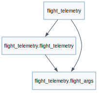
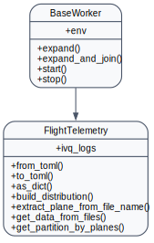
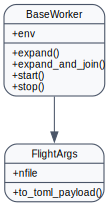
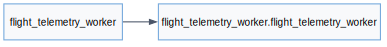
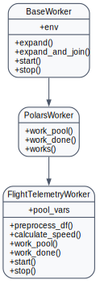

Flight-Telemetry Project
========================

Overview
--------
- End-to-end reference project that ingests file-based aeronautical telemetry, cleans it
  with `Polars` and pushes curated artefacts back into the AGILab export
  directory.
- Demonstrates how to orchestrate file-based distributions, run inside the
  cluster pool and keep the web interface responsive while the
  worker pipeline operates asynchronously.
- Bundles web-view lab material (``lab_stages.toml``) and prompt examples to help
  you reproduce the workflow showcased in AGILab live demos.

Scientific highlights
---------------------
The worker derives segment distances from time-stamped telemetry. For two
samples with latitude/longitude :math:`(\phi_1, \lambda_1)` and
:math:`(\phi_2, \lambda_2)`, a common great-circle approximation is the
haversine formula:

.. math::

   d = 2R \arcsin\left(\sqrt{\sin^2\frac{\Delta\phi}{2} + \cos\phi_1\cos\phi_2\sin^2\frac{\Delta\lambda}{2}}\right)

with Earth radius :math:`R` and angular differences
:math:`\Delta\phi = \phi_2 - \phi_1`, :math:`\Delta\lambda = \lambda_2 - \lambda_1`.
The public demo stores this per-sample segment distance in the historical
``speed`` column so existing analysis pages and reducer contracts remain
compatible.

Public scope
------------
``flight_telemetry_project`` is intentionally file-only. The wider AGILab connector
catalog supports SQL, object-storage, and OpenSearch-compatible connector
definitions, but this built-in app rejects search-index data sources instead of
exposing a partially implemented path.

Manager (`flight.flight`)
-------------------------
- Wraps the runnable application. Converts user-supplied arguments into a
  validated `FlightArgs` model, normalises data URIs, and initialises cluster
  dispatch by seeding ``WorkDispatcher``.
- Provides ``from_toml`` / ``to_toml`` helpers so snippets on the Orchestrate page can
  reload configuration and persist overrides.
- Handles managed-PC specifics (path remapping, data directory resets) and keeps
  the dataframe export folder clean between runs.

Args (`flight.flight_args`)
---------------------------
- Pydantic models that capture the supported public configuration, including
  dataset location, slicing parameters and cluster toggles.
- Ships conversion utilities for reading/writing ``app_settings.toml`` and merging
  overrides that are injected by the Orchestrate page.

Worker (`flight_worker.flight_worker`)
--------------------------------------
- Extends ``PolarsWorker`` to preprocess raw telemetry, compute great-circle
  segment distances between samples, and partition files across the cluster.
- Can be compiled by the AGILab dispatcher when Cython is enabled; generated
  ``.pyx``/``.c`` files are build artefacts, not source-of-truth files.
- Demonstrates Windows-friendly path handling and data staging for managed
  environments.

Assets & Tests
--------------
- ``test/test_flight_telemetry_project_runtime_args.py`` covers argument validation,
  file inventory building, worker defaults, and reduce-artifact emission.
- Cluster validation and UI tests cover the default ``view_maps`` route,
  first-proof flow, and Release Decision reduce-artifact discovery.

API Reference
-------------

.. automodule:: flight.flight
   :members:
   :show-inheritance:

.. automodule:: flight.flight_args
   :members:
   :show-inheritance:

.. automodule:: flight_worker.flight_worker
   :members:
   :show-inheritance:

