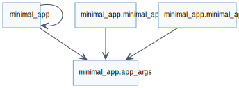
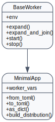
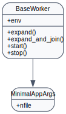
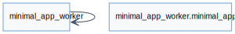
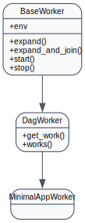

Minimal App Project
===================

Overview
--------
- Minimal starter template you can copy to bootstrap a new AGILab application.
- Demonstrates the project layout expected by the platform (manager package,
  worker package, ``app_args`` definitions, Analysis configuration) with minimal
  business logic so you can focus on custom code.
- Ships with blank web forms and prompt files to illustrate where to plug
  in UI customisation and WORKFLOW prompts.

Scientific placeholders
-----------------------
The template is intentionally lightweight, but many AGILab workflows ultimately
fit the pattern of learning or calibrating a function :math:`f_\theta`:

.. math::

   \theta^* = \arg\min_{\theta} \; \frac{1}{N} \sum_{i=1}^{N} \ell\left(f_{\theta}(x_i), y_i\right)

where :math:`\ell` is a task-dependent loss (regression, classification,
imitation learning, etc.). You can use the Minimal App skeleton to prototype the
data loading, feature extraction, and artifact export around this core loop.

Manager (`minimal_app.minimal_app`)
-----------------------------------
- Lightweight subclass of ``BaseWorker`` that shows how to wire argument
  handling, logging and dataframe export without heavy dependencies.
- Provides the same ``from_toml`` / ``to_toml`` helpers as production projects so
  you can reuse the Orchestrate page snippets verbatim.

Args (`minimal_app.app_args`)
-----------------------------
- Simple Pydantic model that mirrors the keys present in ``app_settings.toml``.
- Ideal starting point for capturing new configuration options; extend the model
  and the web form generated on the Orchestrate page will pick them up.

Worker (`minimal_app_worker.minimal_app_worker`)
------------------------------------------------
- Skeleton worker that demonstrates the lifecycle hooks (``start``,
  ``work_init``, ``run``) required by the distributor.
- Includes placeholder logic for dataset loading and result persistence—replace
  with your domain-specific processing stages.

Reducer contract status
-----------------------
``minimal_app_project`` is template-only. It intentionally does not ship a reducer
contract because the manager and worker contain placeholders and no concrete
merge output.

When a cloned project starts producing durable worker summaries, add a
``reduction.py`` module, emit ``reduce_summary_worker_<id>.json`` artifacts, and
export a ``*_REDUCE_CONTRACT`` symbol from the manager package. That keeps custom
apps aligned with the shared ``agi_node`` reducer contract without treating the
starter template as an unfinished built-in app.

Assets & Tests
--------------
- ``app_test.py`` ensures the installer and worker skeleton keep working as the
  template evolves.
- ``test/_test_*`` modules show how to unit-test managers and workers in
  isolation.
- ``app_args_form.py`` provides the optional web form that mirrors the
  generated UI; tailor it when you need additional validation or widgets.

API Reference
-------------

.. automodule:: minimal_app.minimal_app
   :members:
   :show-inheritance:

.. automodule:: minimal_app.app_args
   :members:
   :show-inheritance:

.. automodule:: minimal_app_worker.minimal_app_worker
   :members:
   :show-inheritance:

