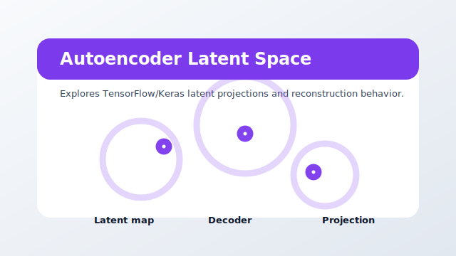

# autoencoder_latentspace



Package: `agi-page-latent-space`

Opt-in playground exception for TensorFlow/Keras latent projections and reconstruction behavior.

## When To Use It

Use for heavier Python 3.12 teaching or exploration sessions where latent-space structure matters more than lightweight packaging. This bundle trains a small autoencoder in-page, so treat it as an explicit playground exception rather than a generic app-agnostic analysis sidecar.

## Opt-In Boundary

Most apps-pages inspect artifacts produced by the active app. This page is different: it builds and fits a TensorFlow/Keras autoencoder from the selected dataframe to demonstrate latent projections. Keep reproducible training workflows in app projects; use this bundle only when the in-page teaching loop is intentional.

## Expected Inputs

- A dataframe with continuous/discrete columns.
- Optional model or embedding outputs from the selected app.

Open it from `ANALYSIS` after selecting a project, or run it directly while developing:

```bash
uv --preview-features extra-build-dependencies run streamlit run src/agilab/apps-pages/autoencoder_latentspace/src/autoencoder_latentspace/main.py -- --active-app src/agilab/apps/builtin/flight_telemetry_project
```

## Quality Contract

This bundle has a local README, a source-controlled preview asset, direct test coverage, and uses the shared `agi_pages.runtime` page chrome.
