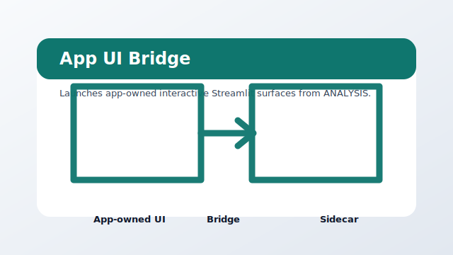

# view_app_ui



Package: `agi-page-app-ui`

Launches app-owned interactive Streamlit surfaces from ANALYSIS.

## When To Use It

Use when the app owns live controls, training loops, or a custom UI that should stay outside generic page bundles.

## Expected Inputs

- An active app with a [pages.view_app_ui] or app_surface Streamlit entrypoint.
- The app-owned UI source and its exported artifacts.

Open it from `ANALYSIS` after selecting a project, or run it directly while developing:

```bash
uv --preview-features extra-build-dependencies run streamlit run src/agilab/apps-pages/view_app_ui/src/view_app_ui/view_app_ui.py -- --active-app src/agilab/apps/builtin/pytorch_playground_project
```

## Quality Contract

This bundle has a local README, a source-controlled preview asset, direct test coverage, and uses the shared `agi_pages.runtime` page chrome.
