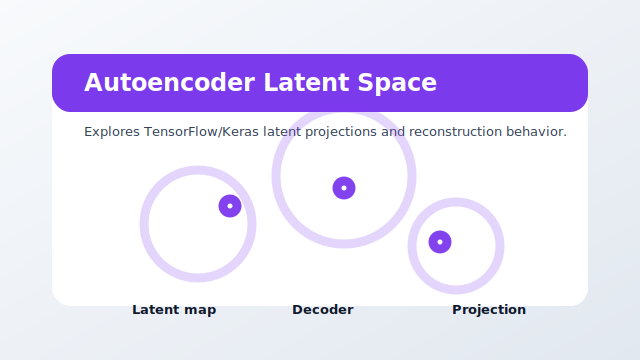

# view_autoencoder_latentspace



Package: `agi-page-latent-space`

Explores TensorFlow/Keras latent projections and reconstruction behavior.

## When To Use It

Use for heavier Python 3.12 teaching or exploration sessions where latent-space structure matters more than lightweight packaging.

## Expected Inputs

- A dataframe with continuous/discrete columns.
- Optional model or embedding outputs from the selected app.

Open it from `ANALYSIS` after selecting a project, or run it directly while developing:

```bash
uv --preview-features extra-build-dependencies run streamlit run src/agilab/apps-pages/view_autoencoder_latentspace/src/view_autoencoder_latentspace/view_autoencoder_latentspace.py -- --active-app src/agilab/apps/builtin/flight_telemetry_project
```

## Quality Contract

This bundle has a local README, a source-controlled preview asset, direct test coverage, and uses the shared `agi_pages.runtime` page chrome.
