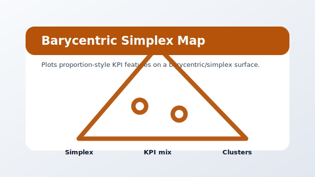

# view_barycentric



Package: `agi-page-simplex-map`

Plots proportion-style KPI features on a barycentric/simplex surface.

## When To Use It

Use when three or more normalized contributions need a visual balance map instead of a raw table.

## Expected Inputs

- A dataframe with proportion or KPI columns.
- An active app export containing the selected table.

Open it from `ANALYSIS` after selecting a project, or run it directly while developing:

```bash
uv --preview-features extra-build-dependencies run streamlit run src/agilab/apps-pages/view_barycentric/src/view_barycentric/view_barycentric.py -- --active-app src/agilab/apps/builtin/flight_telemetry_project
```

## Quality Contract

This bundle has a local README, a source-controlled preview asset, direct test coverage, and uses the shared `agi_pages.runtime` page chrome.
