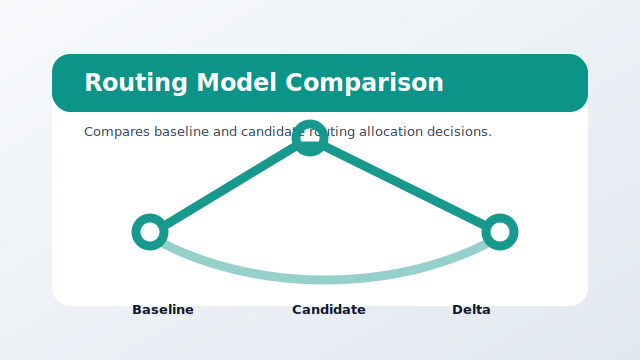

# view_routing_model_comparison



Package: `agi-page-routing-model-comparison`

Compares baseline and candidate routing allocation decisions.

## When To Use It

Use when routing models need allocation deltas, failure inspection, and side-by-side decision evidence.

## Expected Inputs

- Baseline and candidate allocation exports.
- Optional queue-analysis pipeline run folders.

Open it from `ANALYSIS` after selecting a project, or run it directly while developing:

```bash
uv --preview-features extra-build-dependencies run streamlit run src/agilab/apps-pages/view_routing_model_comparison/src/view_routing_model_comparison/view_routing_model_comparison.py -- --active-app src/agilab/apps/builtin/uav_relay_queue_project
```

## Quality Contract

This bundle has a local README, a source-controlled preview asset, direct test coverage, and uses the shared `agi_pages.runtime` page chrome.
