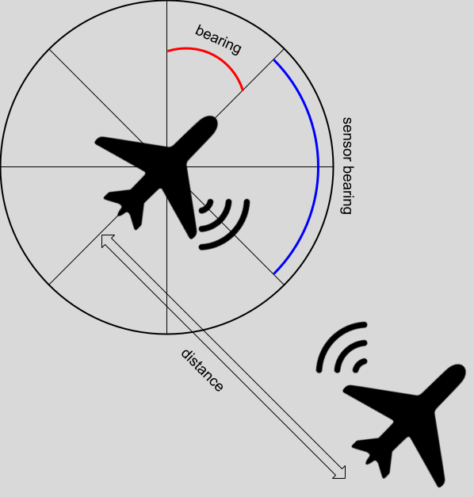
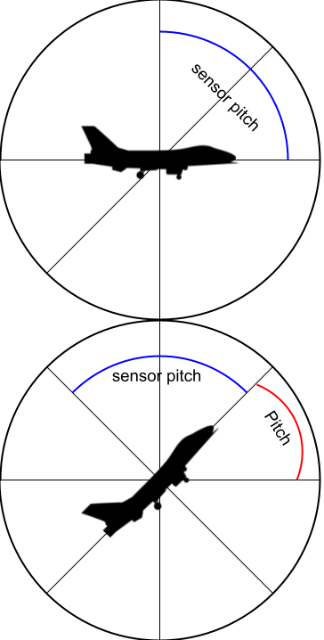

# Detailed Mathematical Explanation of the Line-of-Sight Code

This document explains, in exhaustive detail, the mathematics behind each step of the provided Python code, with particular emphasis on the calculation of the received power `Pr`. We will:

1. Describe the vectorized matrix operations and broadcasting.
2. Walk through each helper function’s math:

   * Shannon capacity
   * Watts to dBm conversion
   * Antenna gain
   * Off-axis loss
   * Free-space path loss (FSPL)
   * 3D Euclidean distance
   * Bearing and elevation errors
3. Derive the final expression for `Pr` and how it is computed element-wise on arrays.

---

## 1. Vectorization and Matrix Operations

All “\_vec” functions accept scalars or array-like inputs and return NumPy arrays of matching shape by:

* Converting inputs to arrays:

  ```python
  B = np.asarray(bandwidth_hz, dtype=float)
  snr_db_arr = np.asarray(snr_db, dtype=float)
  ```
* Broadcasting to a common shape:

  ```python
  B_b, snr_b = np.broadcast_arrays(B, snr_db_arr)
  ```
* Creating masks (e.g. `valid = B_b > 0`) to operate only on valid entries.
* Returning arrays filled with `np.nan` by default and then computing only on valid entries.

All subsequent arithmetic is **element-wise**, leveraging NumPy’s vectorized operations.

---

## 2. Helper Functions

### 2.1 Shannon Capacity

Let

* $B$ be the channel bandwidth (in hertz),
* $\mathrm{SNR}_{\mathrm{dB}}$ the signal-to-noise ratio expressed in decibels.

1. **Linear SNR**

   $$
   \mathrm{SNR} = 10^{\frac{\mathrm{SNR}_{\mathrm{dB}}}{10}}.
   $$

2. **Capacity (bits per second)**
   According to Shannon’s theorem, the maximum achievable data rate $C$ is

   $$
   C = B \,\log_{2}\bigl(1 + \mathrm{SNR}\bigr)\quad\bigl[\mathrm{bits/s}\bigr].
   $$

3. **Capacity (megabits per second)**
   To express $C$ in megabits per second (Mbps), divide by $10^{6}$:

   $$
   C_{\mathrm{Mbps}} = \frac{B \,\log_{2}\bigl(1 + 10^{\mathrm{SNR}_{\mathrm{dB}}/10}\bigr)}{10^{6}}.
   $$

---

### 2.2 Watts → dBm Conversion

Let $P$ be a power in watts ($\mathrm{W}$). Since $1\,\mathrm{W}=1000\,\mathrm{mW}$, the corresponding power in decibels-milliwatts is

$$
P_{\mathrm{dBm}} = 10 \,\log_{10}\!\bigl(P\,[\mathrm{W}]\times 1000\bigr).
$$

Equivalently, if $P$ is given in milliwatts ($\mathrm{mW}$), then

$$
P_{\mathrm{dBm}} = 10\,\log_{10}\bigl(P\,[\mathrm{mW}]\bigr).
$$


### 2.3 Antenna Gain (dBi):

Given horizontal and vertical half-power beamwidths $\theta_h,\theta_v$ in degrees and efficiency $\eta$,

$$
  G_{\mathrm{lin}}
  = \eta\,\frac{4\pi}{\Omega_A}, 
  \quad
  \Omega_A \approx \frac{\theta_h\,[\mathrm{rad}]\;\theta_v\,[\mathrm{rad}]}{(180/\pi)^2}.
$$

In degrees form the code approximates

$$
  G_{\mathrm{lin}}
  = \eta\,\frac{4\pi}{(\theta_h\,\theta_v)\,\bigl(\tfrac{\pi}{180}\bigr)^2}
  = \eta\,\frac{41253}{\theta_h\,\theta_v}.
$$

Then in dBi:

$$
  G_{\mathrm{dBi}} = 10\log_{10}(G_{\mathrm{lin}}).
$$

### 2.4 Off-Axis Loss:

For an elliptical beam with HPBW $(\theta_h,\theta_v)$, and off-axis angles $\alpha_h,\alpha_v$:

1. Compute scaling constant so that at $\alpha=\mathrm{ref\_frac}\,\theta$ the loss is $\mathrm{ref\_loss}$:

   $$
     K = \frac{\mathrm{ref\_loss}}{\mathrm{ref\_frac}^2}.
   $$
2. Quadratic loss in each plane:

   $$
     L_h = K\;\bigl(\tfrac{\alpha_h}{\theta_h}\bigr)^2,\quad
     L_v = K\;\bigl(\tfrac{\alpha_v}{\theta_v}\bigr)^2.
   $$
3. Total off-axis loss:

   $$
     L_{\mathrm{off}} = L_h + L_v.
   $$

### 2.5 Free-Space Path Loss (FSPL):

For frequency $f\,[\mathrm{MHz}]$ and distance $d\,[\mathrm{km}]$:

$$
  \mathrm{FSPL}_{\mathrm{dB}}
  = 32.44 + 20\log_{10}(f) + 20\log_{10}(d).
$$

### 2.6 Haversine-Based 3D Distance

Let point $P_i$ have latitude $\phi_{1,i}$, longitude $\lambda_{1,i}$, altitude $h_{1,i}$; and $Q_i$ similarly.  Lat/lon in radians, altitude in meters.

1. **Haversine parameter**:

$$
a_i = \sin^2\Bigl(\tfrac{\phi_{2,i}-\phi_{1,i}}{2}\Bigr)
      + \cos(\phi_{1,i})\,\cos(\phi_{2,i})
        \sin^2\Bigl(\tfrac{\lambda_{2,i}-\lambda_{1,i}}{2}\Bigr).
$$

2. **Central angle**:

$$
\Delta\sigma_i = 2\,\mathrm{atan2}\bigl(\sqrt{a_i},\sqrt{1 - a_i}\bigr).
$$

3. **Surface distance**:

$$
 d_{s,i} = R_E\,\Delta\sigma_i,\quad R_E = 6.371\times10^6\,\mathrm{m}.
$$

4. **Vertical difference**:

$$
 \Delta h_i = h_{2,i} - h_{1,i}.
$$

5. **3D distance**:

$$
 d_i = \sqrt{d_{s,i}^2 + (\Delta h_i)^2}.
$$

6. **Kilometer conversion**:

$$
 \mathrm{distance}_i = d_i / 1000.
$$

---

### 2.7 Bearing & Elevation Errors




### 2.7.1 Notation

- Let the plane’s yaw (heading) be denoted by  
  $$
    \psi_p \in [0,360)\,\text{degrees},
  $$
  and its pitch by  
  $$
    \theta_p \in [-90,+90]\,\text{degrees}.
  $$
- Let the sensor’s horizontal offset (bearing) be  
  $$
    \beta_s\in\mathbb{R}
  $$  
  and its pitch offset be  
  $$
    \theta_s\in\mathbb{R},
  $$  
  both in degrees.
- In the code, the array columns satisfy  
  $$
    \text{plane}[:,4] = \psi_p,
    \quad
    \text{plane}[:,3] = \theta_p - 90
    \quad(\text{so that } \theta_p = \text{plane}[:,3] + 90).
  $$

---

### 2.7.2 Computation of Relative Bearing

The absolute bearing of the sensor is obtained by  
$$
  \psi_{\rm rel} = (\psi_p + \beta_s)\bmod 360,
$$  
where “mod 360” wraps $\psi_{\rm rel}$ into $[0,360)$.

```python
matrix_bearing = np.mod(plane[:, 4] + sensor["bearing"], 360)
````

---

### 2.7.3 Computation of Relative Pitch

1. Recover the plane’s true pitch:

   $$
     \theta_p = \text{plane}[:,3] + 90.
   $$
2. Sum the pitch offsets:

   $$
     \phi = \theta_p + \theta_s.
   $$
3. Clamp (and reflect) \$\phi\$ into $\[-90,+90]\$ so that any “over-the-top” excursion folds back into the valid range.  Equivalently:

   $$
     \phi_{\rm clamped}
     =
     \begin{cases}
       \phi, & 0 \le \phi \le 180,\\
       (180 - (\phi \bmod 180)) - 90, & \text{otherwise}.
     \end{cases}
   $$

```python
matrix_pitch = plane[:, 3] + 90 + sensor["pitch"]
mask = (matrix_pitch > 180) | (matrix_pitch < 0)
matrix_pitch[mask] = (180 - np.mod(matrix_pitch[mask], 180)) - 90
```

---

### 2.7.4 Handling Over-The-Top Inversion

Whenever the intermediate pitch \$\phi\$ falls outside $\[0,180]\$, the sensor has flipped over the zenith and its horizontal bearing must be rotated by 180°:

$$
  \psi_{\rm rel}[\text{mask}]
  = (\psi_{\rm rel}[\text{mask}] + 180)\bmod 360.
$$

```python
matrix_bearing[mask] = (matrix_bearing[mask] + 180) % 360
```

---

### 2.7.5 Assembly of the Output Matrix

Stack the two resulting angles column-wise to form the \$N\times2\$ matrix

$$
  R \;=\;
  \begin{bmatrix}
    \psi_{\rm rel} & \phi_{\rm clamped}
  \end{bmatrix},
$$

so that each row corresponds to one (plane, sensor) pair.

```python
return np.column_stack((matrix_bearing, matrix_pitch))
```

---

**Summary:**

1. **Relative bearing**: add plane yaw and sensor bearing, wrap to $\[0,360)\$.
2. **Relative pitch**: add plane pitch and sensor pitch, then reflect out‐of‐range values back into $\[-90,+90]\$.
3. **Zenith-crossing correction**: for any over-the-top pitch, also rotate bearing by 180°.
4. Return each pair as $[\,\psi_{\rm rel},\,\theta_{\rm rel}\,]$.


## 3. Calculation of Received Power $P_r$

In the final `get_line_sight_matrix` function, once we have:

* Transmit power $P_t$ in dBm
* Transmit antenna gain $G_t$ in dBi
* Receive antenna gain $G_r$ in dBi (here set equal to $G_t$)
* Off-axis loss $L_{\mathrm{off}}$ in dB
* Free-space path loss $\mathrm{FSPL}$ in dB

we compute, for each element (plane pair) in the arrays,

$$
  P_r = P_t + G_t + G_r \;-\; L_{\mathrm{off}} \;-\; \mathrm{FSPL}.
$$

### 3.1 Why Addition/Subtraction in dB?

* In **linear scale**, power received $P_r^\mathrm{lin}$ would be

  $$
    P_r^\mathrm{lin}
    = P_t^\mathrm{lin}\times G_t^\mathrm{lin}\times G_r^\mathrm{lin}
      \;/\;L_{\mathrm{off}}^\mathrm{lin}\;/\;\mathrm{FSPL}^\mathrm{lin}.
  $$
* Converting each term to dB/dBi (log scale) turns products/divisions into sums/differences:


  $$
    10\log_{10}P_r^\mathrm{lin}
    = 10\log_{10}P_t^\mathrm{lin}
    + 10\log_{10}G_t^\mathrm{lin}
    + 10\log_{10}G_r^\mathrm{lin}
    - 10\log_{10}L_{\mathrm{off}}^\mathrm{lin}
    - 10\log_{10}\mathrm{FSPL}^\mathrm{lin}.
  $$

  And we denote $P_r$ in dBm and the gains in dBi, losses in dB.

### 3.2 Element-wise Array Form

If all quantities are arrays of shape $(N,)$, then:

$$
  \mathbf{P_r}
  = \mathbf{P_t} \;+\;\mathbf{G_t}\;+\;\mathbf{G_r}\;-\;\mathbf{L_{\mathrm{off}}}\;-\;\mathbf{FSPL},
$$

where each bold symbol is an $N$-vector. NumPy implements this via vectorized addition and subtraction:

```python
Pr = Pt + Gt + Gr - off_axis_loss - fspl
```

---

## 4. From $P_r$ to SNR and Capacity

1. **Noise floor** at the receiver:

   $$
     N_0 = -174\;\mathrm{dBm/Hz} + 10\log_{10}(B)\quad
     \bigl(B=\text{sensor["Shannon\_bande\_Hz"]}\bigr).
   $$
2. **Signal-to-Noise Ratio**:

   $$
     \mathrm{SNR}
     = P_r - N_0.
   $$
3. **Capacity** via the Shannon formula (re-using the vectorized function).

---

## 5. Summary of the Full Pipeline

1. **Geometry**: compute 3D distances and off-axis angles.
2. **Path Losses**:

   * FSPL from distance and frequency.
   * Off-axis loss from beam patterns.
3. **Gains**:

   * Transmit and receive antenna gains.
4. **Power Budget**:

   $$
     P_r = P_t + G_t + G_r - L_{\mathrm{off}} - \mathrm{FSPL}.
   $$
5. **Performance Metrics**:

   * SNR: $P_r - N_0$.
   * Capacity: $B\log_2(1+\mathrm{SNR_{lin}})$.

All of these steps are implemented as **element-wise** operations on NumPy arrays, allowing efficient, vectorized computation for many plane/sensor pairs at once.

---

*End of mathematical exposition.*

```
